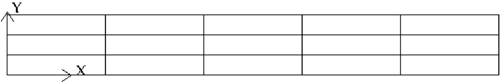
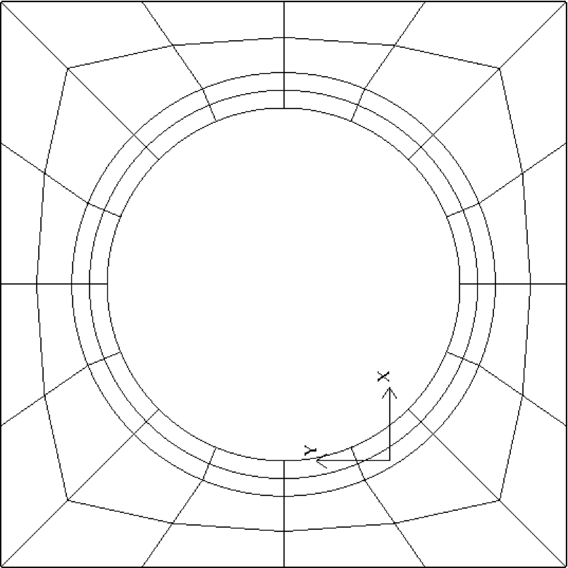

==========
Appendices
==========

-----------------
Build Options
-----------------

The shell script ``makenek`` is designed to assist the compilation process of Nek5000. The script will create a ``makefile`` based on the user settings section in ``makenek``. The GNU gmake utility is used to build Nek5000.
Available configurations options:

.. _tab:bdms:

.. csv-table:: Compiler options
   :header: name,values,default,description
   :widths: 12,7,12,20

   PPLIST, string, , "list of pre-processor symbols (CVODE, ...)"                                     
   MPI, "1, 0", 1, use MPI (needed for a multiprocessor computation)                                           

   FC, string, optional, Fortran compiler (mpif77)                                                         
   CC, string, optional, C compiler (mpicc)                                                               
   FCLAGS, string, optional, optional Fortan compilation flags        
   CCLAGS, string, optional, optional C compilation flags                                                                  
   SOURCE_ROOT, string, optional, path of Nek5000 source                                                                      
   USR, string, optional, object list of additional files to compile make intructions (``makefile_usr.inc`` required) 
   USR_LFLAGS, string, optional, optional linking flags                                                                      
   PROFILING, "1, 0", 1, enable internal timers for performance statistics                                       
   VISIT, "1, 0", 0, Toggles Visit in situ. See Visit_in_situ for details                                        
   VISIT_INSTALL, string, VISIT in situ, Path to VISIT install path. See Visit_in_situ for details.                                 
   VISIT_STOP, "true, false", false, "When running VISIT in situ, simulation stops after step 1 to connect VISIT."                 

The ``PPLIST`` field can be used to activate several features at compilation time. 
A list of possible options is below:

.. _tab:PPLIST:

.. csv-table:: PPLIST options
   :header: Symbol, Description

   NOMPIIO, deactivate MPI-IO support
   BGQ, use Blue Gene Q optimized mxm
   XSMM, use libxsmm for mxm
   CVODE, compile with CVODE support for scalars
   VENDOR_BLAS, use VENDOR BLAS/LAPACK
   EXTBAR, add underscore to exit call (for BGQ)
   NEKNEK, activate overlapping mesh solver (experimental)
   CMTNEK, activate discontinuous Galerkin compressible-flow solver (experimental)

In addition to these preprocessor items, the user can add compilation and linking flags. 
``FFLAGS`` allows the user to add Fortran compilation flags while ``CCFAGS`` allows the user to 
add C compilation flags. 
These will be compiler dependent and the user is encouraged to consult the manual of the compiler if specific options are needed/desired. 
A commonly used flag is ``-mcmodel`` which allows for arrays of size larger than 2GB. 
This option  tells the compiler to use a specific memory model to generate code and store data. 
It can affect code size and performance. 
If your program has global and static data with a total size smaller than 2GB, ``-mcmodel=small`` is sufficient. 
Global and static data larger than 2GB requires ``-mcmodel=medium`` or ``-mcmodel=large``.

.. Another useful flag is related to implicit typesetting. 
.. Nek5000 relies often on implicit typesetting as default in the example cases. 
.. This means in practice that if the user defines a new variable in the user file and forgets to define its type explicitly then variable beginning with a character from I to N, its type is ``INTEGER``. 
.. Otherwise, it is ``REAL``.  
.. To avoid confusion the user not accustomed to implicit typesetting may use the warning flag ``-Wimplicit``. 
.. This flag warns whenever a variable, array, or function is implicitly declared and has an effect similar to using the ``IMPLICIT NONE`` statement in every program unit.

----------------------------------
Internal Input Parameters/Switches
----------------------------------

....................
Parameters
....................

.. raw:: html

    

.. role:: red

| **P001**  density for the case of constant properties
|
| **P002**  dynamic viscosity 
|
| **P007**  heat capacity for the case of constant properties 
|
| **P008**  conductivity for the case of constant properties
|
| **P010**  simulation end time
| 
| **P011**  number of time steps
| 
| **P012**  time step size
| 
| **P014**  time fequency to dump fld files
| 
| **P015**  step frequency to dump fld files
| 
| **P021**  pressure solver tolernace
| 
| **P022**  velocity solver tolerance
| 
| **P023**  number of passive scalars
| 
| **P024**  relative tolerance for Helmholtz solver
| 
| **P025**  absolute tolerance for Helmholtz solver
| 
| **P026**  target Courant number (determines the number of RK4 substeps for OIFS)
| 
| **P027**  temporal discretization order
| 
| **P028**  temporal discretization order for mesh solver
| 
| **P029**  magnetic viscosity
| 
| **P030**  material properties (0: constant, 1: uservp) 
| 
| **P031**  number of perturbation modes in linearized N-S.
| 
| **P032**  number of boundary conditions in .re2 file
| 
| **P033**  first field index in .re2
| 
| **P040**  pressure coarse grid solver (0: XXT, 1: AMG)
| 
| **P041** 1 :math:`\rightarrow` multiplicative SEMG
| 
| **P042** linear solver for the pressure equation (0: GMRES, 1: CG)
|
| **P043** 0: additive multilevel scheme - 1: original two level scheme.
| 
| **P044** 0=E-based additive Schwarz for PnPn-2; 1=A-based.
| 
| **P045** Free-surface stability control (defaults to 1.0)
| 
| **P046** if :math:`>0`, do not set Initial Condition (no call to subroutine ``SETICS``).
| 
| **P047** Poisson ratio for mesh elasticity solve (default 0.4)
| 
| **P054** direction of fixed flowrate (1: x, 2: y, 3: z), negative means fixed bulk
| 
| **P055** volumetric flowrate or bulk velocity (see p054) for periodic case
| 
| **P059** deformed element switch
| 
| **P060** initialize velocity to 1e-10 (for steady Stokes problem).
| 
| **P062** byte swap for output
| 
| **P063** output precision (4: SP, 8: DP)
| 
| **P064** restart perturbation solution
| 
| **P065** number of I/O nodes (if :math:`< 0` write in separate subdirectories).
| 
| **P066** output format (0: ASCII, 4: legacy binary, 6: binary)
| 
| **P067** read format 
| 
| **P068** averaging frequency in ``avg_all`` (0: every timestep).
| 
| **P084** custom inital time step
| 
| **P086** use skew-symmetric instead of convective form.
| 
| **P093** number of previous solutions to use for residual projection.
| 
| **P094** number of steps starting residual projection for velocity and passive scalars
| 
| **P095** number of steps starting residual projection for pressure 
| 
| **P099** dealiasing mode (:math:`<0`: disabled, 3: old dealiasing, 4: new dealiasing)
| 
| **P100** :red:`RESERVED!` pressure preconditioner when using CG solver (0: Jacobi, :math:`>0`: two-level Schwarz) :red:`or viseversa?`
| 
| **P101** number of additional modes to filter
| 
| **P103** filter weight for last mode
| 
| **P107** if :math:`\neq0`, add it to ``h2`` in ``sethlm``
| 
| **P116 NELX** number of elements in :math:`x` for FTP
| 
| **P117 NELY** number of elements in :math:`y` for FTP
| 
| **P118 NELZ** number of elements in :math:`z` for FTP
| 

.. _sec:switches:

................
Logical switches
................

**IFFLOW** solve for fluid (velocity, pressure)

**IFHEAT** solve for heat (temperature and/or scalars)

**IFTRAN** solve transient equations (otherwise, solve the steady Stokes flow)

**IFADVC** specify the fields with convection

**IFTMSH** specify the field(s) defined on T mesh  (first field is the ALE mesh)

**IFAXIS** axisymmetric formulation

**IFSTRS** use stress formulation

**IFLOMACH** use low Mach number formulation

**IFMGRID** moving grid

**IFMVBD** moving boundary (for free surface flow)

**IFCHAR** use characteristics for convection operator

**IFSYNC** use upfront synchronization

**IFUSERVP** user-defined properties

.....................
Other Input Variables
.....................

**filterType** 0: explicit, 1: HPT-RT

**restol(:)** field solver tolerance 

------------------------------
Commonly used Variables
------------------------------

..................
Solution Variables
..................

.. table::

  +---------------+------------------------------------+---------+------------------------------------------+
  | Variable Name | Size                               | Type    | Short Description                        |
  +===============+====================================+=========+==========================================+
  | ``vx``        | (lx1,ly1,lz1,lelv)                 | real    | x-velocity (u)                           |
  +---------------+------------------------------------+---------+------------------------------------------+
  | ``vy``        | (lx1,ly1,lz1,lelv)                 | real    | y-velocity (v)                           |
  +---------------+------------------------------------+---------+------------------------------------------+
  | ``vz``        | (lx1,ly1,lz1,lelv)                 | real    | z-velocity (w)                           |
  +---------------+------------------------------------+---------+------------------------------------------+
  | ``pr``        | (lx2,ly2,lz2,lelv)                 | real    | pressure (pr)                            |
  +---------------+------------------------------------+---------+------------------------------------------+
  | ``t``         | (lx1,ly1,lz1,lelt,ldimt)           | real    | temperature (t) and passive scalars (ps) |
  +---------------+------------------------------------+---------+------------------------------------------+
  | ``vtrans``    | (lx1,ly1,lz1,lelt,ldimt+1)         | real    | convective coefficient                   |
  +---------------+------------------------------------+---------+------------------------------------------+
  | ``vdiff``     | (lx1,ly1,lz1,lelt,ldimt+1)         | real    | diffusion coefficient                    |
  +---------------+------------------------------------+---------+------------------------------------------+
  | ``vxlag``     | (lx1,ly1,lz1,lelv,2)               | real    | x-velocity at previous time steps        |
  +---------------+------------------------------------+---------+------------------------------------------+
  | ``vylag``     | (lx1,ly1,lz1,lelv,2)               | real    | y-velocity at previous time steps        |
  +---------------+------------------------------------+---------+------------------------------------------+
  | ``vzlag``     | (lx1,ly1,lz1,lelv,2)               | real    | z-velocity at previous time steps        |
  +---------------+------------------------------------+---------+------------------------------------------+
  | ``prlag``     | (lx2,ly2,lz2,lelv,lorder2)         | real    | pressure at previous time steps          |
  +---------------+------------------------------------+---------+------------------------------------------+
  | ``tlag``      | (lx1,ly1,lz1,lelv,lorder-1,ldimt+1)| real    | t and ps at previous time steps          |
  +---------------+------------------------------------+---------+------------------------------------------+
  | ``time``      | --                                 | real    | physical time                            |
  +---------------+------------------------------------+---------+------------------------------------------+
  | ``dt``        | --                                 | real    | time step size                           |
  +---------------+------------------------------------+---------+------------------------------------------+
  | ``dtlag``     | ( 10 )                             | real    | previous time step sizes                 |
  +---------------+------------------------------------+---------+------------------------------------------+
  | ``istep``     | --                                 | integer | time step number                         |
  +---------------+------------------------------------+---------+------------------------------------------+

..................
Geometry Variables
..................

.. table::

  +---------------+---------------------------+-------------+-------------------------------------------+
  | Variable Name | Size                      | Type        | Short Description                         |
  +===============+===========================+=============+===========================================+
  | ``xm1``       | (lx1,ly1,lz1,lelt)        | real        | x-coordinates for velocity mesh           |
  +---------------+---------------------------+-------------+-------------------------------------------+
  | ``ym1``       | (lx1,ly1,lz1,lelt)        | real        | y-coordinates for velocity mesh           |
  +---------------+---------------------------+-------------+-------------------------------------------+
  | ``zm1``       | (lx1,ly1,lz1,lelt)        | real        | z-coordinates for velocity mesh           |
  +---------------+---------------------------+-------------+-------------------------------------------+
  | ``bm1``       | (lx1,ly1,lz1,lelt)        | real        | mass matrix for velocity mesh             |
  +---------------+---------------------------+-------------+-------------------------------------------+
  | ``binvm1``    | (lx1,ly1,lz1,lelv)        | real        | inverse mass matrix for velocity mesh     |
  +---------------+---------------------------+-------------+-------------------------------------------+
  | ``bintm1``    | (lx1,ly1,lz1,lelt)        | real        | inverse mass matrix for t mesh            |
  +---------------+---------------------------+-------------+-------------------------------------------+
  | ``volvm1``    | --                        | real        | total volume for velocity mesh            |
  +---------------+---------------------------+-------------+-------------------------------------------+
  | ``voltm1``    | --                        | real        | total volume for t mesh                   |
  +---------------+---------------------------+-------------+-------------------------------------------+
  | ``xm2``       | (lx2,ly2,lz2,lelv)        | real        | x-coordinates for pressure mesh           |
  +---------------+---------------------------+-------------+-------------------------------------------+
  | ``ym2``       | (lx2,ly2,lz2,lelv)        | real        | y-coordinates for pressure mesh           |
  +---------------+---------------------------+-------------+-------------------------------------------+
  | ``zm2``       | (lx2,ly2,lz2,lelv)        | real        | z-coordinates for pressure mesh           |
  +---------------+---------------------------+-------------+-------------------------------------------+
  | ``unx``       | (lx1,ly1,6,lelt)          | real        | x-component of face unit normal           |
  +---------------+---------------------------+-------------+-------------------------------------------+
  | ``uny``       | (lx1,ly1,6,lelt)          | real        | y-component of face unit normal           |
  +---------------+---------------------------+-------------+-------------------------------------------+
  | ``unz``       | (lx1,ly1,6,lelt)          | real        | z-component of face unit normal           |
  +---------------+---------------------------+-------------+-------------------------------------------+
  | ``area``      | (lx1,ly1,6,lelt)          | real        | face area (surface integral weights)      |
  +---------------+---------------------------+-------------+-------------------------------------------+

.......................
Problem Setup Variables
.......................

.. table::

  +---------------+---------------------------+-------------+-------------------------------------------+
  | Variable Name | Size                      | Type        | Short Description                         |
  +===============+===========================+=============+===========================================+
  | ``nid``       | --                        | integer     | MPI rank id (lowest rank is always 0)     |
  +---------------+---------------------------+-------------+-------------------------------------------+
  | ``nio``       | --                        | integer     | I/O node id                               |
  +---------------+---------------------------+-------------+-------------------------------------------+
  | ``nelv``      | --                        | integer     | number of elements in velocity mesh       |
  +---------------+---------------------------+-------------+-------------------------------------------+
  | ``nelt``      | --                        | integer     | number of elements in t mesh              |
  +---------------+---------------------------+-------------+-------------------------------------------+
  | ``ndim``      | --                        | integer     | dimensionality of problem (i.e. 2 or 3)   |
  +---------------+---------------------------+-------------+-------------------------------------------+
  | ``nsteps``    | --                        | integer     | number of time steps to run               |
  +---------------+---------------------------+-------------+-------------------------------------------+
  | ``iostep``    | --                        | integer     | time steps between data output            |
  +---------------+---------------------------+-------------+-------------------------------------------+
  | ``cbc``       | (6,lelt,ldimt+1)          | character*3 | boundary condition                        |
  +---------------+---------------------------+-------------+-------------------------------------------+
  | ``lglel``     | (lelt)                    | integer     | local to global element number map        |
  +---------------+---------------------------+-------------+-------------------------------------------+
  | ``gllel``     | (lelg)                    | integer     | global to local element number map        |
  +---------------+---------------------------+-------------+-------------------------------------------+

...................
Averaging Variables
...................

Arrays associated with the ``avg_all`` subroutine

.. table::

  +---------------+---------------------------+---------+-----------------------------------------------+
  | Variable Name | Size                      | Type    | Short Description                             |
  +===============+===========================+=========+===============================================+
  | ``uavg``      | (ax1,ay1,az1,lelt)        | real    | time averaged x-velocity                      |
  +---------------+---------------------------+---------+-----------------------------------------------+
  | ``vavg``      | (ax1,ay1,az1,lelt)        | real    | time averaged y-velocity                      |
  +---------------+---------------------------+---------+-----------------------------------------------+
  | ``wavg``      | (ax1,ay1,az1,lelt)        | real    | time averaged z-velocity                      |
  +---------------+---------------------------+---------+-----------------------------------------------+
  | ``pavg``      | (ax2,ay2,az2,lelt)        | real    | time averaged pressure                        |
  +---------------+---------------------------+---------+-----------------------------------------------+
  | ``tavg``      | (ax1,ay1,az1,lelt,ldimt)  | real    | time averaged temperature and passive scalars |
  +---------------+---------------------------+---------+-----------------------------------------------+
  | ``urms``      | (ax1,ay1,az1,lelt)        | real    | time averaged u^2                             |
  +---------------+---------------------------+---------+-----------------------------------------------+
  | ``vrms``      | (ax1,ay1,az1,lelt)        | real    | time averaged v^2                             |
  +---------------+---------------------------+---------+-----------------------------------------------+
  | ``wrms``      | (ax1,ay1,az1,lelt)        | real    | time averaged w^2                             |
  +---------------+---------------------------+---------+-----------------------------------------------+
  | ``prms``      | (ax1,ay1,az1,lelt)        | real    | time averaged pr^2                            |
  +---------------+---------------------------+---------+-----------------------------------------------+
  | ``trms``      | (ax1,ay1,az1,lelt,ldimt)  | real    | time averaged t^2 and ps^2                    |
  +---------------+---------------------------+---------+-----------------------------------------------+
  | ``uvms``      | (ax1,ay1,az1,lelt)        | real    | time averaged uv                              |
  +---------------+---------------------------+---------+-----------------------------------------------+
  | ``vwms``      | (ax1,ay1,az1,lelt)        | real    | time averaged vw                              |
  +---------------+---------------------------+---------+-----------------------------------------------+
  | ``wums``      | (ax1,ay1,az1,lelt)        | real    | time averaged wu                              |
  +---------------+---------------------------+---------+-----------------------------------------------+
  | ``iastep``    | --                        | integer | time steps between averaged data output       |
  +---------------+---------------------------+---------+-----------------------------------------------+

.. _append_subroutines:

-------------------------
Commonly used Subroutines
-------------------------

``subroutine rescale_x(x,x0,x1)``
    Rescales the array ``x`` to be in the range ``(x0,x1)``. This is usually called from ``usrdat2`` in the ``.usr`` file

``subroutine normvc(h1,semi,l2,linf,x1,x2,x3)``
    Computes the error norms of a vector field variable ``(x1,x2,x3)`` defined on mesh 1, the velocity mesh. The error norms are normalized with respect to the volume, with the exception on the infinity norm, ``linf``.

``subroutine comp_vort3(vort,work1,work2,u,v,w)``
    Computes the vorticity (``vort``) of the velocity field, ``(u,v,w)``

``subroutine lambda2(l2)``
    Generates the Lambda-2 vortex criterion proposed by Jeong and Hussain (1995)

``subroutine planar_average_z(ua,u,w1,w2)``
    Computes the r-s planar average of the quantity ``u``.

``subroutine torque_calc(scale,x0,ifdout,iftout)``
    Computes torque about the point ``x0``. Here scale is a user supplied multiplier so that the results may be scaled to any convenient non-dimensionalization. Both the drag and the torque can be printed to the screen by switching the appropriate ``ifdout(drag)`` or ``iftout(torque)`` logical.

``subroutine set_obj``
    Defines objects for surface integrals by changing the value of ``hcode`` for future calculations. Typically called once within ``userchk`` (for ``istep = 0``) and used for calculating torque. (see above)

``subroutine avg1(avg,f, alpha,beta,n,name,ifverbose)``

``subroutine avg2(avg,f, alpha,beta,n,name,ifverbose)``

``subroutine avg3(avg,f,g, alpha,beta,n,name,ifverbose)``
    These three subroutines calculate the (weighted) average of ``f``. Depending on the value of the logical, ``ifverbose``, the results will be printed to standard output along with name. In ``avg2``, the ``f`` component is squared. In ``avg3``, vector ``g`` also contributes to the average calculation.

``subroutine outpost(x,vy,vz,pr,tz,' ')``
    Dumps the current data of ``x``, ``vy``, ``vz``, ``pr``, ``tz`` to an ``.fld`` or ``.f0????`` file for post processing.

``subroutine platform_timer(ivrb)``
    Runs the battery of timing tests for matrix-matrix products,contention-free processor-to-processor ping-pong tests, and ``mpi_all_reduce`` times. Allows one to check the performance of the communication routines used on specific platforms.

``subroutine quickmv``
    Moves the mesh to allow user affine motion.

``subroutine runtimeavg(ay,y,j,istep1,ipostep,s5)``
    Computes, stores, and (for ``ipostep!0``) prints runtime averages of ``j``-quantity ``y`` (along w/ ``y`` itself unless ``ipostep<0``) with ``j`` + '``rtavg_``' + (unique) ``s5`` every ``ipostep`` for ``istep>=istep1``. ``s5`` is a string to append to ``rtavg_`` for storage file naming.

``subroutine lagrng(uo,y,yvec,uvec,work,n,m)``
    Compute Lagrangian interpolant for ``uo``

``subroutine opcopy(a1,a2,a3,b1,b2,b3)``
    Copies ``b1`` to ``a1``, ``b2`` to ``a2``, and ``b3`` to ``a3``, when ``ndim = 3``,

``subroutine cadd(a,const,n)``
    Adds ``const`` to vector ``a`` of size ``n``.

``subroutine col2(a,b,n)``
    For ``n`` entries, calculates ``a=a*b``.

``subroutine col3(a,b,c,n)``
    For ``n`` entries, calculates ``a=b*c``.

``function glmax(a,n)``

``function glamax(a,n)``

``function iglmax(a,n)``
    Calculates the (absolute) max of a vector that is size ``n``. Prefix ``i`` implies integer type.

``function i8glmax(a,n)``
    Calculates the max of an integer*8 vector that is size ``n``.

``function glmin(a,n)``

``function glamin(a,n)``

``function iglmin(a,n)``
    Calculates the (absolute) min of a vector that is size ``n``. Prefix ``i`` implies integer type.

``function glsc2(a,b,n)``

``function glsc3(a,b,mult,n)``

``function glsc23(a,b,c,n)``

``function glsum(a,n)``

  Computes the global sum of the real arrays ``a``, with number of local entries ``n``

``function iglsum(a,n)``

  Computes the global sum of the integer arrays ``a``, with number of local entries ``n``

``function i8glsum(a,n)``

  Computes the global sum of the integer*8 arrays ``a``, with number of local entries ``n``

``subroutine surface_int(dphi,dS,phi,ielem,iside)``
    Computes the surface integral of scalar array ``phi`` over face ``iside`` of element ``ielem``. 
    The resulting integral is storted in ``dphi`` and the area in ``dS``.

.. _mesh_gen: 

-----------------------------
Generating a Mesh with Genbox
-----------------------------

..........................
Uniformly Distributed Mesh
..........................

Suppose you wish to simulate flow through an axisymmetric pipe,
of radius :math:`R=0.5` and length :math:`L=4`.  You estimate that you will
need 3 elements in radial :math:`(y)` direction, and 5 in the :math:`x` direction,
as depicted in :numref:`fig:mesh_axi1`.
This would be specified by the following input file (called ``pipe.box``)
to ``genbox``:

.. code-block:: none

   axisymmetric.rea
   2                      spatial dimension
   1                      number of fields
   #
   #    comments:   This is the box immediately behind the
   #                refined cylinder in Ugo's cyl+b.l. run.
   #
   #
   #========================================================
   #
   Box 1                         Pipe
   -5 -3                         Nelx  Nely
   0.0   4.0   1.0               x0  x1   ratio
   0.0   0.5   1.0               y0  y1   ratio
   v  ,O  ,A  ,W  ,   ,          BC's:  (cbx0, cbx1, cby0, cby1, cbz0, cbz1)

.. _fig:mesh_axi1:

    Axisymmetric pipe mesh.

- The first line of this file supplies the name of an existing 2D ``.rea`` file that has the appropriate run parameters (viscosity, timestep size, etc.). These parameters can be modified later, but it is important that ``axisymmetric.rea`` be a 2D file, and not a 3D file.
- The second line indicates the number of fields for this simulation, in this case, just 1, corresponding to the velocity field (i.e., no heat transfer).
- The next set of lines just shows how one can place comments into a ``genbox`` input file.
- The line that starts with "Box" indicates that a new box is starting, and that the following lines describe a typical box input.  Other possible key characters (the first character of Box, "B") are "C" and "M", more on those later.
- The first line after "Box" specifies the number of elements in the
  :math:`x` and :math:`y` directions.   The fact that these values are negative indicates
  that you want ``genbox`` to automatically generate the element distribution
  along each axis, rather than providing it by hand.  (More on this below.)
- The next line specifies the distribution of the 5 elements in the :math:`x` direction.
  The mesh starts at :math:`x=0` and ends at :math:`x=4.0`.  The ``ratio`` indicates the
  relative size of each element, progressing from left to right.
- The next line specifies the distribution of the 3 elements in the :math:`y` direction,
  starting at :math:`y=0` and going to :math:`y=0.5`.  Again,
  ``ratio`` =1.0 indicates that the elements will be of uniform height.
- The last line specifies boundary conditions on each of the 4 sides of the
  box:

  - Lower-case *v* indicates that the left :math:`(x)` boundary is to be a velocity
    boundary condition, with a user-specified distribution determined by
    routine ``userbc`` in the ``.usr`` file.  (Upper-case :math:`V` would indicate that
    the velocity is constant, with values specified in the .rea file.)
  - *O* indicates that the right :math:`(x)` boundary is an outflow boundary -- the
    flow leaves the domain at the left and the default exit pressure is :math:`p=0`.
  - *A* indicates that the lower :math:`(y)` boundary is the axis---this condition
    is mandatory for the axisymmetric case, given the fact that the lower domain
    boundary is at :math:`y=0`, which corresponds to :math:`r=0`.
  - *W* indicates that the upper :math:`(y)` boundary is a wall.  This would be
    equivalent to a *v* or *V* boundary condition, with :math:`{\bf u}=0`.

...........
Graded Mesh
...........

.. _fig:mesh_axi2:

.. figure:: figs/mesh_axi2.png
    :align: center
    :figclass: align-center
    :alt: axis-pipe-mesh-graded

    Axisymmetric pipe mesh, graded

Suppose you wish to have the mesh be graded,
that you have increased resolution near the wall.
In this case you change ``ratio`` in the :math:`y`-specification
of the element distribution.  For example, changing the 3 lines
in the above ``genbox`` input file from

.. code-block:: none

   -5 -3                         Nelx  Nely
   0.0   4.0   1.0               x0  x1   ratio
   0.0   0.5   1.0               y0  y1   ratio

to

.. code-block:: none

   -5 -4                         Nelx  Nely
   0.0   4.0   1.0               x0  x1   ratio
   0.0   0.5   0.7               y0  y1   ratio

yields the mesh shown in :numref:`fig:mesh_axi2`.

...........................
User-Specified Distribution
...........................

.. _fig:mesh_axi3:

.. figure:: figs/mesh_axi3.png
    :align: center
    :figclass: align-center
    :alt: axis-pipe-mesh-user

    Axisymmetric pipe mesh, user specified.

You can also specify your own, precise, distribution of element
locations.   For example, another graded mesh similar to the
one of the preceding example could be built by changing the
``genbox`` input file to contain:

.. code-block:: none

   -5  4                                               Nelx  Nely
   0.0   4.0   1.0                                     x0  x1   ratio
   0.000    0.250    0.375    0.450    0.500           y0  y1 ... y4

Here, the positive number of elements for the :math:`y` direction indicates
that ``genbox`` is expecting ``Nely+1`` values of :math:`y` positions on the
:math:`y`-element distribution line.   This is the ``genbox`` default, which
explains why it corresponds to ``Nely`` :math:`>` 0.  The corresponding mesh
is shown in :numref:`fig:mesh_axi3`.

-----------------------
Mesh Modification
-----------------------

For complex shapes, it is often convenient to modify the mesh
direction in the simulation code, Nek5000.  This can be done
through the ``usrdat2`` routine provided in the ``.usr`` file.
The routine ``usrdat2`` is called by Nek5000 immediately after
the geometry, as specified by the ``.rea`` file, is established.
Thus, one can use the existing geometry to map to a new geometry
of interest.

For example, suppose you want the above pipe geometry to have
a sinusoidal wall.  Let :math:`{\bf x} := (x,y)` denote the old geometry,
and :math:`{\bf x}' := (x',y')` denote the new geometry.  For a domain
with :math:`y\in [0,0.5]`, the following function will map the straight
pipe geometry to a wavy wall with amplitude :math:`A`, wavelength :math:`\lambda`:

.. math::

    y'(x,y) = y  + y A \sin( 2 \pi x / \lambda ).

Note that, as :math:`y \longrightarrow 0`, the perturbation,
:math:`yA \sin( 2 \pi x / \lambda )`, goes to zero.  So, near the axis,
the mesh recovers its original form.

In Nek5000, you would specify this through ``usrdat2`` as follows

.. code-block:: fortran

   subroutine usrdat2
   include 'SIZE'
   include 'TOTAL'

   real lambda

   ntot = nx1*ny1*nz1*nelt

   lambda = 3.
   A      = 0.1

   do i=1,ntot
      argx         = 2*pi*xm1(i,1,1,1)/lambda
      ym1(i,1,1,1) = ym1(i,1,1,1) + ym1(i,1,1,1)*A*sin(argx)
   end do

   param(59) = 1.  ! Force nek5 to recognize element deformation.

   return
   end

Note that, since Nek5000 is modifying the mesh, ``postx`` will not
recognize the current mesh unless you tell it to, because ``postx``
looks to the ``.rea`` file for the mesh geometry.  The only way for
Nek5000 to communicate the new mesh to ``postx`` is via the ``.fld``
file, so you must request that the geometry be dumped to the
``.fld`` file.  
The result of above changes is shown in :numref:`fig:wavypipe`.

.. _fig:wavypipe:

.. figure:: figs/wavypipe.png
    :align: center
    :figclass: align-center
    :alt: axis-pipe-mesh-wavy

    Axisymmetric pipe mesh.

.. _sec:genbox:

.......................................
Cylindrical/Cartesian-transition Annuli
.......................................

.. _fig:cylbox_2d:

.. figure:: figs/cylbox_2d.png
    :align: center
    :figclass: align-center
    :alt: annuli-mesh-1

    Cylinder mesh

.. _fig:cylbox_2da:

    Cylinder mesh

More sophisticated
transition treatments may be generated using the GLOBAL REFINE options in
``prenek`` or through an upgrade of ``genb7``, as demand warrants.
Example 2D and 3D input files are provided in the ``nek5000/doc`` files
``box7.2d`` and ``box7.3d``.
:numref:`fig:cylbox_2d` shows a 2D example generated using
the ``box7.2d`` input file, which reads:

.. code-block:: none

   x2d.rea
   2                      spatial dimension
   1                      number of fields
   #
   #    comments
   #
   #
   #========================================================
   #
   Y                   cYlinder
   3 -24 1             nelr,nel_theta,nelz
   .5 .3               x0,y0 - center of cylinder
   ccbb                descriptors: c-cyl, o-oct, b-box (1 character + space)
   .5 .55 .7 .8        r0 r1 ... r_nelr
   0  1  1             theta0/2pi theta1/2pi  ratio
   v  ,W  ,E  ,E  ,    bc's (3 characters + comma)
    
An example of a mesh is shown in :numref:`fig:cylbox_2d`.   The mesh has been quad-refined
once with oct-refine option of ``prenek``. The 3D counterpart to this
mesh could joined to a hemisphere/Cartesian transition built with
the spherical mesh option in ``prenek``.

----------------------------
Mesh Extrusion and Mirroring
----------------------------

In ``nek5000/tools``, there is a code ``n2to3.f`` that can be compiled with your
local fortran compiler (preferably not g77).
By running this code, you can extend two dimensional domains to
three dimensional ones with a user-specified number of levels in the
:math:`z`-direction.  Such a mesh can then be modified using the mesh modification
approach. Assuming you have a valid two-dimensional mesh, ``n2to3`` is straightforward
to run.  Below is a typical session, upon typing ``n2to3`` the user is prompted at the command line

.. code-block:: none

    Input old (source) file name:
   h2e
    Input new (output) file name:
   h3e
    input number of levels: (1, 2, 3,... etc.?):
   16
    input z min:
   0
    input z max:
   16
    input gain (0=custom,1=uniform,other=geometric spacing):
   1
    This is for CEM: yes or no:
   n
    Enter Z (5) boundary condition (P,v,O):
   v
    Enter Z (6) boundary condition (v,O):
   0
    this is cbz: v  O   <---

         320 elements written to h3e.rea
   FORTRAN STOP

In this context CEM stands for computational electromagnetics, a spin-off of the original Nek5000 code.

The domain in which the fluid flow/heat transfer
problem is solved consists of two distinct subdomains. The
first subdomain is that part of the region occupied by
fluid, denoted :math:`\Omega_f`, while the second subdomain is that part
of the region occupied by a solid, denoted :math:`\Omega_s`. These two
subdomains are depicted in :numref:`fig-walls`. The entire domain is denoted as :math:`D=\Omega_f \cup \Omega_s`.
The fluid problem is solved in the domain :math:`\Omega_f`, while the
temperature in the energy equation is solved in the
entire domain; the passive scalars can be solved in either
the fluid or the entire domain.

We denote the entire boundary of :math:`\Omega_f` as :math:`\partial \Omega_f`, that part
of the boundary of :math:`\Omega_f` which is not shared by :math:`\Omega_s` as
:math:`\overline{\partial \Omega_f}`, and
that part of the boundary of :math:`\Omega_f` which is shared by :math:`\Omega_s`.
In addition, :math:`\partial \Omega_{s}, \overline{\partial \Omega_s}` are analogously defined.
These distinct portions of the
domain boundary are illustrated in :numref:`fig-walls`.
The restrictions on the domain for Nek5000 are itemized below.

- The domain :math:`\Omega=\Omega_f \cup \Omega_s` must correspond either to a
  planar (Cartesian) two-dimensional geometry, or to the
  cross-section of an axisymmetric region specified by
  revolution of the cross-section about a specified axis, or
  by a (Cartesian) three-dimensional geometry.
- For two-dimensional and axisymmetric geometries, the
  boundaries of both subdomains, :math:`\partial \Omega_f` and
  :math:`\partial \Omega_s`, must be
  representable as (or at least approximated by) the union of
  straight line segments, splines, or circular arcs.
- Nek5000 can interpret a two-dimensional image as either
  a planar Cartesian geometry, or
  the cross-section of an axisymmetric body. In the case of
  the latter, it is assumed that the :math:`y`-direction is the radial
  direction, that is, the axis of revolution is at :math:`y=0`.
  Although an axisymmetric geometry is, in fact,
  three-dimensional, Nek5000 can assume that the field variables
  are also axisymmetric ( that is, do not depend on azimuth,
  but only :math:`y`, that is, radius, :math:`x`, and :math:`t` ), thus reducing the
  relevant equations to "two-dimensional" form.

Fully general three-dimensional meshes generated by other softwares
packages can be input to ``prenek`` as imported meshes.

