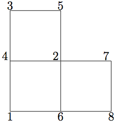

========
Geometry
========

-----------------------------
Generating a Mesh with Genbox
-----------------------------

Note that in case of any changes in the SIZE file, a recompilation is necessary.

..........................
Uniformly Distributed Mesh
..........................

Suppose you wish to simulate flow through an axisymmetric pipe,
of radius :math:`R=0.5` and length :math:`L=4`.  You estimate that you will
need 3 elements in radial :math:`(y)` direction, and 5 in the :math:`x` direction,
as depicted in :numref:`fig:mesh_axi1`.
This would be specified by the following input file (called *pipe.box*)
to genbox:

.. code-block:: none

   axisymmetric.rea
   2                      spatial dimension
   1                      number of fields
   #
   #    comments:   This is the box immediately behind the
   #                refined cylinder in Ugo's cyl+b.l. run.
   #
   #
   #========================================================
   #
   Box 1                         Pipe
   -5 -3                         Nelx  Nely
   0.0   4.0   1.0               x0  x1   ratio
   0.0   0.5   1.0               y0  y1   ratio
   v  ,O  ,A  ,W  ,   ,          BC's:  (cbx0, cbx1, cby0, cby1, cbz0, cbz1)

.. _fig:mesh_axi1:

.. figure:: figs/mesh_axi1.png
    :align: center
    :figclass: align-center
    :alt: axis-pipe-mesh

    Axisymmetric pipe mesh.

- The first line of this file supplies the name of an existing 2D .rea file that has the appropriate run parameters (viscosity, timestep size, etc.). These parameters can be modified later, but it is important that axisymmetric.rea be a 2D file, and not a 3D file.
- The second line indicates the number of fields for this simulation, in this case, just 1, corresponding to the velocity field (i.e., no heat transfer).
- The next set of lines just shows how one can place comments into a genbox input file.
- The line that starts with "Box" indicates that a new box is starting, and that the following lines describe a typical box input.  Other possible key characters (the first character of Box, "B") are "C" and "M", more on those later.
- The first line after "Box" specifies the number of elements in the
  :math:`x` and :math:`y` directions.   The fact that these values are negative indicates
  that you want genbox to automatically generate the element distribution
  along each axis, rather than providing it by hand.  (More on this below.)
- The next line specifies the distribution of the 5 elements in the :math:`x` direction.
  The mesh starts at :math:`x=0` and ends at :math:`x=4.0`.  The *ratio* indicates the
  relative size of each element, progressing from left to right.
- The next line specifies the distribution of the 3 elements in the :math:`y` direction,
  starting at :math:`y=0` and going to :math:`y=0.5`.  Again,
  *ratio* =1.0 indicates that the elements will be of uniform height.
- The last line specifies boundary conditions on each of the 4 sides of the
  box:

  - Lower-case *v* indicates that the left :math:`(x)` boundary is to be a velocity
    boundary condition, with a user-specified distribution determined by
    routine *userbc* in the .usr file.  (Upper-case :math:`V` would indicate that
    the velocity is constant, with values specified in the .rea file.)
  - *O* indicates that the right :math:`(x)` boundary is an outflow boundary -- the
    flow leaves the domain at the left and the default exit pressure is :math:`p=0`.
  - *A* indicates that the lower :math:`(y)` boundary is the axis---this condition
    is mandatory for the axisymmetric case, given the fact that the lower domain
    boundary is at :math:`y=0`, which corresponds to :math:`r=0`.
  - *W* indicates that the upper :math:`(y)` boundary is a wall.  This would be
    equivalent to a *v* or *V* boundary condition, with :math:`{\bf u}=0`.

...........
Graded Mesh
...........

.. _fig:mesh_axi2:

.. figure:: figs/mesh_axi2.png
    :align: center
    :figclass: align-center
    :alt: axis-pipe-mesh-graded

    Axisymmetric pipe mesh, graded

Suppose you wish to have the mesh be graded,
that you have increased resolution near the wall.
In this case you change *ratio* in the :math:`y`-specification
of the element distribution.  For example, changing the 3 lines
in the above genbox input file from

.. code-block:: none

   -5 -3                         Nelx  Nely
   0.0   4.0   1.0               x0  x1   ratio
   0.0   0.5   1.0               y0  y1   ratio

to

.. code-block:: none

   -5 -4                         Nelx  Nely
   0.0   4.0   1.0               x0  x1   ratio
   0.0   0.5   0.7               y0  y1   ratio

yields the mesh shown in :numref:`fig:mesh_axi2`.

...........................
User-Specified Distribution
...........................

.. _fig:mesh_axi3:

.. figure:: figs/mesh_axi3.png
    :align: center
    :figclass: align-center
    :alt: axis-pipe-mesh-user

    Axisymmetric pipe mesh, user specified.

You can also specify your own, precise, distribution of element
locations.   For example, another graded mesh similar to the
one of the preceding example could be built by changing the
genbox input file to contain:

.. code-block:: none

   -5  4                                               Nelx  Nely
   0.0   4.0   1.0                                     x0  x1   ratio
   0.000    0.250    0.375    0.450    0.500           y0  y1 ... y4

Here, the positive number of elements for the :math:`y` direction indicates
that genbox is expecting ``Nely+1`` values of :math:`y` positions on the
:math:`y`-element distribution line.   This is the genbox default, which
explains why it corresponds to ``Nely`` :math:`>` 0.  The corresponding mesh
is shown in :numref:`fig:mesh_axi3`.

............................
Mesh Modification in Nek5000
............................

For complex shapes, it is often convenient to modify the mesh
direction in the simulation code, Nek5000.  This can be done
through the usrdat2 routine provided in the .usr file.
The routine usrdat2 is called by nek5000 immediately after
the geometry, as specified by the .rea file, is established.
Thus, one can use the existing geometry to map to a new geometry
of interest.

For example, suppose you want the above pipe geometry to have
a sinusoidal wall.  Let :math:`{\bf x} := (x,y)` denote the old geometry,
and :math:`{\bf x}' := (x',y')` denote the new geometry.  For a domain
with :math:`y\in [0,0.5]`, the following function will map the straight
pipe geometry to a wavy wall with amplitude :math:`A`, wavelength :math:`\lambda`:

.. math::

    y'(x,y) = y  + y A \sin( 2 \pi x / \lambda ).

Note that, as :math:`y \longrightarrow 0`, the perturbation,
:math:`yA \sin( 2 \pi x / \lambda )`, goes to zero.  So, near the axis,
the mesh recovers its original form.

In nek5000, you would specify this through usrdat2 as follows

.. code-block:: fortran

   subroutine usrdat2
   include 'SIZE'
   include 'TOTAL'

   real lambda

   ntot = nx1*ny1*nz1*nelt

   lambda = 3.
   A      = 0.1

   do i=1,ntot
      argx         = 2*pi*xm1(i,1,1,1)/lambda
      ym1(i,1,1,1) = ym1(i,1,1,1) + ym1(i,1,1,1)*A*sin(argx)
   end do

   param(59) = 1.  ! Force nek5 to recognize element deformation.

   return
   end

Note that, since nek5000 is modifying the mesh, postx will not
recognize the current mesh unless you tell it to, because postx
looks to the .rea file for the mesh geometry.  The only way for
nek5000 to communicate the new mesh to postx is via the .fld
file, so you must request that the geometry be dumped to the
.fld file.   This is done by modifying the OUTPUT SPECIFICATIONS,
which are found near the bottom of the .rea file.  Specifically,
change

.. code-block:: none

   ***** OUTPUT FIELD SPECIFICATION *****
   6 SPECIFICATIONS FOLLOW
   F      COORDINATES
   T      VELOCITY
   T      PRESSURE
   T      TEMPERATURE
   F      TEMPERATURE GRADIENT
   0      PASSIVE SCALARS

to

.. code-block:: none

   ***** OUTPUT FIELD SPECIFICATION *****
   6 SPECIFICATIONS FOLLOW
   T      COORDINATES                       <------  CHANGE HERE
   T      VELOCITY
   T      PRESSURE
   T      TEMPERATURE
   F      TEMPERATURE GRADIENT
   0      PASSIVE SCALARS

The result of above changes is shown in :numref:`fig:wavypipe`.

.. _fig:wavypipe:

.. figure:: figs/wavypipe.png
    :align: center
    :figclass: align-center
    :alt: axis-pipe-mesh-wavy

    Axisymmetric pipe mesh.

.......................................
Cylindrical/Cartesian-transition Annuli
.......................................

.. _fig:cylbox_2d:

.. figure:: figs/cylbox_2d.png
    :align: center
    :figclass: align-center
    :alt: annuli-mesh-1

    Cylinder mesh

.. _fig:cylbox_2da:

.. figure:: figs/cylbox_2da.png
    :align: center
    :figclass: align-center
    :alt: annuli-mesh-2

    Cylinder mesh

An updated version of genb6, known as genb7, is currently under development
and designed to simply/automate the construction of cylindrical annuli,
including *basic* transition-to-Cartesian elements.   More sophisticated
transition treatments may be generated using the GLOBAL REFINE options in
prenek or through an upgrade of genb7, as demand warrants.
Example 2D and 3D input files are provided in the nek5000/doc files
*box7.2d* and *box7.3d*.
:numref:`fig:cylbox_2d` shows a 2D example generated using
the *box7.2d* input file, which reads:

.. code-block:: none

   x2d.rea
   2                      spatial dimension
   1                      number of fields
   #
   #    comments
   #
   #
   #========================================================
   #
   Y                   cYlinder
   3 -24 1             nelr,nel_theta,nelz
   .5 .3               x0,y0 - center of cylinder
   ccbb                descriptors: c-cyl, o-oct, b-box (1 character + space)
   .5 .55 .7 .8        r0 r1 ... r_nelr
   0  1  1             theta0/2pi theta1/2pi  ratio
   v  ,W  ,E  ,E  ,    bc's (3 characters + comma)
    
An example of a mesh is shown in :numref:`fig:cylbox_2d`.   The mesh has been quad-refined
once with oct-refine option of prenek. The 3D counterpart to this
mesh could joined to a hemisphere/Cartesian transition built with
the spherical mesh option in prenek.

-----------------------
Extrusion and Mirroring
-----------------------

...................................
Building Extruded Meshes with n2to3
...................................

In nek5000/tools, there is a code n2to3.f that can be compiled with your
local fortran compiler (preferably not g77).
By running this code, you can extend two dimensional domains to
three dimensional ones with a user-specified number of levels in the
z-direction.  Such a mesh can then be modified using the mesh modification
approach. Assuming you have a valid two-dimensional mesh, n2to3 is straightforward
to run.  Below is a typical session, upon typing ``n2to3`` the user is prompted at the command line

.. code-block:: none

    Input old (source) file name:
   h2e
    Input new (output) file name:
   h3e
    input number of levels: (1, 2, 3,... etc.?):
   16
    input z min:
   0
    input z max:
   16
    input gain (0=custom,1=uniform,other=geometric spacing):
   1
    This is for CEM: yes or no:
   n
    Enter Z (5) boundary condition (P,v,O):
   v
    Enter Z (6) boundary condition (v,O):
   0
    this is cbz: v  O   <---

         320 elements written to h3e.rea
   FORTRAN STOP

In this context CEM stands for computational electromagnetics, a spin-off of the original Nek5000 code.

The domain in which the fluid flow/heat transfer
problem is solved consists of two distinct subdomains. The
first subdomain is that part of the region occupied by
fluid, denoted :math:`\Omega_f`, while the second subdomain is that part
of the region occupied by a solid, denoted :math:`\Omega_s`. These two
subdomains are depicted in :numref:`fig-walls`. The entire domain is denoted as :math:`D=\Omega_f \cup \Omega_s`.
The fluid problem is solved in the domain :math:`\Omega_f`, while the
temperature in the energy equation is solved in the
entire domain; the passive scalars can be solved in either
the fluid or the entire domain.

We denote the entire boundary of :math:`\Omega_f` as :math:`\partial \Omega_f`, that part
of the boundary of :math:`\Omega_f` which is not shared by :math:`\Omega_s` as
:math:`\overline{\partial \Omega_f}`, and
that part of the boundary of :math:`\Omega_f` which is shared by :math:`\Omega_s`.
In addition, :math:`\partial \Omega_{s}, \overline{\partial \Omega_s}` are analogously defined.
These distinct portions of the
domain boundary are illustrated in :numref:`fig-walls`.
The restrictions on the domain for Nek5000 are itemized below.

- The domain :math:\Omega=\Omega_f \cup \Omega_s` must correspond either to a
  planar (Cartesian) two-dimensional geometry, or to the
  cross-section of an axisymmetric region specified by
  revolution of the cross-section about a specified axis, or
  by a (Cartesian) three-dimensional geometry.
- For two-dimensional and axisymmetric geometries, the
  boundaries of both subdomains, :math:`\partial \Omega_f` and
  :math:`\partial \Omega_s`, must be
  representable as (or at least approximated by) the union of
  straight line segments, splines, or circular arcs.
- Nek5000 can interpret a two-dimensional image as either
  a planar Cartesian geometry, or
  the cross-section of an axisymmetric body. In the case of
  the latter, it is assumed that the y-direction is the radial
  direction, that is, the axis of revolution is at :math:`y=0`.
  Although an axisymmetric geometry is, in fact,
  three-dimensional, Nek5000 can assume that the field variables
  are also axisymmetric ( that is, do not depend on azimuth,
  but only :math:`y`, that is, radius, :math:`x`, and :math:`t` ), thus reducing the
  relevant equations to "two-dimensional" form.

Fully general three-dimensional meshes generated by other softwares
packages can be input to PRENEK as import meshes.

---------------
Moving Geometry
---------------

If the imposed boundary conditions allow for motion
of the boundary during the solution period (for example,
moving walls, free-surfaces, melting fronts, fluid layers),
then the geometry of the computational domain is automatically
considered in Nek5000 as being time-dependent.

For time-dependent geometry problems,
a mesh velocity **w** is defined at each
collocation point of the computational domain (mesh) to
characterize the deformation of the mesh.
In the solution of the mesh velocity, the value of the mesh
velocity at the moving boundaries is first computed
using appropriate kinematic conditions (for free-surfaces, moving walls
and fluid layers) or dynamic conditions (for melting fronts).
On all other external boundaries, the normal mesh velocity on the
boundary is always set to zero.
In the tangential direction, either a zero tangential velocity
condition or a zero tangential traction condition is imposed; this
selection is automatically performed by Nek5000 based on
the fluid and/or thermal boundary conditions specified
on the boundary.
However, under special circumstances the user may want
to override the defaults set by Nek5000, this is
described in the PRENEK manual in Section 5.7. (This manual is old may soon be deprecated.)
If the zero tangential mesh velocity is imposed, then the mesh
is fixed in space; if the zero traction condition is imposed,
then the mesh can slide along the tangential directions on
the boundary.
The resulting boundary-value-problem for the mesh velocity is solved
in Nek5000 using a elastostatic solver, with the Poisson ratio
typically set to zero.
The new mesh geometry is then computed by integrating the
mesh velocity explicitly in time and updating the nodal coordinates of the
collocation points.

Note that the number of macro-elements, the order of the macro-elements
and the topology of the mesh remain *unchanged* even though
the geometry is time-dependent.
The use of an arbitrary-Lagrangian-Eulerian description in Nek5000
ensures that the moving fronts are tracked with the minimum amount
of mesh distortion;
in addition, the elastostatic mesh solver can handle moderately
large mesh distortion.
However, it is the responsibility of the user to decide when
a mesh would become "too deformed" and thus requires remeshing.
The execution of the program will terminate when the mesh becomes
unacceptable, that is, a one-to-one mapping between the physical
coordinates and the isoparametric local coordinates for any
macro-element no longer exists.

-------------------------------
Boundary and Initial Conditions
-------------------------------

...................
Boundary Conditions
...................

The boundary conditions for the governing equations
given in the previous section are now described.

The boundary conditions can be imposed in various ways:

- when the mesh is generated with ``genbox``, as will be explained in Section~\ref{sec:genbox}
- when the .rea file is read in PRENEK or directly in the .rea file
- directly in the .rea file
- in the subroutine ``userbc``

The general convention for boundary conditions in the .rea file is

- upper case letters correspond to Primitive boundary conditions, as given in :numref:`tab:primitiveBCf`, :numref:`tab:primitiveBCt`
- lower case letters correspond to user defined boundary conditions, see :numref:`tab:userBCf` :numref:`tab:userBCt`

Since there are no supporting tools that will correctly populate the .rea file with the appropriate values, temperature, velocity, and flux boundary conditions are typically lower case and values must be specified in the ``userbc`` subroutine in the .usr file.

..............
Fluid Velocity
..............

Two types of boundary conditions are applicable to the
fluid velocity : essential (Dirichlet) boundary
condition in which the velocity is specified;
natural (Neumann) boundary condition in which the traction
is specified.
For segments that constitute the boundary :math:`\partial \Omega_f`, see :numref:`fig-walls`,
one of these two types of boundary conditions must be
assigned to each component of the fluid velocity.
The fluid boundary condition can be *all Dirichlet*
if all velocity components of :math:`{\bf u}` are
specified; or it can be *all Neumann* if all traction components
:math:`{\bf t} = [-p {\bf I} + \mu (\nabla {\bf u} +
(\nabla {\bf u})^{T})] \cdot {\bf n}`, where
:math:`{\bf I}` is the identity tensor, :math:`{\bf n}` is the unit normal
and :math:`\mu` is the dynamic viscosity, are specified;
or it can be *mixed Dirichlet/Neumann*
if Dirichlet and Neumann conditions are selected for different
velocity components.
Examples for all Dirichlet, all Neumann and mixed Dirichhlet/Neumann
boundaries are wall, free-surface and symmetry, respectively.
If the nonstress formulation is selected, then traction
is not defined on the boundary.
In this case, any Neumann boundary condition imposed must be homogeneous;
i.e., equal to zero.
In addition, mixed Dirichlet/Neumann boundaries must be aligned with
one of the Cartesian axes.

For flow geometry which consists of
a periodic repetition of a particular geometric unit,
the periodic boundary conditions can be imposed,
as illustrated in :numref:`fig-walls`.

.. _tab:primitiveBCf:

.. table:: Primitive boundary conditions

   +------------+-----------------------+---------------------------+------------------+
   | Identifier | Description           | Parameters                | No of Parameters |
   +============+=======================+===========================+==================+
   | P          | periodic              | periodic element and face | 2                |
   +------------+-----------------------+---------------------------+------------------+
   | V          | Dirichlet velocity    | u,v,w                     | 3                |
   +------------+-----------------------+---------------------------+------------------+
   | O          | outflow               | ``-``                     | 0                |
   +------------+-----------------------+---------------------------+------------------+
   | W          | wall (no slip)        | ``-``                     | 0                |
   +------------+-----------------------+---------------------------+------------------+
   | F          | flux                  | flux                      | 1                |
   +------------+-----------------------+---------------------------+------------------+
   | SYM        | symmetry              | ``-``                     | 0                |
   +------------+-----------------------+---------------------------+------------------+
   | A          | axisymmetric boundary | ``-``                     | 0                |
   +------------+-----------------------+---------------------------+------------------+
   | MS         | moving boundary       | ``-``                     | 0                |
   +------------+-----------------------+---------------------------+------------------+
   | ON         | Outflow, Normal       | ``-``                     | 0                |
   +------------+-----------------------+---------------------------+------------------+
   | E          | Interior boundary     | Neighbour element ID      | 2                |
   +------------+-----------------------+---------------------------+------------------+

.. _tab:userBCf:

.. table:: User defined boundary conditions

   +-------------+------------------------------------+
   | Indentifier | Description                        |
   +=============+====================================+
   | v           | user defined Dirichlet velocity    |
   +-------------+------------------------------------+
   | t           | user defined Dirichlet temperature |
   +-------------+------------------------------------+
   | f           | user defined flux                  |
   +-------------+------------------------------------+

The open(outflow) boundary condition ("O") arises as a natural boundary condition from the variational formulation of Navier Stokes. We identify two situations

- In the non-stress formulation, open boundary condition ('Do nothing')

  .. math::

     [-p{\bf I} + \nu(\nabla {\bf u})]\cdot {\bf n}=0

- In the stress formulation, free traction boundary condition

  .. math::

     [-p{\bf I} + \nu(\nabla {\bf u}+\nabla {\bf u}^T)]\cdot {\bf n}=0

- the symmetric boundary condition ("SYM") is given as

  .. math::

     {\bf u} \cdot {\bf n}&=&0\ ,\\
     (\nabla {\bf u} \cdot {\bf t})\cdot {\bf n}&=&0

  where :math:`{\bf n}` is the normal vector and :math:`{\bf t}` the tangent vector. If the normal and tangent vector are not aligned with the mesh the stress formulation has to be used.
- the periodic boundary condition ("P") needs to be prescribed in the .rea file since it already assigns the last point to first via :math:`{\bf u}({\bf x})={\bf u}({\bf x} + L)`, where :math:`L` is the periodic length.
- the wall boundary condition ("W") corresponds to :math:`{\bf u}=0`.

For a fully-developed flow in such a configuration, one can
effect great computational efficiencies by considering the
problem in a single geometric unit (here taken to be of
length L), and requiring periodicity of the field variables.
Nek5000 requires that the pairs of sides (or faces, in
the case of a three-dimensional mesh) identified as periodic
be identical (i.e., that the geometry be periodic).

For an axisymmetric flow geometry, the axis boundary
condition is provided for boundary segments that lie
entirely on the axis of symmetry.
This is essentially a symmetry (mixed Dirichlet/Neumann)
boundary condition
in which the normal velocity and the tangential traction
are set to zero.

For free-surface boundary segments, the inhomogeneous
traction boundary conditions
involve both the surface tension coefficient :math:`\sigma`
and the mean curvature of the free surface.

...............................
Passive scalars and Temperature
...............................

The three types of boundary conditions applicable to the
temperature are: essential (Dirichlet) boundary
condition in which the temperature is specified;
natural (Neumann) boundary condition in which the heat flux
is specified; and mixed (Robin) boundary condition
in which the heat flux is dependent on the temperature
on the boundary.
For segments that constitute the boundary
:math:`\partial \Omega_f' \cup \partial \Omega_s'` (refer to Fig. 2.1),
one of the above three types of boundary conditions must be
assigned to the temperature.

The two types of Robin boundary condition for temperature
are: convection boundary conditions for which the heat
flux into the domain depends on the heat transfer coefficient
:math:`h_{c}` and the difference between the environmental temperature
:math:`T_{\infty}` and the surface temperature; and radiation
boundary conditions for which the heat flux into the domain
depends on the Stefan-Boltzmann constant/view-factor
product :math:`h_{rad}` and the difference between the fourth power
of the environmental temperature :math:`T_{\infty}` and the fourth
power of the surface temperature.

.. _tab:primitiveBCt:

.. table:: Primitive boundary conditions (Temperature and Passive scalars)

   +------------+---------------------------------------+------------+------------------+
   | Identifier | Description                           | Parameters | No of Parameters |
   +============+=======================================+============+==================+
   | T          | Dirichlet temperature/scalar          | value      | 1                |
   +------------+---------------------------------------+------------+------------------+
   | O          | outflow                               | ``-``      | 0                |
   +------------+---------------------------------------+------------+------------------+
   | P          | periodic boundary                     | ``-``      | 0                |
   +------------+---------------------------------------+------------+------------------+
   | I          | insulated (zero flux) for temperature |            | 0                |
   +------------+---------------------------------------+------------+------------------+

.. _tab:userBCt:

.. table:: User defined boundary conditions (Temperature and Passive scalars)

   +------------+------------------------------------+
   | Identifier | Description                        |
   +============+====================================+
   | t          | user defined Dirichlet temperature |
   +------------+------------------------------------+
   | c          | Newton cooling                     |
   +------------+------------------------------------+
   | f          | user defined flux                  |
   +------------+------------------------------------+

- open boundary condition ("O")

  .. math::

     k(\nabla T)\cdot {\bf n} =0

- insulated boundary condition ("I")

  .. math::

     k(\nabla T)\cdot {\bf n} =0

  where :math:`{\bf n}` is the normal vector and :math:`{\bf t}` the tangent vector. If the normal and tangent vector are not aligned with the mesh the stress formulation has to be used.
- the periodic boundary condition ("P") needs to be prescribed in the .rea file since it already assigns the last point to first via :math:`{\bf u}({\bf x})={\bf u}({\bf x} + L)`, where :math:`L` is the periodic length.
- Newton cooling boundary condition ("c")

  .. math::

     k(\nabla T)\cdot {\bf n}=h(T-T_{\infty})

- flux boundary condition ("f")

  .. math::

     k(\nabla T)\cdot {\bf n} =f

...............
Passive scalars
...............

The boundary conditions for the passive scalar fields
are analogous to those used for the temperature field.
Thus, the temperature boundary condition
menu will reappear for each passive scalar field so that the
user can specify an independent set of boundary conditions
for each passive scalar field.

............................
Internal Boundary Conditions
............................

In the spatial discretization, the entire computational
domain is subdivided into macro-elements, the boundary
segments shared by any two of these macro-elements
in :math:`\Omega_f` and :math:`\Omega_s` are denoted as internal boundaries.
For fluid flow analysis with a single-fluid system or heat
transfer analysis without change-of-phase, internal
boundary conditions are irrelevant as the corresponding
field variables on these segments are part of the
solution. However, for a multi-fluid system and for
heat transfer analysis with change-of-phase, special
conditions are required at particular internal
boundaries, as described in the following.

For a fluid system composes of multiple immiscible fluids,
the boundary (and hence the identity) of each fluid must
be tracked, and a jump in the normal traction exists
at the fluid-fluid interface if the surface tension
coefficient is nonzero.
For this purpose, the interface between any two fluids
of different identity must be defined as a special type of
internal boundary, namely, a fluid layer;
and the associated surface tension coefficient also
needs to be specified.

In a heat transfer analysis with change-of-phase, Nek5000 assumes
that both phases exist at the start of the solution, and that
all solid-liquid interfaces are specified as special internal
boundaries, namely, the melting fronts.
If the fluid flow problem is considered, i.e., the energy
equation is solved in conjunction with the momentum and
continuity equations, then only
the common boundary between the fluid and the solid
(i.e., all or portion of :math:`\partial \overline{\Omega}_f'` in :numref:`fig-walls`)
can be defined as the melting front.
In this case, segments on :math:`\partial \overline{\Omega}_f'` that
belong to the dynamic melting/freezing interface need to be
specified by the user.
Nek5000 always assumes that the density of the two phases
are the same (i.e., no Stefan flow); therefore at the melting
front, the boundary condition for the fluid velocity is the
same as that for a stationary wall, that is, all velocity
components are zero.
If no fluid flow is considered, i.e., only the energy equation
is solved, then any internal boundary can be defined as
a melting front.
The temperature boundary condition at the melting front
corresponds to a Dirichlet
condition; that is, the entire segment maintains a constant temperature
equal to the user-specified melting temperature :math:`T_{melt}`
throughout the solution.
In addition, the volumetric latent heat of fusion :math:`\rho L`
for the two phases,
which is also assumed to be constant, should be specified.

..................
Initial Conditions
..................

For time-dependent problems Nek5000 allows the user to choose among
the following types of initial conditions for the
velocity, temperature and passive scalars:

- Zero initial conditions: default; if nothing is specified.
- Fortran function: This option allows the user to specify the
  initial condition as a fortran function,
  e.g., as a function of :math:`x`, :math:`y` and :math:`z`.
- Presolv: For a temperature problem the presolv option gives the
  steady conduction solution as initial condition for the temperature.
  For a fluid problem this option *can* give the
  steady Stokes solution as the initial condition for the velocity
  *provided* that the classical splitting scheme is *not* used.
- Restart: this option allows the user to read in results from an earlier
  simulation, and use these as initial conditions.

A tabulated summary of the compatibility of these initial condition options
with various other solution strategies/parameters is given in the appendix.

--------------------------------------
Parallel Mesh Partitioning with Genmap
--------------------------------------

Genmap is spectral graph partitioning tool, similar to e.g. METIS, which partitions the graph associated to the mesh to assure optimal communication time in HPC applications. Let us consider a simple mesh such as the one in :numref:`fig:genmap`. The vertices are distributed in a random fashion, which is the way they may be provided by some mesh generator. Let us assume the vertices are here given as

.. math::

   V_1=(-1,0),\ V_2=(0,1),\ V_3=(-1,2),\ V_4=(-1,1),\ V_5=(0,2),\ V_6=(0,0),\ V_7=(1,1),\ V_8=(1,0)

The geometry is already stored in the .rea file by the point coordinates, and not vertex numbers

.. table::

   +--------------------------------------------------+-----+-----+-----+
   | :math:`\texttt{Element } 1=[V_1\ V_6\ V_2\ V_4]` |     |     |     |
   +--------------------------------------------------+-----+-----+-----+
   | :math:`x_{1,\ldots,4}= -1.`                      | 0.  | 0.  | -1. |
   +--------------------------------------------------+-----+-----+-----+
   | :math:`y_{1,\ldots,4}= 0.`                       | 0.  | 1.  | 1.  |
   +--------------------------------------------------+-----+-----+-----+
   | :math:`\texttt{Element } 2=[V_8\ V_7\ V_2\ V_6]` |     |     |     |
   +--------------------------------------------------+-----+-----+-----+
   | :math:`x_{1,\ldots,4}= 1.`                       | 1.  | 0.  | 0.  |
   +--------------------------------------------------+-----+-----+-----+
   | :math:`y_{1,\ldots,4}= 0.`                       | 1.  | 1.  | 0.  |
   +--------------------------------------------------+-----+-----+-----+
   | :math:`\texttt{Element } 3=[V_5\ V_3\ V_4\ V_2]` |     |     |     |
   +--------------------------------------------------+-----+-----+-----+
   | :math:`x_{1,\ldots,4}= 0.`                       | -1. | -1. | 0.  |
   +--------------------------------------------------+-----+-----+-----+
   | :math:`y_{1,\ldots,4}= 2.`                       | 2.  | 1.  | 1.  |
   +--------------------------------------------------+-----+-----+-----+

.. _fig:genmap:

    Two-dimensional mesh

Let us a regard the mesh in :numref:`fig:genmap` as a graph of :math:`N` vertices and :math:`M` edges, :math:`G(V_N,E_M)`. We define the Laplacian matrix associated to a graph :math:`G` as :math:`L(G)`. We define as the degree of a node :math:`V_i` the number of incident edges, e.g. in :numref:`fig:genmap` :math:`deg(V_2)=4` and :math:`deg(V_6)=3`.

.. math::

   L(G)_{ij}= \left\{
   \begin{array}{l l}
     i=j & \quad \mathrm deg(V_i)\\
     i\neq j & \quad -1 \text{ if there is and edge (i,j) and } 0 \text{ otherwise}
   \end{array} \right .

.. math::

   L(G)= \begin{pmatrix}
     &1 & 2 & 3 & 4 & 5 & 6 & 7 & 8\\
     \hline
   1| &2 & 0 & 0 & -1 & 0 & -1 & 0 & 0\\
   2| &0 & 4 & 0 & -1 & -1 & -1 & -1 & 0\\
   3| &0 & 0 & 2 & -1 & -1 & 0 & 0 & 0\\
   4| &-1 & -1 & -1 & 3 & 0 & 0 & 0 & 0\\
   5| &0 & -1 & -1 & 0 & 2 & 0 & 0 & 0\\
   6| &-1 & -1 & 0 & 0 & 0 & 3 & 0 & -1\\
   7| &0 & -1 & 0 & 0 & 0 & 0 & 2 & -1\\
   8| &0 & 0 & 0 & 0 & 0 & -1 & -1 & 2\\
   \end{pmatrix}

Properties of :math:`L(G)`

- :math:`L(G)` symmetric
- the unit vector :math:`e=[1, \ldots 1]\in \mathcal{N}(L(G))` is in the nullspace of the Laplacian matrix
- :math:`\forall\lambda \in \sigma(L(G)>0`, i.e. all the eigenvalues of :math:`L(G)` are positive except :math:`\lambda_0` corresponding to the unit vector
- :math:`\lambda_2\neq 0` if the graph is connected, :math:`\lambda_2(L(G))` is also called the algebraic connectivity of the graph

The main ides of the spectral bisection algorithm is

.. code-block:: none

   compute \(v_2\) eigenvector corresponding to \(\lambda_2(L(G))\)
   for i=1,N
     if v_2(i) < 0 put vertex \(V_i\) in N_{-}
     else put vertex \(V_i\) in N_{-}

The eigenvectors and eigenvalues are computed using Lanczos's algorithm.
These steps are repeated recursively on each of the two branches of the graph :math:`N_{-}, N_{+}`. This is possible since according to Fiedler's theorems the graph :math:`N_{-}` is connected, :math:`N_{+}` connected only if no :math:`v_2(i)=0`,  and for each subgraph :math:`G_1` the algebraic connectivities satisfy :math:`\lambda_2(L(G_1))\leq\lambda_2(L(G))`.

To run the genmap code be sure that the Nek tools are up-to-date and compiled.
At command line type: genmap
NOTE-If the executables for the tools were not placed in the bin directory(default),
include the path to the genmap executable. We give here the output for the .rea file in the Kovasznay example

.. code-block:: none

   Input (.rea) file name:
   kov
   Input mesh tolerance (default 0.2):
   NOTE: smaller is better, but generous is more forgiving for bad meshes.
   0.05
    reading .rea file data ...
    start locglob_lexico:           8         960        7680  0.10000000000000001
    locglob:           1           1        7680
    .....
    locglob:           3        1254        7680
    done locglob_lexico:        1254        1254        7680           8
    start periodic vtx:         960        1254
    done periodic vtx
    start rec_bisect:         960
    done:    0.1%
    .....
    done:   99.4%

    done rec_bisect
   writing kov.map

The user is prompted for .rea file name and should enter only the prefix of the .rea file.
The user is prompted for mesh tolerance value. Typically a value of .05 is sufficient. Increasing or decreasing this value should make very little difference in the mesh generation. However, if given an error from genmap, the tolerance may need to be made slightly more generous.

A successful genmap run will produce a .map file with the proper processor decomposition.

NOTE: For large element counts, it is not uncommon for genmap to be produce a few disconnected sets.
These sets are typically under 7 elements large and  will not affect optimization of the NEK5000 run.
If a disconnected set is produced, genmap will output the following warning to stdout:

.. code-block:: none

   not connected   N0   NEL  Nsets   Nlarge sets

Here, ``N0`` is the number of elements disconnected from the set of ``NEL`` elements, ``Nsets`` is the counter of disconnected sets found,
and ``Nlarge sets`` is the number of sets greater than 64 elements in size.  ``Nlarge sets`` should always be 0.  If not, please contact someone on the developer team so we can be sure to have a more optimal partition of your mesh.

Genmap outputs an ordered set of numbers which are organized as follows
Line number 1 contains the header ``nel, nactive, depth, d2, npts, nrank, noutflow``

- ``nel``  number of elements
- ``nactive`` nrank-noutflow
- ``depth`` floor(log2(nel))
- ``d2`` :math:`2^{depth}`
- ``npts`` number of corner points (``nel*4`` in 2D, ``nel*8`` in 3D)
- ``nrank`` number of unique corner points
- ``noutflow`` number of outflows (not used anymore, is zero)

For the Kovasnay flow on an 8 element mesh with periodic boundary conditions we have::

  8         12          3          8         32         12          0

Next we have the data (one line per element, listed in order of global element number)::

  6          12          11           6           5

This means that elemnt one (since we are on the first line) belongs to group 6, and this element is given by vertices in unique ordering.
The vertices are ordered in symmetric ordering (starting at 1)::

  3 - 4
  |   |
  1 - 2

To distribute amongst processors, one just takes as many consecutive
processors as one wants.

