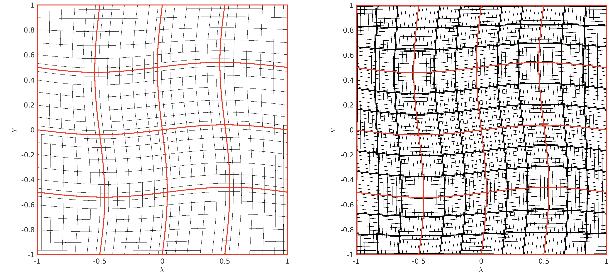
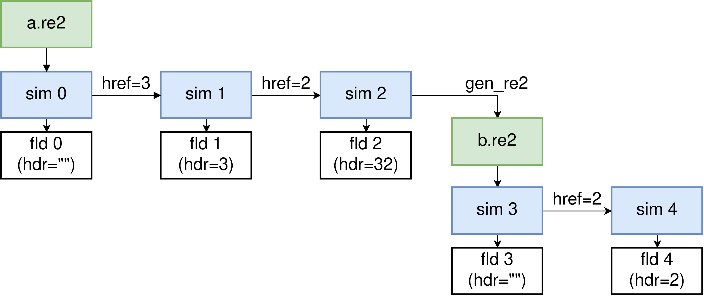

===================
Additional Features
===================

*Nek5000* includes several features which make case setup, running, and data processing much easier.  
These capabilities are outlined here.

.. _features_his:

--------------
History Points    
--------------

Assuming a case named ``foo``, a list of monitor points can be defined in the file ``foo.his`` to evaluate velocity, temperature, pressure and passive scalars. 
Values for each scalar will be spectrally interpolated to each point and appended to this file each time the subroutine ``hpts()`` is called. 
The values printed to this file are controlled by the ``writeToFieldFile`` parameters for each quantity in the ``.par`` file.
Depending on the number of monitoring points, you may need to increase parameter ``lhis`` in SIZE.
Note that the monitoring points are assumed to be distributed among MPI ranks, so it may be necessary to increase ``lhis`` above the actual number of history points requested.

Usage example:

- setup an ASCII file called ``foo.his``, e.g.:

  .. code-block:: none

     3 !number of monitoring points
     1.1 -1.2 1.0
     . . .
     x y z

- add ``call hpts()`` to ``userchk()``

.. _features_gfldr:

--------------------------
Grid-to-Grid Interpolation
--------------------------

*Nek5000* includes the capability to transfer a solution from one mesh to an entirely different mesh.
This allows a user to restart from an existing field file with a new mesh. 
This is accomplished by calling the generic field reader which will spectrally interpolate a result file from a previous case.
If using the latest master branch from github, this can be done by specifying the ``int`` restart option in the ``.par`` file.
For example, to interpolate a result from case ``foo``:

.. code-block:: ini

   [GENERAL]
   startFrom = foo0.f00001 int

When invoked from the ``.par`` file, the ``int`` option is compatible with all other restart options, except for ``X``.

To use this feature in V19, add a call to the ``gfldr`` subroutine in ``userchk`` in the user routines file.

.. literalinclude:: g2g.txt
   :language: fortran
   :emphasize-lines: 9

Note that ``foo0.f00001`` must include the coordinates, i.e.\ it must have been created from a run with ``writeToFieldFile = yes`` in the ``[MESH]`` section of the ``.par`` file and that selection of specific fields to read is not currently supported.
That means all fields included in ``foo.f00001`` will be overwritten.

.. _features_restart:

---------------
Restart Options
---------------

By default, *Nek5000* will read all available variables from the restart file. 
Restart options can be added after the filename in the ``.par`` file to control which variables are loaded, to manually set the time, and in the latest github version, to specify an interpolated restart (see :ref:`features_gfldr`).
To control which variables are read from a restart file, add an additional string composed of the following:

.. csv-table:: Variables loaded with restart options
   :header: "Variable","Characters"
   :widths: 20, 30
 
   Coordinates,``X``
   Velocity,``U``
   Pressure,``P``
   Temperature,``T``
   Passive scalar 'i',``Si``
   reset time,``time=0.0``

:Example:
  The following directive will load only velocity and passive scalar 2, and set the physical time to 5.0.

.. code-block:: ini

   [GENERAL]
   startFrom = foo0.f00001 US2 time=5.0

Additionally, *Nek5000* supports loading multiple files simultaneously by providing a list of comma separated filenames.
With the default behavior, each subsequent file will overwrite everything loaded with the previous file.
However, by making use of the restart options, a Frankenstein's Monster type of restart can be created combining fields from multiple solution files.

:Example:
  The following directive will load the mesh coordinates from the first file, ``mshfoo0.f00001``, then interpolate velocity, pressure and temperature from the second file, ``foo0.f00001`` onto the new coordinates.
  
.. code-block:: ini

   [GENERAL]
   startFrom = mshfoo0.f00001 X, foo0.f00001 UPT int

.. Note::

   If a restart file contains coordinates, *Nek5000* will overwrite the coordinates generated from the ``.re2`` file. This behavior may or may not be desirable, use the restart options to control it!

.. _features_avg:

---------------
Averaging
---------------

When running a high fidelity case with DNS or LES turbulence models, it is often necessary to time-average the solution fields to extract meaningful quantities.
This may sometimes even be useful for a URANS case as well.
*Nek5000* includes a subroutine for calculating a running time-average of all the primitive variables, i.e. :math:`u`, :math:`v`, :math:`w`, :math:`p`, and :math:`T`, as well as the second order terms :math:`u^2`, :math:`v^2`, :math:`w^2`, :math:`uv`, :math:`uw`, and :math:`vw`.
Which can be used to reconstruct the Reynolds stresses.
To activate time-averaging, simply call ``avg_all`` in ``userchk``.

.. literalinclude:: avgall.txt
   :language: fortran
   :emphasize-lines: 9

Adding this call to ``userchk`` will output three additional files, ``avgfoo``, ``rmsfoo``, and ``rm2foo``, where "foo" is your case name.
As the case is running, the running averages are stored in memory in the arrays documented :ref:`here <sec:avgvars>`.

.. Warning::

  Averaging files are written in double precision by default and can very quickly consume a large amount of disk space!

These files will be written at the same interval as the standard restart output.
When the files are written, the averaging restarts. 
The average files thus only contain averages over the window specified by ``writeInterval`` in the ``.par`` file.

The complete list of variables, including which file they are written to and the scalar position they occupy in that file are specified in the table below.
Additionally, the width of the time-window is recorded as the physical time in each average file.

.. csv-table:: Variables included in ``avg_all``
   :header: "Variable","filename","scalar"
   :widths: 10, 30, 30

   :math:`\overline{u}`,avgfoo0.f00000,u-velocity
   :math:`\overline{v}`,avgfoo0.f00000,v-velocity
   :math:`\overline{w}`,avgfoo0.f00000,w-velocity
   :math:`\overline{p}`,avgfoo0.f00000,pressure
   :math:`\overline{T}`,avgfoo0.f00000,temperature
   :math:`\overline{\phi_i}`,avgfoo0.f00000,scalar i
   :math:`\overline{u^2}`,rmsfoo0.f00000,u-velocity
   :math:`\overline{v^2}`,rmsfoo0.f00000,v-velocity
   :math:`\overline{w^2}`,rmsfoo0.f00000,w-velocity
   :math:`\overline{p^2}`,rmsfoo0.f00000,pressure
   :math:`\overline{T^2}`,rmsfoo0.f00000,temperature
   :math:`\overline{\phi_i^2}`,rmsfoo0.f00000,scalar i
   :math:`\overline{uv}`,rm2foo0.f00000,u-velocity
   :math:`\overline{vw}`,rm2foo0.f00000,v-velocity
   :math:`\overline{uw}`,rm2foo0.f00000,w-velocity
   :math:`\overline{p^2}`,rm2foo0.f00000,pressure
   :math:`\overline{T^2}`,rm2foo0.f00000,temperature

.. Note::
 
  ``avg_all`` does NOT output enough information to reconstruct the turbulent heat fluxes by default.
  Currently, custom user code is necessary to accomplish this.

The averaging files can then be reloaded into *Nek5000* as a standard restart file for post processing.
The files contain enough information to reconstruct Reynolds stresses considering that for a sufficiently large time-window at statistically steady state:

.. math::

   \overline{u'u'}=\overline{u^2}-\overline{u}^2

.. _features_hrefine:

------------------
*h*-Refinement
------------------

This option performs an on-the-fly global mesh refinement. Each element edge is
split into :math:`N_{\text{cut}}` uniform segments, so the total number of
elements increases by a factor :math:`N_{\text{cut}}^d`, where :math:`d = 2, 3`
is the spatial dimension. The refined mesh is built by high-order tensor-product
interpolation and preserves the original boundary conditions, connectivity, and
partitioning.

To use this feature, set the refinement schedule in the ``.par`` file, as shown
below for :math:`N_{\text{cut}} = 3`. See :numref:`fig:hrefine_mesh` for a 2D
illustration.

.. code-block:: ini

   [MESH]
   hrefine = 3

.. _fig:hrefine_mesh:

   h-refinement demo. Each element (red) of a 4×4 2D mesh is refined into 3×3
   smaller elements, resulting in 144 elements.

Refinement is applied before ``usrdat2``, so users can still adjust mesh
coordinates and boundary conditions in ``usrdat2``. Multiple rounds of
*h*-refinement are also supported (up to ``lhref = 10`` in ``SIZE.inc``). See
:numref:`tab:hrefine_ex1` for examples.

.. _tab:hrefine_ex1:

.. csv-table:: Examples of *h*-refinement options
   :header: "Par keys","Rounds","Refinement(s)",":math:`E_{new} / E_{old}`"
   :widths: 30, 15, 40, 15

   "``hrefine=2``", 1, ":math:`N_{\text{cut}} = 2`", ":math:`2^d`"
   "``hrefine=2,3``", 2, ":math:`N_{\text{cut}} = 2` then :math:`3`", ":math:`6^d`"
   "``hrefine=3,2``", 2, ":math:`N_{\text{cut}} = 3` then :math:`2`", ":math:`6^d`"
   "``hrefine=4``", 1, ":math:`N_{\text{cut}} = 4`", ":math:`4^d`"
   "``hrefine=2,2``", 2, ":math:`N_{\text{cut}} = 2` then :math:`2`", ":math:`4^d`"
   "``hrefine=2,2,2``", 3, ":math:`(N_{\text{cut}} = 2)\ \times` 3 times", ":math:`8^d`"

.. Note::

   The order of the refinement schedule matters. Because elements are not
   renumbered, ``hrefine=2,3`` produces a different element numbering than
   ``hrefine=3,2``. The same rule applies to the restart option below.

.. Note::

   Because the partitioning is not recomputed, :math:`h`-refinement can introduce
   load imbalance of up to :math:`N_{\text{cut}}^d` elements per rank.

The restart option also works with *h*-refinement so you can reuse solutions on
refined meshes. Each checkpoint stores up to four refinement steps in its header.
On restart, *Nek5000* compares the *h*-schedule in the ``.par`` with the
*h*-schedule stored in the ``*0.f00001`` file and applies any required refinement
to the fields. A checkpoint is valid as long as its *h*-schedule is an ordered
subset of the *h*-schedule requested for the new run. See the table and diagram
below for an example.

.. csv-table:: Example of *h*-refinement and restart options
   :header: "Simulations","Input mesh","``hrefine``","Output size"
   :widths: 15,30,20,35

   "0","``a.re2``","*(none)*",":math:`E`"
   "1","``a.re2``","3",":math:`3^d E`"
   "2","``a.re2``","3,2",":math:`6^d E`"
   "3","``b.re2``","*(none)*",":math:`6^d E`"
   "4","``b.re2``","2",":math:`12^d E`"

.. _fig:hrefine_restart:

   Restart diagram for *h*-refinement. Starting from the top-left ``a.re2``
   (green), each simulation (blue) dumps a checkpoint file (white) whose header
   shows the stored *h*-schedule. After writing a new ``b.re2``, the schedule is
   reset and older checkpoint files are no longer compatible.

.. csv-table:: Supported restart scenarios
   :header: "","Sim 1","Sim 2","Sim 3","Sim 4"
   :widths: 12,22,22,22,22

   "fld 0","ok","ok","Not supported","Not supported"
   "fld 1","ok","ok","Not supported","Not supported"
   "fld 2","NA","ok","Not supported","Not supported"
   "fld 3","NA","NA","ok","ok"

.. Note::

   The *h*-refinement restart option can be combined with other restart options
   except ``int``. It also requires the latest binary format
   (``param(67) = 6``) and skips the pressure field when
   ``if_full_pres = .true.``.

.. _features_post:

------------------
Post Processing
------------------
TODO...

.. _features_obj:

------------------
Objects
------------------
TODO...

