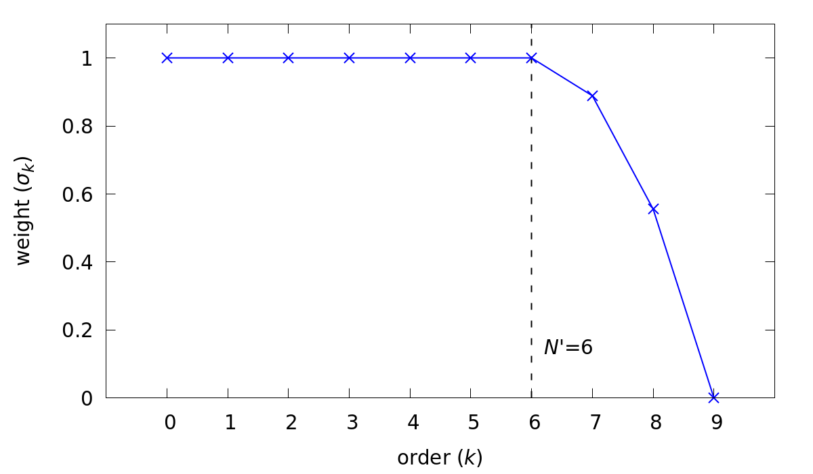
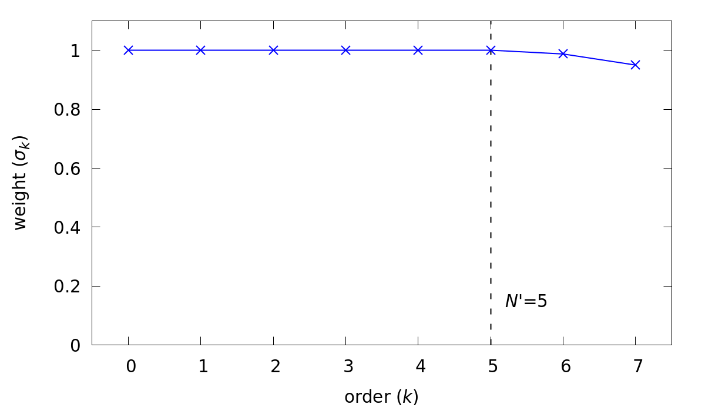

.. _sec:filter:

===================
Stabilizing Filters
===================

Nek5000 includes two options to implement a stabilizing filter.
Both methods will drain energy from the solution at the lowest resolved wavelengths, effectively acting as a sub-grid scale dissipation model.
A filter is necessary to run an LES turbulence model in *Nek5000* and spectral methods in general, as they lack the numerical dissipation necessary to stabilize a so-called "implicit LES" method, which relies on a lack of resolution to provide dissipation.
Both methods described here demonstrate spectral convergence for increasing polynomial order as they use the same underlying convolution operator, but apply it in different ways.

The convolution operator is applied on an element-by-element basis.
Functions in the SEM are locally represented on each element as :math:`N^{th}`-order tensor-product Lagrange polynomials in the reference element, :math:`\hat\Omega\equiv[-1,1]^3`.
This representation can readily be expressed as a tensor-product of Legendre polynomials, :math:`P_k`.
For example, consider

.. math::

  u(x)=\sum^N_{k=0}\hat u_k P_k(x)

:Reminder:
  :math:`N` is the polynomial order, :math:`N=` ``lx1`` :math:`-1` (See :ref:`the SIZE file<case_files_SIZE>`)

where :math:`u(x)` is any polynomial of degree :math:`N` on :math:`[-1,1]`.
As each Legendre polynomial corresponds to a wavelength on :math:`[-1,1]`, a filtered variant of :math:`u(x)` can be constructed from

.. math::

  \tilde u(x)=\sum^N_{k=0}\sigma_k\hat u_k P_k(x).

By choosing appropriate values for the weighting factors, :math:`\sigma_k`, we can control the characteristics of the filter.
In *Nek5000* we select a filter cutoff ratio, :math:`(N'+1)/(N+1)`, which can also be equivalently expressed as a number of filtered modes, :math:`N_{modes}=N-N'`.
Weights are chosen as

.. math::

  \sigma_k = 1\qquad\text{for}\qquad k\le N'\\
  \sigma_k < 1\qquad\text{for}\qquad k> N'

to construct a low-pass filter. 
An example is shown below in :numref:`fig:filter`.
The signal produced by this filter would have the highest Legendre mode (shortest wavelength) completely removed with the next two highest modes significantly diminished.
However, if the energy of the input signal is fully resolved on the first six modes, the filter would not affect the signal at all.

.. _fig:filter:

   Example of a strong low-pass filter.

We define :math:`F` as the matrix operation that applies for this one-dimensional low-pass filter.
From there, the convolution operator representing the three-dimensional low-pass filter, :math:`(G*)`, on the reference element, :math:`\hat\Omega`, is given by the Kronecker product :math:`F \otimes F \otimes F`

.. math::

  {\bf \tilde u} = G * {\bf u} = (F \otimes F \otimes F) {\bf u}.

:Important:
  The filtered wavelengths depend on the local element size, so the filtering operation is **NOT** uniform across the domain.

---------------
Explicit Filter
---------------

The explicit filter is based on a method described by Fischer and Mullen [Fischer2001]_.
It is so named as it applies a low-pass filtering operation directly to all the solution variables at the end of every time step, **explicitly** filtering the solution.
In the turbulence energy cascade, energy is transferred from large scales to lower scales.
In methods with negligible numerical dissipation, such as the SEM, this energy builds in the lowest resolved length-scales, or shortest resolved wavelengths. 
By applying a low-pass filter, *Nek5000* removes energy from the shortest wavelengths, acting as a sub-grid dissipation model and stabilizing the solution.

The explicit filter can be invoked by setting the ``filtering=explicit`` key in the ``[GENERAL]`` section of the ``.par`` file.
The weight is controlled by the ``filterWeight`` key and the cutoff ratio is controlled by either the ``filterCutoffRatio`` or the ``filterModes`` keys.
The ``filterWeight`` key controls the weight of the highest filtered mode

.. math::

  \sigma_N = 1 - {\tt filterWeight}

*Nek5000* will then parabolically decrease the effect of the filter for each subsequent lower mode until :math:`\sigma_{N'}=1`.

The cutoff ratio can be controlled by the ``filterCutoffRatio`` key

.. math::

 \frac{N'+1}{N+1} = {\tt filterCutoffRatio}

The cutoff ratio is assigned as a ``real``, while the corresponding value of :math:`N'` is restricted to integer values.
Consequently, *Nek5000* will pick a value of :math:`N'` to match the specified cutoff ratio as closely as possible.

:Note:
  For any non-zero value of ``filterWeight`` and ``filterCutoffRatio``:math:`<1`, *Nek5000* will always filter at least 1 mode.

It may be more intuitive to directly assign the number of modes with the ``filterModes`` key

.. math::

  N-N' = {\tt filterModes}

:Note:
  The ``filterModes`` key only supports :math:`N-N'\ge2`. To filter only one mode, use ``filterCutoffRatio = 0.99``.

The weights for each mode are printed to the logfile at the end of the first time step.
To verify your filter settings, look for the two lines highlighted below.
It will have two rows by :math:`(N+1)` columns.
The second row corresponds to the values for :math:`\sigma_k`, with :math:`\sigma_0` on the left and :math:`\sigma_N` on the right.

.. literalinclude:: filter/filter_out.txt
   :language: none
   :emphasize-lines: 2,3

In practice, for an LES turbulence model, we want to use as gentle of a filter as possible while maintaining stability.
The filtering method demonstrates spectral convergence, so for stronger settings, the LES solution will still converge in the limit of increasing polynomial order.
However, with a strong filter, we limit the effective resolution, so we want to limit the impact of the filter to take advantage of the full resolution that's available.  
Generally recommended settings for :math:`N\ge5` are as follows:

.. code-block:: ini

   [GENERAL]
   filtering = explicit
   filterModes = 2
   filterWeight = 0.05

This will set up a low-pass filter that touches the two highest Legendre modes and decreases the amplitude of the highest mode by 5%.
The weights for this filter are shown below in :numref:`fig:expfilt` for a 7\ :sup:`th`-order case.

.. _fig:expfilt:

   Weighting for the recommend explicit LES filter

:Note:
  The explicit filter is applied after every time, consequently its strength is inversely proportional to time step size for marginally resolved cases.

----------------
High-Pass Filter
----------------

Another method of applying sub-grid scale dissipation is through the use of a high-pass filter.
The high-pass filter in *Nek5000* is based on a method described by Stolz, Schlatter, and Kleiser [Stolz2005]_.
To implement it, a high-pass filter is constructed using the convolution operator described above.
For any scalar, this term has the form

.. math::

  \chi\left(u-\tilde u\right)

It is proportional to the difference between the original signal, :math:`u` and the low-pass filtered signal, :math:`\tilde u = G*u`.
In polynomial space, this term is only non-zero for the last few Legendre modes.
It is subtracted from the RHS of the momentum, energy, and scalar transport equations, respectively

.. math::

  \rho\left(\frac{\partial\mathbf u}{\partial t} +\mathbf u \cdot \nabla \mathbf u\right) &=- \nabla p 
    + \nabla \cdot \boldsymbol{\underline\tau} + \rho {\bf f} -\chi\left({\bf u} - G * {\bf u}\right)\\
  \rho c_{p} \left( \frac{\partial T}{\partial t} + \mathbf u \cdot \nabla T \right) &=
    \nabla \cdot (\lambda \nabla T) + q''' - \chi\left(T-G*T\right)\\
  \rho_i \left( \frac{\partial \phi_{i}}{\partial t} + \mathbf u \cdot \nabla \phi_{i} \right) &=
    \nabla \cdot (\Gamma_i \nabla \phi_{i}) + (q''')_i-\chi\left(\phi_i-G*\phi_i\right)

It acts to provide the necessary drain of energy out of the discretized system.

The high-pass filter can be invoked by setting the ``filtering=hpfrt`` key in the ``[GENERAL]`` section of the ``.par`` file.
The cutoff ratio is controlled by either the ``filterCutoffRatio`` or the ``filterModes`` keys, identically to the explicit filter.

The convolution operation for the high-pass filter completely removes the highest Legendre mode

.. math::

  \sigma_N = 0

The coefficients used to construct the low-pass filtered signal, :math:`\tilde u`, then decrease parabolically for each subsequent lower mode to 

.. math::

  \sigma_{N'}=1.

This corresponds to a strong low-pass filtering operation, similar to the one shown in :numref:`fig:filter`.

The overall strength of the high-pass filter is controlled by he proportionality coefficient, :math:`\chi`, which is set using the ``filterWeight`` key.

.. math::

  \chi = {\tt filterWeight}

.. code-block:: ini

   [GENERAL]
   filtering = hpfrt
   
