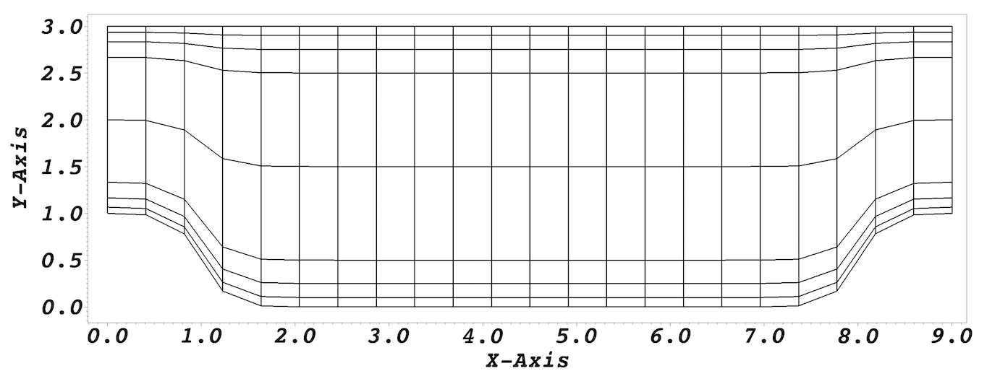

.. _quickstart2:

===========
Quickstart2
===========

This chapter provides a quick overview to using Nek5000 for some basic flow problems distributed
with Nek5000.
           
--------------------
Downloading the code
--------------------
The Nek5000 source code can be found by downloading the latest `tarball <https://github.com/Nek5000/Nek5000/releases/download/v17.0.0-beta2/nek5000_v17.0.0-beta2.tar.gz>`_.  Untar the file into your
home directory and you are all set. If you use our software, please cite the following:

::

  NEK5000 Version X.Y. Release date. Argonne National Laboratory, Illinois. 
  Available: https://nek5000.mcs.anl.gov.

-------------------
Directory structure
-------------------

Here’s a brief description of each top-level directory::

  /core

contains the Nek5000 application sources::

  /bin

contains scripts for running nek5000 and manipulating its output::

  /tools

contains the sources for the pre- and post-processing tools which are stand-alone::

  /short-tests

contains light-weight regression tests for verification::
  
  /run

consistent place for users to place their problem cases::

  /examples

reserved for the Nek5000 example problems::

  /doc

contains the user documentation in HTML and PDF::
  
  /3rd_party

its purpose it to provide a consistent place for 3rd party code.

---------------------
Case files
---------------------
::

   SIZE

contains some hardwired runtime parameters to dimension static arrays::

   foo.par

contains runtime parameters::

   foo.re2

contains mesh and boundary data::

   foo.ma2

contains partioning data::

   foo.usr

contains user specific code to initialize solver, set source terms and boundary conditions or to manipulate solver internals::

   foo.his

contains probing points::
 
   foo.f00000

contains checkpoint data::

   foo.nek5000

contains metadata for VisIt::

   foo.rea (legacy)

contains runtime parameters and mesh in ASCII. Replaced by .par and .re2 file::

   foo.map (legacy)

contains partioning data in ASCII

Note: The old legacy files (.rea & .map) are recommended for debugging purposes only.

-------------------
Scripts
-------------------

Let’s walk through some useful batch scripts:

- ``makenek <case>`` compiles your case
- ``nek/nekb <case>`` runs a serial job in foreground or background
- ``nekmpi/nekbmpi <case> <number of ranks>`` runs a parallel job
- ``neknek <case1> <cas2> <ranks 1> <ranks 2>`` runs Nek5000 with two overlapping component grids 
- ``visnek <case>`` creates metadata file required by `Visit <https://wci.llnl.gov/simulation/computer-codes/visit/>`_. 
- ``mvn <old name> <new name>`` renames all case files
- ``cpn <old name> <new name>`` copies all case files

----------------------------------
Running your very first simulation
----------------------------------

Hold your horses, this needs less than 5 min.

::

  cd ~
  tar -xvzf Nek5000_17.0.0.tar.gz
  export PATH=$HOME/Nek5000/bin:$PATH
  cd ~/Nek5000/tools; ./maketools genmap
  cd ~/Nek5000/run
  cp -r ../short_tests/eddy .
  cd eddy
  genmap                       # run partioner, on input type turbChannel
  makenek eddy_uv              # build case, edit script to change settings
  nekbmpi eddy_uv 2            # run Nek5000 on 2 ranks in the background
  echo -2 >ioinfo              # stop Nek5000 run and dump checkpoint
  visnek eddy_uv; visit -o eddy_uv.nek5000 # requires a VisIt installation

-------------------
Meshing
-------------------

Nek5000 is mainly a solver. However, simple box type meshes can be generated with the ``genbox`` tool. For more complex meshes please consider using ``PRENEK`` and the meshing tools ``nekmerge`` and ``n2to3``. We provide mesh converters like ``exo2nek`` and ``msh2nek`` which are quite handy if you want to use your favorite mesh generator. Also check our 
`Bazaar <https://github.com/Nek5000/NekBazaar>`_ for 3rd party meshing tools.

-------------------
Visualization
-------------------
Nek5000 output (fld) files can be read by `VisIt <https://wci.llnl.gov/simulation/computer-codes/visit/>`_ or 
`ParaView <https://www.paraview.org/>`_. There is also an build-in X-Window based postprocessor called ``POSTNEK`` located in tools.

-------------------
Troubleshooting
-------------------
If you run into problems compiling, installing, or running Nek5000, first check the User’s Guide. 
If you are not able to find a solution to your problem there, please send a message 
to the User’s Group `mailing list <https://lists.mcs.anl.gov/mailman/listinfo/nek5000-users>`_.

-------------------
Reporting Bugs
-------------------
Nek5000 is hosted on GitHub and all bugs are reported and tracked through the `Issues <https://github.com/Nek5000/Nek5000/issues>`_ feature on GitHub. 
However, GitHub Issues should not be used for common troubleshooting purposes. If you are having trouble 
installing the code or getting your model to run properly, you should first send a message to the User’s Group mailing list. 
If it turns out your issue really is a bug in the code, an issue will then be created on GitHub. If you want to request that a feature be added to the code,
you may create an Issue on GitHub.

-------------------
Contributing
-------------------
Our project is hosted on `GitHub <https://github.com/Nek5000>`_. Here are the most important things you need to know:

- follow the usual “fork-and-pull” Git workflow
- all development happens on the master branch
- anything in master is always deployable
- upcoming releases get their own tags out of master

If you are planning a large contribution, we encourage you to discuss the concept here on GitHub and interact with us frequently to ensure that your effort is well-directed.

-------------------
Tutorial
-------------------

This tutorial will describe how to run a case from scratch (i.e. creating the mesh, executing the Nek5000 solver, and visualizing the results). 
We illustrate this procedure through a relatively simple example involving isothermal, incompressible flow in a two-dimensional periodic hill domain.  Our implementation is loosely based on the case presented by Mellen et al. [Mellen2000]_. A thorough review
for this case can be found in the `ERCOFTAC <http://qnet-ercoftac.cfms.org.uk/w/index.php/Abstr:2D_Periodic_Hill_Flow>`_ knowledge base wiki.  

..........................
Generating the Mesh
..........................

We begin by generating a simple box mesh using the following input file (called ``hillp.box``)
to ``genbox``:

.. code-block:: none

   -2                     spatial dimension (will create box.re2)
   1                      number of fields
   #
   #    comments: two dimensional periodic hill
   #
   #========================================================
   #
   Box                                       hillp
   -22 8                                     Nelx  Nely
   0.0 9.0 1.                                x0 x1 ratio
   0.0 0.1 0.25 0.5 1.5 2.5 2.75 2.9 3.0     y0 y1 ratio
   P  ,P  ,W  ,W                             BC's:  (cbx0, cbx1, cby0, cby1)

For this mesh we are specifying 22 uniform elements in the stream-wise (x) direction. 8 non-uniform elements are specified in the span-wise (y) direction in order to
resolve the boundary layers. The boundary conditions are periodic in the x-direction and no-slip in the y. Additional details on generating meshes using ``genbox`` can be found in :doc:`geometry`.    

After running ``genbox`` to get the ``hillp.re2``, we run ``genmap`` to produce a ``hillp.map`` file.  We must now modify the geometry to create the hills.

..........................
Modify the Mesh, Set Flow-Rate, Initial Conditions
..........................

For a periodic hill, we will need to modify the geometry.  Let :math:`{\bf x} := (x,y)` denote the old geometry, and :math:`{\bf x}' := (x',y')` denote the new geometry.  For a domain
with :math:`y\in [0,3]` and :math:`x\in [0,9]` the following function will map the straight pipe geometry to a periodic hill:

.. math::

    y'(x,y) = y  + (3-y)(A + A\tanh(|x-B|-C)) .

where :math:`A=1/6, B=4.5, C=3.5`.  We have chosen these constants so that the height of the hill, :math:`h=1`. Note that, as :math:`y \longrightarrow 3`, the perturbation,
:math:`(3-y)(A+A\tanh(|x-B|-C)`, goes to zero.  So that near :math:`y = 3`, the mesh recovers its original form.

In Nek5000, we can specify this through ``usrdat2`` as follows

.. code-block:: fortran

   subroutine usrdat2
   include 'SIZE'
   include 'TOTAL'

   ntot = nx1*ny1*nz1*nelt

   sa   = 4.5
   sb   = 3.5
   sc   = 1.0/6.0

   do i=1,ntot
      xx = xm1(i,1,1,1)   
      argx = sb*(abs(xx-sa)-sb)
      A1   = sc + sc*tanh(argx)
      ym1(i,1,1,1) = ym1(i,1,1,1) + (3-ym1(i,1,1,1))*A1
   end do

   param(59) = 1.  ! Force nek5 to recognize element deformation.

   param(54) = 1   ! x-direction for Flow-Rate 
   param(55) = 2   ! Flow-Rate

   return
   end

.. _fig:hill_mesh:

    Modified box mesh graded

The last two lines in the ``usrdat2`` subroutine are used specify a constant flow-rate through our domain. This will ensure that a non-zero flow-field is sustained after a 
long time integration or at a steady-state. In this approach, Nek will specify a forcing function and adjust the mean pressure drop in order to sustain the requested flow rate (i.e. ``param(55)=2``). By specifying a ``1`` for ``param(54)`` we are indicating that we want the force in the x-direction (a value of ``2`` or ``3`` would indicate forces in the ``y`` or ``z`` directions
respectively).  In this example, the flow-rate is chosen in order to ensure that the mean velocity at the top of the hill :math:`\bar{u}_h = 1`.  

The next step is to specify the initial conditions. For this case, we initialize
the velocity with a quiescent field.  This can be done in the
subroutine ``useric`` as follows:

.. code-block:: fortran

   subroutine useric(ix,iy,iz,ieg)
   include 'SIZE'
   include 'TOTAL'

   e = gllel(ieg)
        
   ux = 0.0 
   uy = 0.0
   uz = 0.0

   return
   end

Before we proceed any further we note that the main non-dimensional parameter is the Reynolds number :math:`Re`, defined as  

.. math::

    Re = \frac{ \bar{u}_h h}{\nu} .

where :math:`\nu` is the kinematic viscosity. Based upon the geometric and flow-field settings noted above, we have :math:`Re=\frac{1}{\nu}`.    

..........................
Set parameters in ``.par`` file 
..........................

The par file for this case is given as

.. code-block:: fortran

    #
    # nek parameter file
    #
    [GENERAL]
    stopAt = endTime #numSteps
    numSteps = 1
    endTime  = 200

    variableDT = yes
    targetCFL  = 0.5
    timeStepper = bdf2 #char #steady

    writeControl = timeStep #runTime
    writeInterval = 200

    dealiasing = yes

    [PROBLEMTYPE]
    equation = incompNS

    [PRESSURE]
    residualTol = 1E-08
    residualProj = yes

    [VELOCITY]
    residualTol = 1E-12
    residualProj = yes
    density = 1
    viscosity = -100

In choosing ``viscosity = -100`` we are actually setting the Reynolds number to be :math:`Re = 100`.  For this Reynolds number, the flows remains laminar and we are interested in flow-field at the steady-state. 

We have set the calculation to stop at the physical time of :math:`T=200` (i.e. ``endTime=200``) which is roughly 22 flow-thru time units (based on the mean velocity :math:`\bar{u}_h` and length of periodic pitch, :math:`L=9`).  Additional details on the names of keys in the ``.par`` file (i.e. ``stopAt, numSteps, endTime, ...`` etc.) can be found in :doc:`user_files`. 

..........................
The SIZE file 
..........................

The ``SIZE.template`` file, which can be found in the ``/core`` directory, is modified and written as

.. code-block:: fortran
     
      integer ldim,lx1,lxd,lx2,lx1m,lelg,lelt,lpmin,lpmax,ldimt
      integer lpelt,lbelt,toteq,lcvelt
      integer lelx,lely,lelz,mxprev,lgmres,lorder,lhis
      integer maxobj,lpert,nsessmax,lxo
      integer lfdm

      ! BASIC
      parameter (ldim=2)               ! domain dimension (2 or 3)
      parameter (lx1=8)                ! p-order (avoid uneven and values <6)
      parameter (lxd=12)               ! p-order for over-integration (dealiasing) 
      parameter (lx2=lx1)              ! p-order for pressure (lx1 or lx1-2)
                                     
      parameter (lelg=200)             ! max total number of elements
      parameter (lpmin=1)              ! min MPI ranks
      parameter (lpmax=4)              ! max MPI ranks
      parameter (ldimt=2)              ! max auxiliary fields (temperature + scalars)

      ! OPTIONAL
      parameter (lhis=1000)            ! max history points
      parameter (maxobj=4)             ! max number of objects
      parameter (lpert=3)              ! max perturbation modes
      parameter (toteq=5)              ! max number of conserved scalars in cmt
      parameter (nsessmax=2)           ! max sessions
      parameter (lxo=lx1)              ! max grid size on output (lxo>=lx1)
      parameter (lelx=1,lely=1,lelz=1) ! global tensor mesh dimensions
      parameter (mxprev=20,lgmres=30)  ! max dim of projection & Krylov space
      parameter (lorder=3)             ! max order in time

      parameter (lelt=lelg/lpmin + 4)  ! max number of local elements per MPI rank
      parameter (lx1m=lx1)             ! polynomial order mesh solver
      parameter (lbelt=lelt)           ! mhd
      parameter (lpelt=lelt)           ! linear stability
      parameter (lcvelt=lelt)          ! cvode
      parameter (lfdm=0)  ! == 1 for fast diagonalization method

      ! INTERNALS
      include 'SIZE.inc'

For this tutorial we have set our polynomial order to be :math:`N=7` - this is defined in the ``SIZE`` file above as ``lx1=8`` which indices that there are 8 points in each spatial dimension of every element.  Note, the 
approximation order for the pressure is the same as it is for velocity (i.e. ``lx2=lx1``). Additional details on the parameters in the ``SIZE`` file are given in :doc:`user_files`.   

..........................
Compile 
..........................
With the ``hillp.par``, ``hillp.map``, ``hillp.re2``, ``hillp.usr``, and ``SIZE`` files created, we are now ready to compile.  First, ensure that all the files listed above
are in the same directory, for example ``/hillp.``  Copy the ``makenek`` file into this directory and compile::

  cp $HOME/Nek5000/bin/makenek .
  ./makenek hillp

If all works properly, upon compilation the executable ``nek5000`` will be generated using
``hillp.usr`` to provide user-supplied initial conditions and analysis.  Note that if you
encountered a problem during a prior attempt to build:: 

  ./makenek clean
  ./makenek hillp

________________________
Running a case in serial
________________________

.. highlight:: bash

Once compilation is successful, start the simulation by typing::

  nekb hillp

which runs the executable in the background (``nekb``, as opposed to ``nek``, which will run in the foreground).  
  
__________________________
Running a case in parallel
__________________________

.. highlight:: bash

If you are running on a multi-processor machine that supports MPI, you can also run this case via::

  nekbmpi hillp 4

which would run on 4 processors.    If you are running on a system that supports queuing for batch
jobs (e.g., pbs), then the following would be a typical job submission command::

  nekpbs hillp 4

In most cases, however, the details of the ``nekpbs`` script would need to be modified to accommodate an
individual's user account, the desired runtime and perhaps the particular queue.   Note that the
scripts ``nek``, ``nekb``, ``nekmpi``, ``nekbmpi``, etc. perform some essential file manipulations prior to
executing ``nek5000``, so it is important to use them rather than invoking ``nek5000`` directly.

Once execution is completed your directory should now contain multiple checkpoint files that look like this::

  hillp.f00000

----------------------------
Viewing the Example
----------------------------

The preferred mode for data visualization and analysis with Nek5000 is
to use `VisIt <https://wci.llnl.gov/simulation/computer-codes/visit/>`_. One can use the script *visnek*, to be found in ``/scripts``. It is sufficent to run:: 

  visnek hillp

*(or the name of your session)* to obatain a file named ``hillp.nek5000`` which can be recognized in VisIt.

In the Visit viewing window one can visualize the flow-field as depicted in
:numref:`fig:hill_flow`.

.. _fig:hill_flow:

.. figure:: figs/hill_flow_v3.png
    :align: center
    :figclass: align-center
    :alt: per_flow

    Steady-State flow field visualized in Visit. Vectors represent velocity. Colors represent velocity magnitude. Note, velocity vectors are equal size and not scaled by magnitude.   
