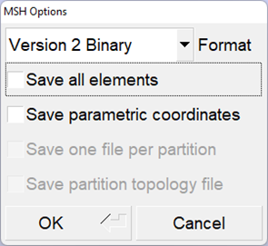

.. _tools_gms2nek:

--------
gmsh2nek
--------

*Nek5000* provides a conversion tool to convert `Gmsh <https://gmsh.info>` meshes (``.msh`` files) into Nek meshes (``.re2`` files) called ``gmsh2nek``.
The source code is located in ``nek5000/tools``, and it can be compiled from that directory with ``./maketools gmsh2nek``.
In addition to the compilers necessary to use *Nek5000*, ``gmsh2nek`` requires ``cmake``.
See :ref:`Before You Begin <qstart_before>` for more information on dependencies.
Once it is compiled, the executable will be available in ``nek5000/bin``.

Before converting a Gmsh mesh, make sure to save it with the appropriate format. 
Both ASCII and binary version 2 formats are supported.
The Binary format is recommend for large meshes.
The appropriate options from Gmsh are shown in :numref:`fig:gmshopts`.

.. _fig:gmshopts:

   Recommended options when saving a Gmsh mesh for compatibility with *Nek5000*
  
.. Note::

  Leave both boxes **unchecked** when exporting the mesh from Gmsh.

The procedure for running ``gmsh2nek`` is simpler compared to ``exo2nek``.
The expected input steps are as follows:

* It will first ask you for the dimension of the mesh (either 2 or 3).
* Next, it will ask for the input Gmsh file.
  The ``.msh`` extension is implied and should not be included.
* The tool will then begin converting the mesh and will print a summary of the boundary IDs.
* Finally, it will ask for the number of periodic boundary pairs (see :ref:`gmsh_pbound` below).
  If your mesh has none, simply enter 0.
* ``gmsh2nek`` will then output a new ``.re2`` file with the same file name as the input Gmsh file.

An example is shown below with the expected user input highlighted.

.. literalinclude:: gmsh2nek/gmsh.output
   :language: none
   :emphasize-lines: 1,2,14

When using a converted Gmsh mesh, the user must set up boundary condition in the ``.usr`` file in either the ``usrdat`` or ``usrdat2`` subroutines, e.g.

.. code-block:: fortran

  do iel=1,nelv
  do ifc=1,2*ndim
    id_face = BoundaryID(ifc,iel)
    if (id_face.eq.1) then        ! surface 1 for inlet 
       cbc(ifc,iel,1) = 'v  '
    elseif (id_face.eq.2) then    ! surface 2 for outlet
       cbc(ifc,iel,1) = 'O  '
    elseif (id_face.eq.3) then    ! surface 3 for wall
       cbc(ifc,iel,1) = 'W  '
    endif
  enddo
  enddo

or 

.. code-block:: fortran

  call setbc(1,1,'v  ') ! set bcID 1 to inlet for field 1 (velocity)
  call setbc(2,1,'O  ') ! set bcID 2 to outlet for field 1 (velocity)
  call setbc(3,1,'W  ') ! set bcID 3 to wall for field 1 (velocity)

.. _gmsh_pbound:

...................
Periodic Boundaries
...................

Periodic boundaries in *Nek5000* are implemented on a mesh connectivity level.
They must have a conformal element face distribution with a consistent offset vector.
Only translational periodicity is supported in ``gmsh2nek``.

:Example:
  The example below describes the expected inputs for a mesh with a single pair of periodic boundaries.

First, the user must provide the number of periodic surface pairs.
In this case, we have 1.

.. code-block:: console

  Enter number of periodic boundary surface pairs
  1

Next the user specifies which surface IDs are periodic.
Here, we set the inlet (sideset 1) to be periodic with the outlet (sideset 2).

.. code-block:: console

  input surface 1 and  surface 2  sideSet ID
  1 2

The sideset 1 element faces will be mapped to sideset 2 element faces accordingly.
However, this requires that you have conformal meshes on sidesets 1 and 2.
The ``P`` boundary tag will be assigned to the ``cbc`` array, while the sideset ID number is still avaialble in the ``BoundaryID`` array.

.. Note::

  Mulitple pairs of periodic boundaries are supported

..............................
Conjugate Heat Transfer Meshes
..............................

Coming soon!

.. About Conjugate Heat Transfer (CHT) mesh, you need to create a solid mesh that is conformal to the fluid mesh.
.. 
.. The following example shows how to assign boundary tag in usr file usrdat2() subroutine for CHT mesh
.. 
.. for velocity bc
.. 
..       do iel=1,nelv
..       do ifc=1,2*ndim
..         id_face = bc(5,ifc,iel,1)
..         if (id_face.eq.1) then        ! surface 1 for inlet 
..            cbc(ifc,iel,1) = 'v  '
..         elseif (id_face.eq.2) then    ! surface 2 for outlet
..            cbc(ifc,iel,1) = 'O  '
..         elseif (id_face.eq.3) then    ! surface 3 for wall
..            cbc(ifc,iel,1) = 'W  '
..         endif
..       enddo
..       enddo
.. 
.. for thermal bc
.. 
..       do iel=1,nelt
..       eg = gllel(iel)                 ! get global element number
..       do ifc=1,2*ndim
..         id_face = bc(5,ifc,iel,2)
..         if (eg.le.nelgv) then           ! for fluid domain
..           if (id_face.eq.1) then        ! surface 1 for inlet 
..              cbc(ifc,iel,2) = 't  '
..           elseif (id_face.eq.2) then    ! surface 2 for outlet
..              cbc(ifc,iel,2) = 'O  '
..           elseif (id_face.eq.3) then    ! surface 3 for wall, which connects to solid domain
..              cbc(ifc,iel,2) = 'E  '
..           endif
..         else                            ! for solid domain
..           if (id_face.eq.1) then        ! surface 1 for wall, which connects to fluid domain
..              cbc(ifc,iel,2) = 'E  '
..           elseif (id_face.eq.2) then    ! surface 2 for all external surfaces
..              cbc(ifc,iel,2) = 'I  '
..           endif
..         
..         endif
..       enddo
..       enddo

