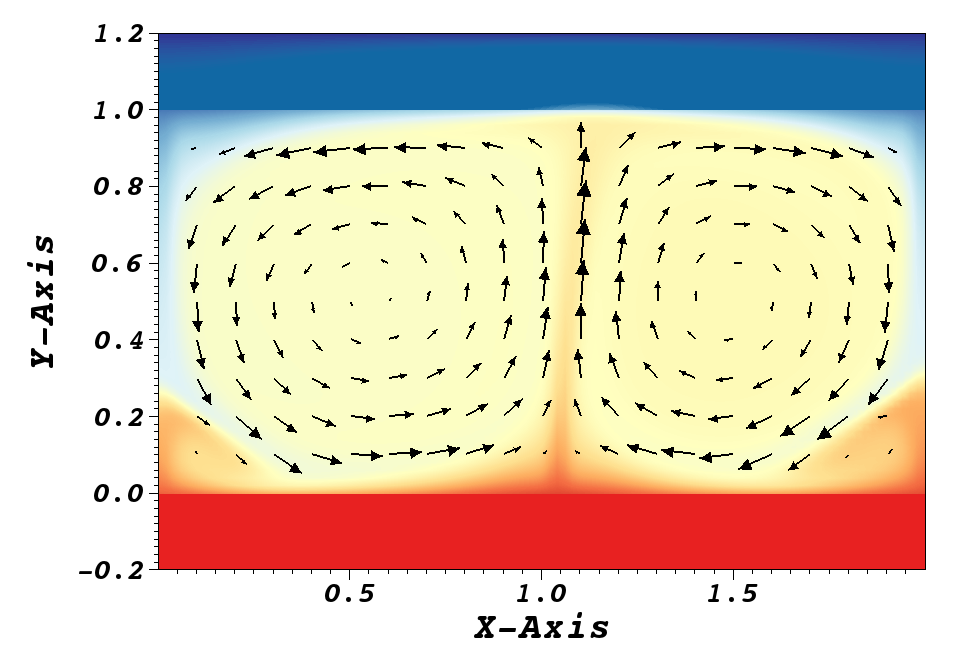

.. _conjht:

-------------------------
Conjugate Heat Transfer
-------------------------

In this tutorial, we want to simulate a simple 2D Rayleigh-Benard convection (RBC) flow using *Nek5000's* conjugate heat transfer capability. 
The conjugate heat transfer capability solves the energy equation across both solid and liquid subdomains.
in the case of RBC, this provides a continuous temperature profile through horizontal walls of finite thickness.
The modeled case corresponds to a simplified version of simulations performed by Foroozhani et al. [Foroozani2021]_.

If you are not familiar with *Nek5000*, we strongly recommend that you begin with the :ref:`periodic hill <perhill>` example first! 
Similarly, we start by generating a 2D mesh, and modify the case files for this instance afterwards and finally run the case.

..........................
Pre-processing
..........................
Users must always bear in mind, when setting up a test case in *Nek5000*, case files will need to be edited. 
Some samples can be found in the ``Nek5000/examples`` directory included with the release version.
Blank template files for the user file, ``zero.usr``, and the ``SIZE`` file, ``SIZE.template``, can be found in the ``Nek5000/core`` directory.
As a first step, the user should create a case directory in the corresponding run directory:

.. code-block:: none

   cd $HOME/Nek5000/run 
   mkdir conj_ht
   cd conj_ht

and copy the template files into this directory.
Additionally, this tutorial requires the ``ray0.rea`` file from the Rayleigh-Bernard example found in ``Nek5000/examples/rayleigh``.

We begin by creating the mesh with appropriate bounday conditions and then setting up the parameters and case files. 

..........................
Mesh generation
..........................

This tutorial requires that you have the tools ``genbox``, ``genmap``, and *preNek* compiled. 
Note that *preNek* requires the use of an xterminal.
Make sure the tools directory (typically ``Nek5000/bin``) is in your environment PATH. 
Before beginning, it is important to understand that there are two types of mesh topology: the "*v-mesh*" for the velocity and the "*t-mesh*" which can be used for the temperature and passive scalars.
The *v-mesh* (fluid subdomain) is always a subset of the *t-mesh* and the global element ID numbers of the *v-mesh* must preceed those of the *t-mesh*.
Therefore, we generate a *v-mesh* and *t-mesh* with appropriate BCs separately and later merge both subdomains using the conjugate heat transfer merge option in *preNek*.
This ensures the proper element ordering.

First, we create the mesh for the fluid part by creating the following input file in any text editor and running ``genbox``.
Note that any line beginning with '#' is a comment and is ignored by ``genbox``

.. code-block:: none

   ray0.rea
   2        spatial dimension
   2        number of fields
   #========================================================
   #
   #    Example of 2D  .box file for fluid. This gives 2 x 1 
   #    box with 20 x 10 elements
   #
   #    If nelx (y or z) < 0, then genbox automatically generates the
   #    grid spacing in the x (y or z) direction
   #    with a geometric ratio given by "ratio". 
   #    ( ratio=1 implies uniform spacing )
   #
   #========================================================
   #
   Box
   -20     -10         nelx,nely,nelz for Box)
   0.0    2.0   1.0    x0 x1 ratio
   0.0    1.0   1.0    y0 y1 ratio
   W  ,W  ,W  ,W  ,    V bc's  ! NB:  3 characters each !
   I  ,I  ,E  ,E  ,    T bc's  !      You must have 2 spaces!
   
It is worth mentioning that since we are running a 2D case, the input file named ``ray0.rea`` should be a 2D file, not a 3D file. 
In this example, the elements are distributed uniformly in the stream-wise (x) and span-wise (y) directions. 
All surfaces of the fluid domain are assumed to be wall boundaries, as indicated by ``'W  '``.
The lateral surfaces of the inner domain and solid walls are assumed to be adiabatic, denoted by ``'I  '``.
The thermal boundary conditions for the upper and lower face should be ``'E  '``, which indicates that they are *interior boundaries*.
This condition is not mandatory, as any boundary condition set on these faces will be overwritten by *preNek* when the solid and fluid domains are merged with *preNek*.
However, it is **HIGHLY RECOMMENDED** to assign any expected interior faces as ``'E  '``, as any unjoined interior boundaries will be caught later by *preNek*.
This is useful for identifying inconsistencies in mesh generation.

When ``genbox`` is run, the tool will produce a file named ``box.rea`` containing mesh, boundary condition, and simulation parameter information, which should be renamed to ``fluid.rea``. 

In the next step, we create the upper and lower solid parts of finite thickness h=0.2. 
The lower domain spans :math:`y \in [-0.2,0]` and the upper domain spans :math:`y \in [1,1.2]`.

**Note:** It is important to keep the *number of elements equal in the spanwise direction* for different parts.
This is to ensure that all the subdomains are conformal on their interfaces. 

Both domains can be generated simultaneously by ``genbox`` with the following input file:

.. code-block:: none

   ray0.rea
   2        spatial dimension
   2        number of fields
   #========================================================
   #
   #    This gives a 2 x 1 box with 20 x 5 elements
   #    here used for Rayleigh Benard convection.
   #
   #    Note that spatial dimension > 0 implies that box.rea
   #    will be ascii, requiring the ray0.rea template.
   #
   #========================================================
   #
   Box
   -20    -5           nelx,nely,nelz for Box)
   0.0    2.0   1.0    x0 x1 ratio
   -0.2   0.0   1.0    y0 y1 ratio
      ,   ,   ,   ,    V bc's  ! NB:  3 characters each, in order: -x, +x, -y, +y, (-z, +z)!
   I  ,I  ,t  ,E  ,    T bc's  !      You must have 2 spaces!!
   Box
   -20    -5           nelx,nely,nelz for Box)
   0.0    2.0   1.0    x0 x1 ratio
   1.0    1.2   1.0    y0 y1 ratio
      ,   ,   ,   ,    V bc's  ! NB:  3 characters each, in order: left, right, bottom, top
   I  ,I  ,E  ,t  ,    T bc's  !      You must have 2 spaces!!

There are a few things worth notice here.
First, no boundary conditions were given for the velocity.
As the generated mesh corresponds only to the solid domain, any provided BCs will be ignored by *Nek5000* at runtime and these are left as blank, ``'   '``, to indicate that the velocity is not defined on the solid mesh.
Second, Dirichlet boundaries, ``'t  '``, are prescribed for the temperature.
These will indicate which faces the ``userbc`` subroutine is called.
Finally, ``genbox`` does not perform any consistency checks, so even though the two domains are not connected, it will still produce a mesh file.
The tool will again produce a file named ``box.rea`` which should be renamed to ``solid.rea``. 

Then, we can run *preNek* to merge the fluid and solid subdomains. 
*preNek* can be invoked with either the GUI or text-based interface via the commands ``prex`` and ``pretex`` respectively.
While the GUI has more functionality, the text-based interface is useful for scripting.
Note that the GUI is displayed in either case, requiring an X-window.
The only difference is in how commands are input into *preNek*.
For this case the text-based interface will be used.

It is important to first enter the fluid domain file name and then the solid part. 
An example of running ``pretex`` is shown below, with the expected user input highlighted.

.. literalinclude:: conjht/pretex.txt
   :language: none
   :emphasize-lines: 2,8,9,11,13

Note that the ``.rea`` suffix is assumed when specifying files to *preNek*.
If all goes well, this will produce the ``combined.rea`` file.
*preNek* will check for boundary condition consistency before exiting. 
If it asks to assign any BCs, something is inconsistent with the box files. 

Now, the user needs to run the ``reatore2`` and ``genmap`` tools in order to produce the ``cht2d.re2`` and ``cht2d.ma2`` binary files respectively.
An example of running ``reatore2`` is shown, again with expected user input highlighted.

.. literalinclude:: conjht/reatore2.txt
   :language: none
   :emphasize-lines: 2,4

Note that ``reatore2`` will produce both a binary mesh file, ``cht2d.re2``, and a new rea file, ``cht2d.rea``. 
The options in the rea file are propagated from the original template, ``ray0.rea``, and will override the options we will later set in the par file, so it is recommend to either rename or delete the new rea file.
The produced mesh is shown in :numref:`fig:cht_mesh`.

.. _fig:cht_mesh:

.. figure:: conjht/mesh.png
    :align: center
    :figclass: align-center
    :alt: per_mesh

    Modified box mesh graded

..........................
usr file
..........................

The :ref:`user routines <case_files_usr>` file implements various subroutines to allow the users to interact with the solver.

To get started we copy the template to our case directory and then we modify its subroutines accordingly.

.. code-block:: none

   cp $HOME/Nek5000/core/zero.usr cht2d.usr 

User Data                    
_____________________________

*Nek5000* provides multiple subroutines useful for providing user data. 
These are ``usrdat``, ``usrdat2``, and ``usrdat3`` which are all called once at the begining of a run and appear towards the bottom of the template user file.
They are called at different times during initialization and the different use cases for each one can be significant, but for the purposes of this tutorial we focus only on basic input done in ``usrdat``.
By specifying the needed user parameters in ``usrdat`` and providing them in a common block, those parameters can easily be made available to any user subroutine.
The relevant lines describing the common block are highlighted for emphasis.
Note that they will appear in most of the modified subroutines.

.. literalinclude:: conjht/cht2d.usr
   :language: fortran
   :lines: 134-147
   :emphasize-lines: 6,7
      
Variable properties
_____________________________

In the :ref:`uservp subroutine <case_files_uservp>`, users can specifiy different variable properties for the fluid and solid subdomains independently. 
As an example, the thermal diffusivity of Copper is :math:`\alpha = 1.1 (10 ^ {-4})` [:math:`m^{2}/s`]. 
The thermal diffusivity ratio of Copper and liquid metal alloy GaInSn (Pr = 0.033) is 10 and the thermal diffusivity ratio of Copper and air (Pr = 0.7) is 5.2 [Foroozani2021]_.
The conductivity of the solid region is set by comparing the global element number, ``eg``, to the the total number of elements in the *v-mesh*, ``nelgv``.
The highlighted line indicates where this is done:

.. literalinclude:: conjht/cht2d.usr
   :language: fortran
   :lines: 17-34
   :emphasize-lines: 15

Note that the properties only vary between the fluid and the solid subdomains.
Properties with the fluid and solid respectively remain constant as provided by the ``cpfld`` array.
The ``cpfld`` array is filled with the values assigned in the par file according to:

.. csv-table:: The field coefficient array
   :header: "Parameter in the par file",
   :widths: 15, 15

   "viscosity","``cpfld(1,1)``"
   "density","``cpfld(1,2)``"
   "conductivity","``cpfld(2,1)``"
   "rhoCp","``cpfld(2,2)``"

Buoyancy model
______________

To account for buoyancy, the Buossinesq approximation is used. 
Rather than explicitly including a variable density, a body force of the form :math:`F = \rho g \beta (T-T_{ref})` is included.
Due to the choice of non-dimensionalization, this is implemented here simply as :math:`F = T`.
A body force is added to *Nek5000* in the ``userf`` subroutine, which is seen below. 
The highlighted line indicates where the buoyancy force is added in the *y*-direction.

.. literalinclude:: conjht/cht2d.usr
   :language: fortran
   :lines: 36-54
   :emphasize-lines: 15

In this study, the volumetric heat source is set to be zero, ``qvol = 0``, in the *t-mesh* which is the default behavior in the ``userq`` subroutine. 
So no modification to ``userq`` is necessary.

Initial & boundary conditions
_____________________________

The next step is to specify the initial and boundary conditions. 
We apply a linear variation of temperature in the fluid mesh in the *y*-direction where the lower surface of the lower plate is maintained at a high temperature, and the upper surface of the upper plate is maintained at a low temperature. 

In this RBC example :math:`Ra = 10 ^ {7}` and :math:`Pr= 0.033` are choosen. 
The equilibrium state of pure conductive heat transfer as the initial condition takes the form ``T = 1 - y`` for  ``0 < y < 1``  in the fluid domain and :math:`T \approx 1` and :math:`\approx 0` at the fluid-solid boundaries. 
It should be mentioned that the temperature drop across both solid-plates varies with *Pr* and *Ra* and it should be adjusted at the boundaries with temperature increment :math:`\delta T`. 
One can apply a temperature increment of :math:`\delta T = 2.5` at the top of the upper plate and the bottom of the lower plate for *Pr = 0.033* and :math:`\delta T = 4.72` for *Pr = 0.7* as depicted in :numref:`fig:deltaT2`.
Subsequently, we modify ``userbc`` and ``useric`` as:

.. literalinclude:: conjht/cht2d.usr
   :language: fortran
   :lines: 70-93
   :emphasize-lines: 20,21

.. literalinclude:: conjht/cht2d.usr
   :language: fortran
   :lines: 95-117
   :emphasize-lines: 14,17,19

.. _fig:deltaT2:

.. figure:: conjht/deltaT2.png
    :align: center
    :figclass: align-center
    :alt: per_flow
    
    Mean dimensionless temperature profiles in the CHT setting. Temprerature variation in solid-fluid domain is shown here. 

..........................
Control parameters
..........................

The control parameters for any case are given in the ``.par`` file.
For this case, using any text editor, create a new file called ``cht2d.par`` and type in the following:

.. literalinclude:: conjht/cht2d.par
   :language: ini

Note that if the file ``cht2d.rea`` exists within the case directory, *Nek5000* will preferentially read the case parameters from that file instead, which may result in errors or inconsistent results. 
In this example, we have set the calculation to stop after a physical time of 50 (``endTime = 50.0``) and write the checkpoint file every 1 physical time units (``writeInterval = 1.0``).
This will provide 50 snapshots of the developing velocity and temperature fields.
In choosing ``viscosity = 5.744563E-05`` and ``conductivity = 1.740776E-03``, actually we are setting the Rayleigh *Ra=10e7* and *Pr=0.033*. 
By omitting the ``[PRESSURE]`` and ``[PROBLEMTYPE]`` categories, we are telling the solver to use default values for the necessary parameters.
Additional details on available settings in the par file are available :ref:`here <case_files_par>`.

..........................
SIZE file 
..........................

The static memory layout of *Nek5000* requires the user to set some solver parameters through a so called ``SIZE`` file.
Typically it's a good idea to start from the template.
If you haven't already, copy the ``SIZE.template`` file from the core directory and rename it ``SIZE`` in the working directory:

.. code-block:: none

   cp $HOME/Nek5000/core/SIZE.template SIZE

Then, adjust the following parameters in the BASIC section.
The only one you will likely need to change is the number of global elements on the highlighted line.

.. literalinclude:: conjht/SIZE
   :language: fortran
   :lines: 11-20
   :emphasize-lines: 7
      
For this tutorial we have set our polynomial order to be :math:`N=7` - this is defined in the ``SIZE`` file above as ``lx1=8`` which indices that there are 8 points in each spatial dimension of every element.
Additional details on the parameters in the ``SIZE`` file are given :ref:`here <case_files_SIZE>`.  

..........................
Compilation 
..........................

You should now be all set to compile and run your case!
As a final check, you should have the following files:

 * :download:`cht2d.usr <conjht/cht2d.usr>`
 * :download:`cht2d.par <conjht/cht2d.par>`
 * :download:`cht2d.re2 <conjht/cht2d.re2>`
 * :download:`cht2d.ma2 <conjht/cht2d.ma2>`
 * :download:`SIZE <conjht/SIZE>`

If for some reason you encountered an insurmountable error and were unable to generate any of the required files, you may use the provided links to download them.
After confirming that you have all five, you are now ready to compile::

  makenek cht2d

If all works properly, upon compilation the executable ``nek5000`` will be generated and you will see something like:

.. literalinclude:: conjht/buildlog.txt
   :language: none

Note that compilation only relies on the user file and the SIZE file.
Any changes to these two files will require recompiling your case!
Now you are all set, just run

.. code-block:: bash

  nekbmpi cht2d 4

to launch an MPI jobs on your local machine using 4 ranks. The output will be redirected to ``logfile``.

...........................
Post-processing the results
...........................

Once execution is completed your directory should now contain multiple checkpoint files that look like this::

  cht2d.f00001
  cht2d.f00002
  ...

The preferred mode for data visualization and analysis with *Nek5000* is
to use Visit/Paraview. One can use the script *visnek*, to be found in ``/scripts``. It is sufficent to run:: 

  visnek cht2d

*(or the name of your session)* to obtain a file named ``cht2d.nek5000`` which can be recognized in Visit/Paraview.

In the viewing window, one can visualize the temperature-field. 
It will be similar to, but not necessarily identical to that shown in :numref:`fig:cht_rbc`.

.. _fig:cht_rbc:

    Steady-State flow field visualized in Visit/Paraview. Vectors represent velocity. Colors represent velocity magnitude.  

