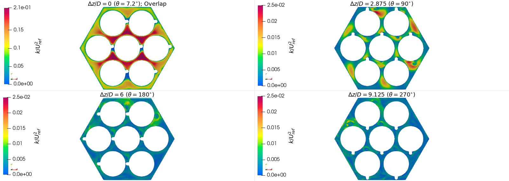

.. _multi_rans:

-----------------------------------
Multi-Component RANS 
-----------------------------------

This is an advanced tutorial comprising RANS simulation in a multi-component geometry. 
The components include an inlet nozzle coupled with a wire-pin bundle. 
Given the scale of the geometry and mesh used in this  tutorial, it is assumed that the user has access to a computing cluster for running the case. 
The final mesh for the inlet nozzle contains 662,360 hexahedral elements and the wire-wrapped fuel bundle contains 207,360 hexahedral elements.
The NekNek module is used for interfacing between the two components, allowing for runtime transfer of field data and coupled simultaneous solution of the flow and temperature equations. 
The tutorial employs several advanced  Nek5000 tools, procedures and user routines including

 * ``exo2nek`` for importing third party mesh file to Nek5000
 * ``reatore2`` for converting ASCII Nek5000 mesh to binary format
 * ``gencon`` for generating mesh connectivity file
 * ``wiremesher`` for generating wire-wrapped pin bundle mesh
 * ``nekamg_setup`` for generating algebraic multi-grid solver (AMG) files
 * :math:`k-\tau` RANS simulation setup 
 * ``NekNek`` setup

..........................
Before You Begin
..........................

It is highly recommended that new users familiarize themselves with the basic Nek5000 simulation
setup files and procedures outlined in the :ref:`fdlf` and :ref:`perhill` tutorials. Further, some 
sections of the tutorial will assume familiarity with :ref:`tutorial_rans` and :ref:`neknek` tutorials.

.. Warning::
  The RANS models rely on setting an implicit source term for robustness. This is not supported in V19 or earlier versions of *Nek5000*. Any implementation of RANS models should use the latest master branch from github.

..........................
Case Overview
..........................

All required files for this tutorial can be downloaded using the following link:

* :download:`inlet_bundle.tar.gz <multi_rans/inlet_bundle.tar.gz>`

Extract the above tar file and navigate to the ``inlet_bundle`` (parent) directory

.. code-block:: console

 $ tar -xzvf inlet_bundle.tar.gz
 $ cd inlet_bundle
	
It has the following directories and files, discussed in detail in the following sections:

* ``inletMesh`` --> Directory containing inlet mesh related files.
* ``bundleMesh`` --> Directory containing pin-wire bundle mesh related files.
* ``SIZE`` --> Parameter file for defining problem size.
* ``inlet_bundle.usr`` --> Fortran file for user specified subroutines.
* ``inlet.par`` --> Nek5000 parameter file.
* ``bundle.par`` --> Nek5000 parameter file.
* ``SPLINE`` --> Common block Fortran file for spline interpolation.
* ``InletProf.dat`` --> Inlet condition data file.
* ``neknekk`` --> Sample script for launching NekNek job (on Sawtooth cluster).

..............................
Geometry Description
..............................

The geometry under consideration consists of two components including an inlet nozzle connected to a wire-wrapped pin bundle.
These are shown below with the inlet nozzle domain in red and the pin bundle domain in light gray. 
The bundle geometry is based loosely on the Advanced Burner Reactor [Grandy2007]_ and the inlet nozzle is based on designs considered for the Versatile Test Reactor [Yoon2021]_.

.. _fig:sfr_geom:

.. figure:: multi_rans/geom.png
   :align: center
   :figclass: align-center

   Component geometries including an inlet nozzle (red) connected to a wire-wrapped pin bundle (gray)
   
The geometry is non-dimensionalized with respect to the pin diameter, :math:`D`. 
The axial extent of the inlet nozzle component is :math:`z/D=[-4.75,0.25]` and the wire-pin bundle axial dimensions are :math:`z/D=[0,12.5]`.  
The two components, therefore, have an axial overlap of :math:`\Delta z/D= 0.25`, while the lateral dimensions are conformal. 
The inlet nozzle has an inlet diameter of :math:`D_{in}/D=1.875`. 

.. Note::

  A reasonable overlap in the computational domains is imperative for a robust ``NekNek`` simulation.
  As a general rule, increasing the extent of overlap will render more stability to the coupled solver.

The Pitch-to-diameter ratio of the wire-pin bundle is 1.13 and the wire diameter is :math:`D_w/D=0.12875`. 
To prevent sharp corners, a fillet of diameter :math:`D_f/D=0.05` is introduced between the pin and the wire and the wire is slightly submerged in the pin by a distance of :math:`0.025D_w`.
The side length of the hexagonal bundle is :math:`1.865D` and the diameter of the inlet nozzle boundary is :math:`D_{in}/D=1.875`.
The length of the bundle component is equal to the wire pitch, :math:`L_b/D=12.5`.
All geometric values are given in both dimensional and dimensionless form in the next section in :numref:`tab:nb_BC` along with other flow parameters.

.....................................................
Thermal-hydraulic Parameters and Boundary Conditions
.....................................................

For non-dimensionalizing this case, the pin diameter and inlet velocity are chosen as reference values.
This leads to the definition of Reynolds number as

.. math::

  Re = \frac{U_{in}D_{pin}}{\nu}

It is also useful to define the inlet Reynolds number as

.. math::

  Re_{in} = \frac{U_{in}D_{in}}{\nu}=\frac{D_{in}}{D_{pin}}Re

and an alternate bundle Reynolds number as

.. math::

  Re_b = \frac{U_{b}D_h}{\nu}=\frac{A_{in}}{A_{b}}\frac{D_h}{D_{pin}}Re

The bundle area is approximated as

.. math::

  A_b = A_{hex} - N_{pins}\frac{\pi}{4}\left( D_{pin}^2 + D_w^2\right)

and the hydraulic diameter as

.. math::

  D_h = \frac{4 A_b}{P_{hex}+N_{pins}\pi\left(D_{pin}+D_w\right)}

For this case, an inlet velocity of :math:`U_{in}=1` m/s was chosen.
This gives an inlet Reynolds number of :math:`Re_{in}=60,000`, a bundle Reynolds number of :math:`Re_b\approx9800`, and a case Reynolds number of :math:`Re = 32,000`
All flow and thermal properties are listed in :numref:`tab:nb_BC`. 

A no-slip boundary condition is  specified on all walls and the corresponding values of :math:`k` and :math:`\tau` on the walls is zero. 
A constant non-dimensional temperature :math:`T^*=1` is specified at the inlet and a non-dimensional heat flux of :math:`q'' =1` is applied on the pin walls from half axial length of the bundle. 
An insulated wall condition is specified on all remaining boundaries. 
A Prandtl number of 0.005 was chosen corresponding to liquid Sodium and an increased turbulent Prandtl number was chosen to account for turbulent mixing.

.. _tab:nb_BC:

.. csv-table:: Flow and Thermal Properties 
   :header: Parameter, Variable, Dimensional Value, Dimensionless Value

   Pin diameter, :math:`D_{pin}`, :math:`8` mm, :math:`1` (reference)
   Wire diameter, :math:`D_{w}`, :math:`1.03` mm, :math:`0.129`
   Inlet diameter, :math:`D_{in}`,:math:`15` mm ,:math:`1.875`
   Hydraulic diameter,:math:`D_h`,:math:`3.06` mm,:math:`0.383`
   Inlet velocity,:math:`U_{in}`,:math:`1.0` m/s,:math:`1` (reference)
   Bundle velocity,:math:`U_b`,:math:`0.801` m/s,:math:`0.801`
   Kinematic viscosity,:math:`\nu`,:math:`2.5\cdot(10^{-7})` m\ :sup:`2`\ /s,:math:`3.125\cdot(10^{-5})`
   Thermal diffusivity,:math:`\alpha`,:math:`5.0\cdot(10^{-5})` m\ :sup:`2`\ /s, :math:`6.25\cdot(10^{-3})`
   Reynolds number, :math:`Re`, -- , :math:`32000`
   Inlet Reynolds number, :math:`Re_{in}`, -- , :math:`60000`                           
   Bundle Reynolds number, :math:`Re_{b}`, --, :math:`9814`
   Prandtl number, :math:`Pr`,--, :math:`0.005`                           
   Peclet number, :math:`Pe`,--, :math:`160`               
   Turbulent Prandtl number, :math:`Pr_t`,--, :math:`1.5`                             

...............
Mesh Generation
............... 

########################
Inlet Nozzle (exo2nek)
########################

A third-party meshing tool (e.g., ANSYS ICEM) is required for generating the mesh for the inlet component.
In this case, the mesh was saved as an ``EXODUS II (.exo)`` mesh file. 
*Nek5000* offers the ``exo2nek`` mesh conversion tool for converting an ``.exo`` mesh file to ``.re2`` format, as well as ``gmsh2nek`` for converting ``.msh`` files from Gmsh.
For more information see :ref:`tools_exo2nek`.

By default, all Nektools support only 150,000 elements. 
To run this case, ``exo2nek`` and ``gencon`` will need to be compiled with support for considerably more elements. 
To do this, go to the ``Nek5000/tools`` directory and edit the ``maketools`` file.

.. code-block:: console

  $ cd ~/Nek5000/tools
  $ vi maketools

Uncomment the line specifying the maximum number of elements and change it to a value larger than the number of elements in the largest mesh, such as that shown on the highlighted line below.

.. literalinclude:: multi_rans/maketools
   :emphasize-lines: 4

The ``exo2nek`` and ``gencon`` tools can then be recompiled with

.. code-block:: console

  $ ./maketools exo2nek gencon

.. Note::

  If you still get errors about the tools not supporting enough elements, you may need to delete the ``exo2nek`` or ``gencon`` binary in ``Nek5000/bin`` and the corresponding ``*.o`` files in the tool's subdirectory manually before recompiling.
  Executing ``$ ./maketools clean`` will also work, but this will delete **all** of the tools.

The above command will compile the ``exo2nek`` and ``gencon`` tools. 
The latter is required for :ref:`generating the mesh connectivity <multi_gencon>` file at a later step.  

Currently, ``exo2nek`` supports the following mesh elements,

 * 1\ :sup:`st` order tetrahedra, ``TET4``
 * 1\ :sup:`st` order wedges, ``WEDGE6``
 * 1\ :sup:`st` order hexahedra, ``HEX8``
 * 2\ :sup:`nd` order tetrahedra, ``TET10``
 * 2\ :sup:`nd` order wedges, ``WEDGE15``
 * 2\ :sup:`nd` order hexahedra, ``HEX20``

The user must ensure that the third-party mesh comprises only the above listed element types. 
The ``inlet.exo`` file included with this tutorial contains 165590 ``TET4`` elements.
The ``exo2nek`` tool includes built-in tet-to-hex and wedge-to-hex conversions, so the 165590 tetrahedral elements will be converted to 662360 hexahedral elements.
Navigate to the folder containing inlet mesh and run ``exo2nek``.

.. code-block:: console
	
  $ cd inletMesh
  $ exo2nek

The output from ``exo2nek`` is shown below, where the expected user input is highlighted.
The inputs are explained as:

 * We are converting the file ``inlet.exo``, where the ``.exo`` file extension is implied.
 * This case does not use a conjugate heat transfer model, so there are 0 solid ``.exo`` files.
 * This case is not periodic, so there are 0 periodic boundary surface pairs.
 * The produced file will be named ``inlet.re2``, where the ``.re2`` file extension is again implied.

.. literalinclude:: multi_rans/exo2nek.output
   :language: none
   :emphasize-lines: 2,4,28,59,61
	
Following the above steps will generate the file ``inlet.re2`` in the current directory. 
For the inlet nozzle component, the following boundary IDs are assigned:

 * 2 --> Nozzle inlet
 * 3 --> Interfacing surface (nozzle outlet/bundle inlet)
 * 4 --> Walls

These are generated from the sideset numbers assigned when generating the original mesh.
As a basic sanity check, ``exo2nek`` prints out any sideset IDs it finds.

.. Note::
  The ``sideSet ID`` for all mesh boundaries must be specified in the ``.exo`` file using the third-party meshing software of the user's choice. 
  These values are accessible in *Nek5000* in the ``BoundaryID`` array.

Return and move the mesh file to the parent directory:

.. code-block:: console

   $ cd ../
   $ mv inletMesh/inlet.re2 .

#############################
Wire-pin Bundle (wiremesher)
#############################

To generate the pin-wire bundle mesh, navigate to the ``wireMesh`` folder:

.. code-block:: console

   $ cd wireMesh
	
It contains two sub-directories, viz., ``wire2nek`` and ``matlab``. Input parameters for the meshing 
script are specified in the header of the ``matlab/wire_mesher.m`` file, as shown:

.. literalinclude:: multi_rans/inlet_bundle/bundleMesh/matlab/wire_mesher.m
	:language: matlab
	:lines: 1-20
	
All input variables are annotated in the above code snippet. 
Although all input dimensions shown are in ``mm``, the script produces the wiremesh in non-dimensional units, normalized with pin diameter ``D``. 
It will usually take some heuristic experimentation to specify optimum parameters based on user requirements (such as resolution, number of elements, etc.).
Additionally some combinations of parameters may result in invalid elements with small or negative Jacobians. 
Critical parameters, that control the mesh resolution and contribute towards a successful mesh, include: 

 * ``Df`` --> Higher fillet diameter will be less likely to cause any errors and produce a smoother mesh. Should be adjusted to a reasonable value.
 * ``T`` --> Trims off a portion of the wire to avoid pinching between the wire and neighboring pin. Typically set to ``0.05*Dw``.
 * ``S`` --> Submerges the wire slightly into the pin to avoid sharp corners. Typically set to :math:`0.025*Dw`.
 * ``Adjust`` --> Ensures trimming only occurs if wire passes neighboring pins. Typically set to 1.
 * ``iFtF`` --> (Deprecated) Adds a layer next to outer wall. Set to 0.
 * ``FtF_rescale`` --> (Deprecated) Inactive i:math:f ``iFtF=0``. 
 * ``G`` --> Controls gap between peripheral wire and outer wall. Adjust to needed value.
 * ``ne`` --> controls the number of pins in the radial direction. ``ne=2`` will produce a bundle with 7 pins, ``ne=3`` will produce 19 pins, and so on. 
 * ``Col`` --> Controls the resolution in the azimuthal direction.
 * ``Row`` --> Controls the resolution in radial direction. 
 * ``Rowdist`` --> Controls layer width distribution percentage in radial direction, from interior to pin wall. Must add up to 100 and entries must be equal to ``Row``.
 * ``Lay`` --> Controls resolution in axial direction. Specifies number of elements in axial length equal to 60 degree rotation of wire.  

.. Note::
  If you encounter Jacobian errors with your mesh, try increasing the fillet diameter, ``Df`` or number of columns, ``Col``.

The preset values included with the tarball should not be changed for this tutorial as the overlapping geometry between the components is fixed.
The mesher is initiated by simply running the ``doall.sh`` bash script. 
Ensure that both Matlab and Python with numpy (tested with Python 3.8) are active before launching the script and that either ``gfortran`` or ``ifort`` is available. 
By default the ``wire2nek`` converter utility looks for ``gfortran``.
To use ``ifort`` instead, the compiler script ``bundleMesh/wire2nek/compile_wire2nek`` must be modified.

.. code-block:: console

   $ ./doall.sh
	
The script can take a while to complete. 
Upon completion it generates the ``wire_out.rea`` mesh file, which is a legacy ASCII mesh file for *Nek5000*. 
Convert this into the binary format by running the ``reatore2`` tool. 
Follow the prompts:

.. code-block:: console

   Input .rea name:
   wire_out
	
.. code-block:: console

   Input .rea/.re2 output name:
   bundle
	
We finally obtain the ``bundle.re2`` file which contains the pin-wire bundle mesh in the *Nek5000* format. 
Boundary IDs are assigned by the ``wiremesher`` as:

 * 1 --> Fuel pin, wire, and fillet walls
 * 2 --> Bundle hexagonal (outer) walls
 * 3 --> Axial inlet surface
 * 4 --> Axial outlet surface

which are available in the ``.usr`` file in the ``BoundaryID`` array.
Return and move the mesh file to the parent directory:

.. code-block:: console

   $ cd ../
   $ mv bundleMesh/bundle.re2 .

.. _multi_gencon:
 
####################################
Generating Connectivity file (.co2)
####################################

After generating the mesh files for both components, it is necessary to generate the corresponding connectivity files using the ``gencon`` tool. 
Note that using ``gencon`` instead of ``genmap`` -- which generates  map (``.ma2``) files -- is the recommended procedure for large meshes. 

.. Note::

  If compiled to support a large number of elements, ``genmap`` can be used to generate the ``.ma2`` file as an alternative to ``gencon`` and parRSB.
  However, for large meshes this can take a **very** long time.

Users must include ``PARRSB`` in the ``PPLIST`` in the ``makenek`` file, which instructs *Nek5000* to partition the mesh at run-time and requires the ``.co2`` file instead of the ``.ma2`` file for running the case. 
See :ref:`build_pplist` for details on ``PPLIST`` and ``makenek``.
It is recommended to copy ``makenek`` from ``Nek5000/bin`` into the project directory to edit.

.. Warning::

  Editing the copy of ``makenek`` in the ``Nek5000/bin`` directory directly can have unintended side-effects when trying to recompile other cases.

Run ``gencon`` from the parent folder for each mesh file. 
Users will be prompted to specify the mesh file name and tolerance.
Use 0.01 for inlet and 0.2 (default) for the bundle mesh:

.. literalinclude:: multi_rans/gencon.inlet
   :language: none
   :emphasize-lines: 2,5

.. literalinclude:: multi_rans/gencon.bundle
   :language: none
   :emphasize-lines: 2,5

The above will generate the ``inlet.co2`` and ``bundle.co2`` connectivity files, respectively.

.........................................
Parameter File (.par)
.........................................

Using NekNek requires separate ``.par`` files for each of the components. 
The files are included in the parent folder and shown below:

.. literalinclude:: multi_rans/inlet_bundle/inlet.par
   :language: ini
	
.. literalinclude:: multi_rans/inlet_bundle/bundle.par
   :language: ini
	
Both parameter files are identical, except for one important difference. 
To restart the case from any given time, separate restart file names should be specified to the ``startFrom`` parameter. 
It is critical that the properties and time step size are identical for both ``.par`` files. 
Values are assigned in dimensionless form -- density is set to unity, viscosity and diffusivity are set to :math:`-Re` and conductivity to :math:`-Pe`.
The negative values indicate that the solver is run in dimensionless form.

Note that given the large size of the meshes, the ``preconditioner`` must be set to ``semg_amg_hypre``. 
This invokes the algebraic multigrid (AMG) solver for pressure instead of the default ``XXT`` solver. 
The AMG preconditioner requires third party ``HYPRE`` libraries which must be included in the preprocessor list option in the ``makenek`` file.

.. Note::

  By default, *Nek5000* does not support using the default ``XXT`` preconditioner for meshes with :math:`E\ge250,000`.
  Generally, the AMG preconditioners perform better for larger meshes.

As mentioned above, it is recommended to copy ``makenek`` from ``Nek5000/bin`` into the project directory to edit.
Also including the ``PARRSB`` option, as mentioned earlier, the ``PPLIST`` should be:

.. code-block:: console
	
	PPLIST = "HYPRE PARRSB"

Further details on all parameters of ``.par`` file can be found :ref:`here <case_files_par>` and further information on ``PPLIST`` is available :ref:`here <build_pplist>`. 
 
.........................................
User Routines (.usr file)
......................................... 

Basics of the required setup routines for a NekNek simulation can be found in the :ref:`neknek` turorial, while for a RANS simulation
in the :ref:`tutorial_rans` tutorial. Although this section decribes all user routines required for a NekNek RANS simulation in detail, 
a comprehensive understanding of routines from these simpler cases is recommended before proceeding.

The following files are required to be included in the ``.usr`` file for loading RANS related subroutines
They can be included anywhere in the ``.usr`` file outside of a subroutine, but we recommend keeping them at the top for consistency and quick reference.

.. literalinclude:: multi_rans/inlet_bundle/inlet_bundle.usr
	:language: fortran
	:lines: 17-18
	
NekNek related parameters are specified in ``usrdat`` routine:

.. literalinclude:: multi_rans/inlet_bundle/inlet_bundle.usr
	:language: fortran
	:lines: 223-242
		
The ``ngeom`` variable specifies the number of overlapping Schwarz-like iterations, while ``ninter`` controls the time extrapolation order of boundary conditions at the overlapping interface. 
Using ``ninter=1`` is unconditionally stable, while a higher temporal order will typically require more iterations for stability (``ngeom>2``). 
For computational savings, we maintain first order temporal extrapolation for this tutorial. 
The number of total field arrays that are transferred between the two meshes is specified by ``nfld_neknek``. 
For 3D RANS cases it must be equal to 7 (3 velocity, 1 pressure and 3 scalar field arrays - temperature,
:math:`k` and :math:`\tau`).

.. Note::

  Ensure that proper common block headers are included in subroutines. 
  The ``NEKNEK`` header is required for routines where ``idsess``, ``nfld_neknek``, the ``valint`` array, and other NEKNEK variables need to be accessed.
	
Boundary Condition specification and RANS initialization is performed in ``usrdat2``:

.. literalinclude:: multi_rans/inlet_bundle/inlet_bundle.usr
	:language: fortran
	:lines: 243-311
	
The NekNek solver launches two Nek5000 sessions simultaneously and field data transfer is performed between the two sessions on each time iteration. 
Each session is assigned a unique sequential ID, stored in the variable ``idsess``.
Here, ``idsess=0`` is assigned to the inlet component solve and ``idsess=1`` to bundle component. 
Boundary conditions are assigned using this variable for each component, as shown above. 

.. Note::

  The ``idsess`` variable is determined by the call order during job submission. 
  See :ref:`sec:compile` for more information.

Recall the boundary IDs assigned to each component during the mesh generation process, described in the preceding section.
Character codes for different boundary conditions are stored in the ``cbc`` array. Their detailed description can be found in
:ref:`boundary-conditions`. For each component, the nested loops go through all elements and their faces, populating
``cbc`` array for all fields based on mesh assigned boundary IDs. Note that ``int`` boundary condition
must be assigned to the overlapping surfaces of the inlet and bundle components. ``int`` condition is replaced 
internally with Dirichlet boundary conditions subsequently by Nek5000. Flux boundary condition, ``f``, is assigned to
pin walls for temperature field while insulated, ``I``, is assigned to all other walls.

With regards to RANS initialization; ``m_id=4`` selects the :math:`k-\tau` RANS model and ``w_id=2`` selects the
wall distance computing algorithm. :math:`k` and :math:`\tau` fields are stored in the 3rd and 4th index, respectively, 
specified with ``ifld_k`` and ``ifld_omega``. Set ``ifcoeffs`` to ``.true.`` only if user specified RANS coefficients
are required. For details on the RANS related parameters, refer :ref:`tutorial_rans` tutorial.  

.. Note::

	``rans_init`` must be called after populating ``cbc`` array

For RANS simulation, diffusion coefficients are assigned in the ``uservp`` routine. The routine used here remains 
nearly identical to the :ref:`tutorial_rans` tutorial:

.. literalinclude:: multi_rans/inlet_bundle/inlet_bundle.usr
	:language: fortran
	:lines: 20-54
	
Only turbulent Prandtl number is changed to ``Pr_t=1.5`` for this tutorial. This value is more appropriate for 
molten sodium salts as compared to the default value of 0.85 (for air), which is assigned through ``rans_turbPrandtl()`` 
function call.

Source terms for the temperature and scalar equations are assigned through ``userq``. The routine here is identical
to the basic :ref:`tutorial_rans` case:

.. literalinclude:: multi_rans/inlet_bundle/inlet_bundle.usr
	:language: fortran
	:lines: 79-106

Note that either component does not have any volumetric source heat source and hence ``qvol=0`` for temperature
field (``ifield.eq.2``).

Initial conditions are specified in ``useric``. Similar values are assigned to both components and, thus, the routine
implementation is straightforward. Temperature is initalized to 1 for both components.

.. literalinclude:: multi_rans/inlet_bundle/inlet_bundle.usr
	:language: fortran
	:lines: 183-206

Boundary conditions are assigned in ``userbc``. For the inlet component, inlet conditions are assigned using data
generated from RANS simulation in a pipe with identical diameter as the inlet surface. The data is stored in the 
``InletProf.dat`` file which contains axial velocity, :math:`k` and :math:`\tau` information as a function of
radial wall distance. Two plugin subroutines are required, which perform spline interpolation of the data to the 
inlet mesh, viz., ``getInletProf`` and ``init_prof``. These are provided for the user in the ``inlet_bundle.usr``
file and can be used without modification. The usage is shown below:

.. literalinclude:: multi_rans/inlet_bundle/inlet_bundle.usr
	:language: fortran
	:lines: 108-181
	
Note that the diameter of the inlet surface is ``din=1.875``. Spline interpolation routine, ``init_prof``, requires
the wall distance array, ``wd``, which is populated in ``usrdat2`` (in ``rans_init`` call). The distance should be
limited to inlet radius to avoid spline from extrapolating. Inlet component is identified with ``idsess.eq.0`` and
inlet surface with its boundary ID, ``id_face.eq.2``.

Temperature flux must also be assigned in ``userbc`` on the pin surface walls. As mentioned earlier, non-dimensional
unit heat flux is assigned from half axial length of the bundle (``zmid``). A smoothed axial flux profile is imposed using
``tanh`` step function as shown. Flux on all remaining walls is zero.

Field data transfer between ``NekNek`` sessions is performed using ``valint`` array and the grid point locations of 
of overlapping boundaries are identified using the ``imask`` array. Thus, Dirichlet boundary condition values stored in 
``valint``, which contains spectral interpolation field values from overlapping mesh, are imposed at the boundary of 
current mesh, where ``imask = 1``.
 
..............................
SIZE file
..............................

The ``SIZE`` file used for this tutorial is included in the provided tar file. The user needs to ensure that the
auxiliary fields specified in the SIZE file is at minimum ``ldimt=3`` for RANS. Further, ``nsessmax`` must be
set to 2 for ``NEKNEK`` simulation. Other details on the contents of the ``SIZE`` file can be found 
:ref:`here<case_files_SIZE>`.

.. Note::

  The choice of ``lelg``, ``lpmin``, and ``lelt`` is different for a NekNek case.
  See the :ref:`Overlapping Overset Grids <neknek_size>` tutorial for guidance.

.. _sec:compile:

..............................
Compilation and Running
..............................

Compile from the parent directory with the command ``$ ./makenek``. 

.. Warning::

  The ``makenek`` file was copied from ``Nek5000/bin`` and edited specifically for this case. 
  It is imperative to include ``./`` in front of ``makenek`` to ensure the terminal environment executes the local version of ``makenek`` instead of the version in ``Nek5000/bin``.

A sample script for running the case on a cluster computing environment is included in the tar file (``neknekk``). 
This script is specific to the PBS job scheduler on the `Sawtooth cluster at Idaho National Laboratory <https://hpc.inl.gov/SitePages/Home.aspx>`_.
It is offered only as an example.
Work with your local system administrator to develop a script to run on the cluster you have access to.

.. literalinclude:: multi_rans/neknekk
   :language: bash

This script expects at least six arguments with an optional seventh.
The arguments are:

 * session 1 name (must match one set of ``par``, ``re2``, and ``con`` files)
 * session 2 name (must match the other set of input files)
 * number of nodes for session 1
 * number of nodes for session 2
 * runtime hours
 * runtime minutes (between 0 - 60)
 * number of MPI ranks per node (optional, defaults to 48)

.. Note::
 
  The first session name given as an argument will be assigned ``idsess=0``, with the second will be assigned ``idsess=1``.
  Keep in mind how these were used in the ``.usr`` file.

As an example, the script can be launched as follows:

.. code-block:: console 
	
   $ ./neknekk inlet bundle 30 10 4 30

This submits a ``NEKNEK`` job on 40 nodes (30 dedicated to the inlet nozzle and 10 dedicated to the wire-wrapped bundle) for 4 hours and 30 minutes. 
The combined case will likely require significantly longer runtime.
As the case runs, output from both sessions will be written to a common logfile. 
This can make interpreting the logfile quite difficult.

.. Note:: 

  When running any NekNek case, the number of nodes for each session should be proportional to the number of elements.

..............................
Helpful Tips
..............................

The following tips may be helpful to make the simulations more tractable:

 * Start with a small time step size and high viscosity value (low Re) to stabilize the pressure solver during initial transients.
 * Accelerate the simulation by running a standalone case for the inlet component, allowing flow to evolve before using the ``NEKNEK`` solver for the coupled simulation. Replace the ``int`` boundary condition with ``O`` (outlet) for the inlet component.
 * Once the case is stable, use characteristics to run the simulation at larger time steps (CFL>1). This requires the following entries in the ``.par`` file (uncomment to use):
 
.. literalinclude:: multi_rans/inlet_bundle/inlet.par
	:language: ini
	:lines: 10-12
	
It is necessary to specify a target CFL to use characteristics, also known as operator-integrator factor splitting. 
It uses a Runge-Kutta substepping method to exceed the CFL constraint.
The number of substeps is based on the ``targetCFL`` value.

.. Warning::

  The characteristics require time to compute.
  It is not unusual for the wall-time per time step to increase by a factor of 3 or 4. 
  It should only be used if your case can achieve at least a comparable increase in time step size. 
  This should be tested on a case-by-case basis!

..............................
Results
..............................

Once the case has been running, it will produce output files for each session independently. 
They can be visualized using either ParaView or VisIt.
The metadata files necessary to do this can be generated by using the ``visnek`` script.

For reference, normalized velocity magnitude and turbulent kinetic energy (TKE) contour plots are shown below along lateral
cross-sections of the inlet and wire-pin bundle components. Note that the overlap plane is located at :math:`z=0` axial location,
where the polar orientation of wire is :math:`7.2^{\circ}`. Contour plots along axial sections at successive downstream locations
are also shown, corresponding to wire polar orientiations of :math:`\{7.2,90,180,360\}^{\circ}`.

Dimensionless temperature axial distribution is shown in :numref:`fig:multi_rans_temp` along :math:`x`-section. Temperature contours
along axial cross-section near the bundle outlet is also included in the figure.
   
.. _fig:multi_rans_v:

.. figure:: multi_rans/results/umag_section.png
   :align: center
   :figclass: align-center

   Normalized velocity magnitude along :math:`x` and :math:`y` cross-sections. Corresponding zoomed views near overlap region (:math:`z=0`) shown.

.. _fig:multi_rans_k:

.. figure:: multi_rans/results/k_section.png
   :align: center
   :figclass: align-center

   Normalized TKE along :math:`x` and :math:`y` cross-sections. Corresponding zoomed views near overlap region (:math:`z=0`) shown.

.. _fig:multi_rans_vpolar:

.. figure:: multi_rans/results/umag_polar.png
   :align: center
   :figclass: align-center

   Normalized velocity magnitude in bundle component at successive downstream locations (corresponding polar orientation annotated).
  
.. _fig:multi_rans_kpolar:

   Normalized TKE in bundle component at successive downstream locations (corresponding polar orientation annotated).

.. _fig:multi_rans_temp:

.. figure:: multi_rans/results/temp.png
   :align: center
   :figclass: align-center

   Dimensionless Temperature contour plot along :math:`x` cross-section. Axial cross-section near the outlet also shown.
  
