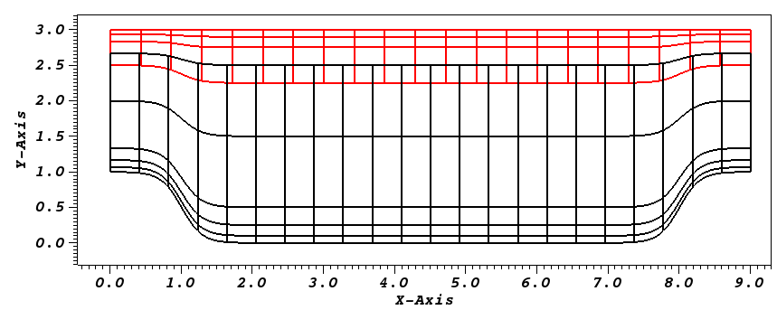
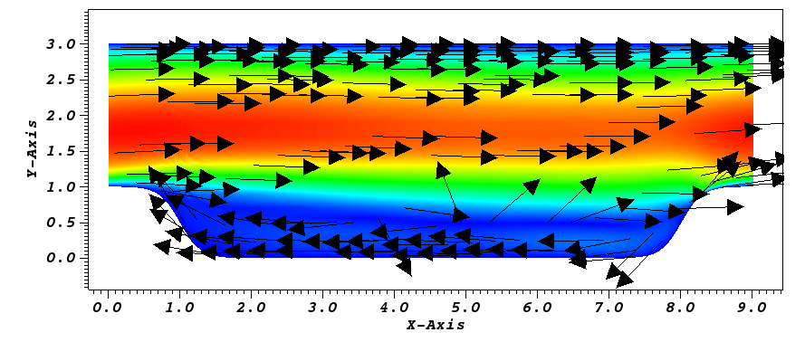

.. _neknek:

-------------------------
Overlapping Overset Grids
-------------------------

This tutorial will describe how to run a case with two overlapping meshes (NekNek) from scratch.
We illustrate this by using the Periodic hill case shown above.
If you are not familiar with Nek5000, we strongly recommend you begin with the Periodic hill first!

The three key steps to running a case with NekNek are: 

  1. Setting up the mesh with appropriate boundary conditions for the overlapping interface.
  2. Specifying parameters to control stability and accuracy for the overlapping-Schwarz iterations.
  3. Modifying ``userbc`` to read Dirichlet boundary data for the overlapping interfaces.

..........................
Pre-processing
..........................

The pre-processing steps for a NekNek calculation differ from a mono-domain Nek5000 calculation only in terms of ensuring that the appropriate boundary condition ``int`` is specified at the overlapping interface.
This boundary condition serves as the flag to let the solver know that Dirichlet data for these boundary conditions must come from interpolation of the data in the overlapping mesh.

..........................
Mesh generation
..........................

In this tutorial, we generate two meshes to span the entire domain, an upper and a lower mesh. 
The lower mesh is generated by genbox with the following input file:

.. code-block:: none

  -2                     spatial dimension (will create box.re2)
  1                      number of fields
  #
  #    comments: two dimensional periodic hill
  #
  #========================================================
  #
  Box                                       hillp
  -22 5                                     Nelx  Nely
  0.0 9.0 1.                                x0 x1 ratio
  0.0 0.1 0.25 0.5 1.5 2.5                  y0 y1 ratio
  P  ,P  ,W  ,int                           BC's:  (cbx0, cbx1, cby0, cby1)
  
and the upper mesh is generated by genbox with the following input file:

.. code-block:: none

  -2                     spatial dimension (will create box.re2)
  1                      number of fields
  #
  #    comments: two dimensional periodic hill
  #
  #========================================================
  #
  Box                                       hillp
  -21 3                                     Nelx  Nely
  0.0 9.0 1.                                x0 x1 ratio
  2.25 2.75 2.9 3.0     y0 y1 ratio
  P  ,P  ,int,W                             BC's:  (cbx0, cbx1, cby0, cby1)

Note: the lower domain spans :math:`y \in [0,2.5]` and the upper domain spans :math:`y \in [2.25,3]`. We also use ``int`` for the boundary surfaces that overlap the other domain. 

Now the meshes can be generated by running genbox for each of these cases to obtain ``upper.re2`` and ``lower.re2``.

..........................
usr file
..........................

As for the mono-domain periodic hill case, we start by copying the template to our case directory:

.. code-block:: none

   cp $HOME/Nek5000/core/zero.usr hillpnn.usr 

_________________________________________
Modify mesh and add forcing to the flow
_________________________________________

As for the mono-domain periodic hill case, we modify the mesh in usrdat2 as:

.. code-block:: fortran

  subroutine usrdat2
  
  implicit none
  
  include 'SIZE'
  include 'TOTAL'

  integer ntot
  real sa,sb,sc,xx,argx,A1
  
  ntot = nx1*ny1*nz1*nelt
  
  sa   = 4.5
  sb   = 3.5
  sc   = 1./6
  
  do i=1,ntot
     xx   = xm1(i,1,1,1)
     argx = sb*(abs(xx-sa)-sb)
     A1   = sc + sc*tanh(argx)
     ym1(i,1,1,1) = ym1(i,1,1,1) + (3-ym1(i,1,1,1))*A1
  enddo
  
  return
  end

.. _fig:hillnn_mesh:

    Modified box mesh graded

Currently, applying a constant mass flux with ``param(54)`` and ``param(55)`` is **not** supported with overlapping overset grids. 
For this case, we drive the flow using a constant acceleration term in userf as:

.. code-block:: fortran

      subroutine userf(ix,iy,iz,eg) ! set acceleration term
 !
 !     Note: this is an acceleration term, NOT a force!
 !     Thus, ffx will subsequently be multiplied by rho(x,t).
 !
      implicit none

      integer ix,iy,iz,eg

      include 'SIZE'
      include 'TOTAL'
      include 'NEKUSE'

      integer e
 !    e = gllel(eg)

      ffx = 0.052
      ffy = 0.0
      ffz = 0.0

      return
      end

_________________________________________
Specify NekNek parameters
_________________________________________

In usrdat, we  specify the number of Schwarz-like iterations and extrapolation order for the boundary conditions of the overlapping interface.
These parameters impact the stability and accuracy of the calculation.
This is done as:

.. code-block:: fortran

      subroutine usrdat()   ! This routine to modify element vertices

      implicit none

      include 'SIZE'
      include 'TOTAL'
      include 'NEKNEK'

      ngeom = 5
      ninter = 2

      return
      end

Here we do 4 sub-iterations ($ngeom=5$) at each time-step between the two meshes, and the temporal extrapolation order ($ninter$) is 2.

_____________________________
Initial & boundary conditions
_____________________________

The next step is to specify the initial conditions.
This can be done in the subroutine ``useric`` as follows:

.. code-block:: fortran

   subroutine useric(ix,iy,iz,ieg)

   implicit none

   integer ix,iy,iz,eg

   include 'SIZE'
   include 'TOTAL'
   include 'NEKUSE'

   ux   = 1.0 
   uy   = 0.0
   uz   = 0.0
   temp = 0.0

   return
   end

Next we modify userbc to read the boundary conditions, interpolated from overlapping domains, as follows:

.. code-block:: fortran

      subroutine userbc(ix,iy,iz,iside,eg) ! set up boundary conditions
 !
 !     NOTE ::: This subroutine MAY NOT be called by every process
 !
      implicit none

      integer ix,iy,iz,iside,eg

      include 'SIZE'
      include 'TOTAL'
      include 'NEKUSE'
      include 'NEKNEK'

      ie = gllel(eg)

      if (imask(ix,iy,iz,ie).eq.0) then
       ux=0.0
       uy=0.0
       uz=0.0
       temp=0.0
      else
       ux = valint(ix,iy,iz,ie,1)
       uy = valint(ix,iy,iz,ie,2)
       uz = valint(ix,iy,iz,ie,3)
       if (nfld_neknek.gt.3) temp = valint(ix,iy,iz,ie,ldim+2)
      end if

      return
      end

..........................
Control parameters
..........................

The control parameters for this case are the same as that for the mono-domain periodic hill case. 
Create two files called ``lower.par`` and ``upper.par``, and type in each the following:

.. code-block:: ini

    #
    # nek parameter file
    #
    [GENERAL]
    stopAt = endTime
    endTime  = 200

    variableDT = yes
    targetCFL = 0.4
    timeStepper = bdf2

    writeControl = runTime
    writeInterval = 20

    [PROBLEMTYPE]
    equation = incompNS

    [PRESSURE]
    residualTol = 1e-5
    residualProj = yes

    [VELOCITY]
    residualTol = 1e-8
    density = 1
    viscosity = -100

..........................
SIZE file 
..........................

The static memory layout of Nek5000 requires the user to set some solver parameters through a so called ``SIZE`` file.
Typically it's a good idea to start from our template.
Copy the ``SIZE.template`` file from the core directory and rename it ``SIZE`` in the working directory:

.. code-block:: none

   cp $HOME/Nek5000/core/SIZE.template SIZE

Then, adjust the following parameters

.. code-block:: fortran

      ...    
 
      ! BASIC
      parameter (ldim=2)
      parameter (lx1=8)
      parameter (lxd=12)
      parameter (lx2=lx1)
                                     
      parameter (lelg=22*8)
      parameter (lpmin=1)
      parameter (lpmax=4)
      parameter (ldimt=1)

      ! OPTIONAL
      parameter (nsessmax=2)
      ...

For this tutorial we have set our polynomial order to be :math:`N=7` - this is defined in the ``SIZE`` file above as ``lx1=8`` which indices that there are 8 points in each spatial dimension of every element.
Additional details on the parameters in the ``SIZE`` file are given :ref:`here <case_files_SIZE>`.   

..........................
Compilation 
..........................

With the ``hillpnn.usr``, and ``SIZE`` files created, we are now ready to compile::  

  makenek hillpnn

If all works properly, upon compilation the executable ``nek5000`` will be generated.

.........................
Running the case
.........................

First we need to run our domain paritioning tool

.. code-block:: bash

  genmap

On input specify ``lower`` as your casename and press enter to use the default tolerance. 
This step will produce ``lower.ma2`` which needs to be generated only once. 
Next do the same for the upper mesh to generate ``upper.ma2``.

Now you are all set, just run

.. code-block:: bash

  neknekb lower upper 2 2

to launch an MPI jobs on your local machine using 4 ranks. The output will be redirected to ``logfile``.

...........................
Post-processing the results
...........................

Using Visit, the user can post-process the results.

.. _fig:hillnn_flow:

    Steady-State flow field visualized in Visit/Paraview. Vectors represent velocity. Colors represent velocity magnitude. Note, velocity vectors are equal size and not scaled by magnitude.  
