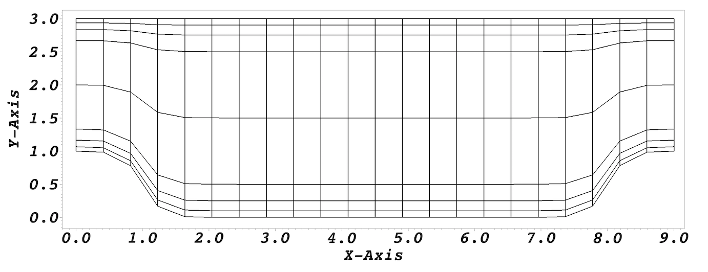
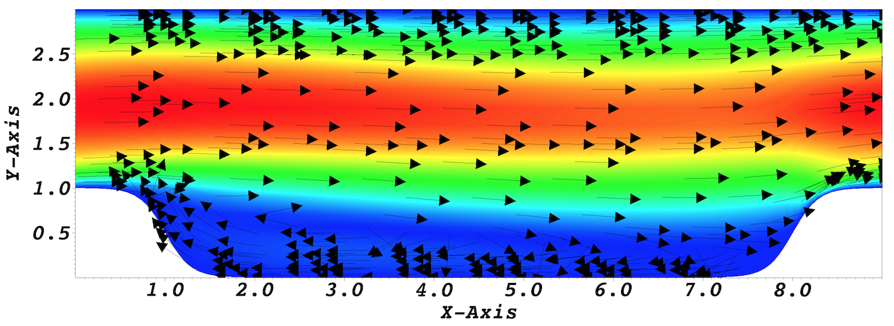

.. _perhill:

-------------------
Periodic Hill
-------------------

This tutorial will describe how to run a case from scratch. 
We illustrate this procedure through a relatively simple example involving incompressible laminar flow in a two-dimensional periodic hill domain.  Our implementation is loosely based on the case presented by Mellen et al. [Mellen2000]_. A thorough review
for this case can be found in the `ERCOFTAC <http://qnet-ercoftac.cfms.org.uk/w/index.php/Abstr:2D_Periodic_Hill_Flow>`_ knowledge base wiki.  

..........................
Pre-processing
..........................

We assume that you have installed Nek5000 in your home directory. 
This tutorial requires that you have the tools ``genbox`` and ``genmap`` compiled. 
Make sure ``$HOME/Nek5000/bin`` is in your search PATH. 

Cases are setup in Nek5000 by editing case files. Users should select an editor of choice with which to do this (e.g vi). A case being simulated involves data for mesh, parameters, etc. As a first step, the user should create a case directory in their run directory.

.. code-block:: none

   cd $HOME/Nek5000/run 
   mkdir hillp
   cd hillp

..........................
Mesh generation
..........................

In this tutorial we use a simple box mesh generated by
``genbox`` with the following input file:

.. code-block:: none

   -2                     spatial dimension (will create box.re2)
   1                      number of fields
   #
   #    comments: two dimensional periodic hill
   #
   #========================================================
   #
   Box                                       hillp
   -22 8                                     Nelx  Nely
   0.0 9.0 1.                                x0 x1 ratio
   0.0 0.1 0.25 0.5 1.5 2.5 2.75 2.9 3.0     y0 y1 ratio
   P  ,P  ,W  ,W                             BC's:  (cbx0, cbx1, cby0, cby1)

For this mesh we are specifying 22 uniform elements in the stream-wise (x) direction. 
8 non-uniform elements are specified in the span-wise (y) direction in order to resolve the boundary layers. 
The boundary conditions are periodic in the x-direction and no-slip in the y. 
Additional details on generating meshes using ``genbox`` can be found :ref:`here <mesh_gen>`. Now we can run genbox with

.. code-block:: none

   genbox

On input provide the input file name (e.g. ``hillp.box``).
The tool will produce a binary mesh and boundary data file ``box.re2`` which should be renamed to ``hillp.re2``. 

..........................
usr file
..........................

The :ref:`user file <case_files_usr>` implements various subroutines to allow the user to interact with the solver.

To get started we copy the template to our case directory 

.. code-block:: none

   cp $HOME/Nek5000/core/zero.usr hillp.usr 

_______________________________
Modify mesh and apply mass flux
_______________________________

To drive the flow a mass flux is applied such that  bulk velocity :math:`u_b=1`.

For a periodic hill, we will need to modify the geometry.  Let :math:`{\bf x} := (x,y)` denote the old geometry, and :math:`{\bf x}' := (x',y')` denote the new geometry.  For a domain
with :math:`y\in [0,3]` and :math:`x\in [0,9]` the following function will map the straight pipe geometry to a periodic hill:

.. math::

    y'(x,y) = y + C(3-y)\Big\{1+\tanh\big[B(|x-A|-B)\big]\Big\} .

where :math:`A=4.5, B=3.5, C=1/6`.
We have chosen these constants so that the height of the hill (our reference length), :math:`h=1`. 
Note that, as :math:`y \longrightarrow 3`, the perturbation, goes to zero.
So that near :math:`y = 3`, the mesh recovers its original form.

In Nek5000, we can specify this through ``usrdat2`` in the usr file as follows

.. code-block:: fortran

   subroutine usrdat2()
   implicit none
   include 'SIZE'
   include 'TOTAL'

   integer ntot,i
   real sa,sb,sc,xx,argx,A1

   ntot = lx1*ly1*lz1*nelt

   sa   = 4.5
   sb   = 3.5
   sc   = 1./6

   do i=1,ntot
      xx   = xm1(i,1,1,1)   
      argx = sb*(abs(xx-sa)-sb)
      A1   = sc + sc*tanh(argx)
      ym1(i,1,1,1) = ym1(i,1,1,1) + (3-ym1(i,1,1,1))*A1
   enddo

   ! apply mass flux to drive the flow such that Ubar = 1 
   param(54) = -1   ! x-direction 
   param(55) = 1.0  ! Ubar

   return
   end

.. _fig:hill_mesh:

    Modified box mesh graded

_____________________________
Initial & boundary conditions
_____________________________

The next step is to specify the initial conditions.
This can be done in the subroutine ``useric`` as follows:

.. code-block:: fortran

   subroutine useric(ix,iy,iz,ieg)
   implicit none
   include 'SIZE'
   include 'TOTAL'
   include 'NEKUSE'

   integer ix,iy,iz,ieg

   ux   = 1.0 
   uy   = 0.0
   uz   = 0.0
   temp = 0.0

   return
   end

For walls and periodic boundaries, nothing needs to be specified in the user file, so ``userbc`` can remain unmodified.

..........................
Control parameters
..........................

The control parameters for any case are given in the ``.par`` file.
For this case, using any text editor, create a new file called ``hillp.par`` and type in the following

.. code-block:: ini

    #
    # nek parameter file
    #
    [GENERAL]
    stopAt = endTime
    endTime  = 200

    variableDT = yes
    targetCFL = 0.4
    timeStepper = bdf2

    writeControl = runTime
    writeInterval = 20

    [PROBLEMTYPE]
    equation = incompNS

    [PRESSURE]
    residualTol = 1e-5
    residualProj = yes

    [VELOCITY]
    residualTol = 1e-8
    density = 1
    viscosity = -100

In choosing ``viscosity = -100`` we are actually setting the Reynolds number. This assumes that
:math:`\rho \times u_b \times h = 1` where :math:`u_b` denotes the bulk velocity and :math:`h` the hill height.  

We have set the calculation to stop at the physical time of :math:`T=200` (``endTime=200``) which is roughly 22 flow-thru time units (based on the bulk velocity :math:`u_b` and length of periodic pitch, :math:`L=9`).  Additional details on the names of keys in the ``.par`` file can be found :ref:`here <case_files_par>`. 

..........................
SIZE file 
..........................

The static memory layout of Nek5000 requires the user to set some solver parameters through a so called ``SIZE`` file.
Typically it's a good idea to start from our template.
Copy the ``SIZE.template`` file from the core directory and rename it ``SIZE`` in the working directory:

.. code-block:: none

   cp $HOME/Nek5000/core/SIZE.template SIZE

Then, adjust the following parameters in the BASIC section  

.. code-block:: fortran

      ...    
 
      ! BASIC
      parameter (ldim=2)
      parameter (lx1=8)
      parameter (lxd=12)
      parameter (lx2=lx1)
                                     
      parameter (lelg=22*8)
      parameter (lpmin=1)
      parameter (lpmax=4)
      parameter (ldimt=1)

      ...

For this tutorial we have set our polynomial order to be :math:`N=7` - this is defined in the ``SIZE`` file above as ``lx1=8`` which indices that there are 8 points in each spatial dimension of every element.
Additional details on the parameters in the ``SIZE`` file are given :ref:`here <case_files_SIZE>`.   

..........................
Compilation 
..........................

With the ``hillp.usr``, and ``SIZE`` files created, we are now ready to compile::  

  makenek hillp

If all works properly, upon compilation the executable ``nek5000`` will be generated.

.........................
Running the case
.........................

First we need to run our domain paritioning tool

.. code-block:: bash

  genmap

On input specify ``hillp`` as your casename and press enter to use the default tolerance. This step will produce ``hillp.ma2`` which needs to be generated only once. 

Now you are all set, just run

.. code-block:: bash

  nekbmpi hillp 4

to launch an MPI jobs on your local machine using 4 ranks. The output will be redirected to ``logfile``.

...........................
Post-processing the results
...........................

Once execution is completed your directory should now contain multiple checkpoint files that look like this::

  hillp.f00001
  hillp.f00002
  ...

The preferred mode for data visualization and analysis with Nek5000 is
to use Visit/Paraview. One can use the script *visnek*, to be found in ``/scripts``. It is sufficent to run:: 

  visnek hillp

*(or the name of your session)* to obatain a file named ``hillp.nek5000`` which can be recognized in Visit/Paraview.

In the viewing window one can visualize the flow-field as depicted in
:numref:`fig:hill_flow`.

.. _fig:hill_flow:

    Steady-State flow field visualized in Visit/Paraview. Vectors represent velocity. Colors represent velocity magnitude. Note, velocity vectors are equal size and not scaled by magnitude.  
