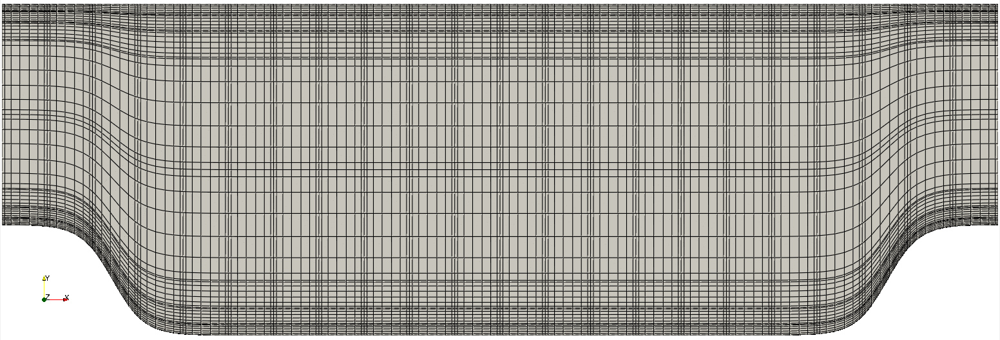

:orphan:

.. _perhill_old:

-------------------
Periodic Hill
-------------------

This tutorial will describe how to run a case from scratch. 
We illustrate this procedure through a relatively simple example involving incompressible laminar flow in a two-dimensional periodic hill domain. 
Our implementation is loosely based on the case presented by Mellen et al. [Mellen2000]_. 
A thorough review for this case can be found in the `ERCOFTAC <http://qnet-ercoftac.cfms.org.uk/w/index.php/Abstr:2D_Periodic_Hill_Flow>`_ knowledge base wiki.  

..........................
Pre-processing
..........................

We assume that you have installed Nek5000 in your home directory. 
This tutorial requires that you have the tools ``genbox`` and ``genmap`` compiled. 
Make sure ``$HOME/Nek5000/bin`` is in your search PATH. 

Cases are setup in Nek5000 by editing case files. Users should select an editor of choice with which to do this (e.g vi). A case being simulated involves data for mesh, parameters, etc. As a first step, the user should create a case directory in their run directory.

.. code-block:: console

  $ cd $HOME/Nek5000/run 
  $ mkdir hillp
  $ cd hillp

..........................
Mesh generation
..........................

In this tutorial we use a simple box mesh generated by
``genbox`` with the following input file:

.. literalinclude:: perhill/hillp.box

For this mesh we are specifying 22 uniform elements in the stream-wise (x) direction. 
8 non-uniform elements are specified in the span-wise (y) direction in order to resolve the boundary layers. 
The boundary conditions are periodic in the x-direction and no-slip in the y. 
Additional details on generating meshes using ``genbox`` can be found :ref:`here <tools_genbox>`. Now we can run genbox with

.. code-block:: console

   $ genbox

On input provide the input file name (e.g. ``hillp.box``).
The tool will produce a binary mesh and boundary data file ``box.re2`` which should be renamed to ``hillp.re2``. 

..........................
usr file
..........................

The :ref:`user file <case_files_usr>` implements various subroutines to allow the user to interact with the solver.

To get started we copy the template to our case directory 

.. code-block:: console

   $ cp $HOME/Nek5000/core/zero.usr hillp.usr 

_______________________________
Modify mesh and apply mass flux
_______________________________

To drive the flow a mass flux is applied such that  bulk velocity :math:`u_b=1`.

For a periodic hill, we will need to modify the geometry.  Let :math:`{\bf x} := (x,y)` denote the old geometry, and :math:`{\bf x}' := (x',y')` denote the new geometry.  For a domain
with :math:`y\in [0,3]` and :math:`x\in [0,9]` the following function will map the straight pipe geometry to a periodic hill:

.. math::

    y'(x,y) = y + C(3-y)\Big\{1+\tanh\big[B(|x-A|-B)\big]\Big\} .

where :math:`A=4.5, B=3.5, C=1/6`.
We have chosen these constants so that the height of the hill (our reference length), :math:`h=1`. 
Note that, as :math:`y \longrightarrow 3`, the perturbation, goes to zero.
So that near :math:`y = 3`, the mesh recovers its original form.

In Nek5000, we can specify this through ``usrdat2`` in the ``.usr`` file as follows.
The first highlighted line shows where the mesh is deformed.
The second set of highlighted lines are used to set a forced flowrate.

.. literalinclude:: perhill/deprecated/hillp.usr
   :language: fortran
   :lines: 131-158
   :emphasize-lines: 20,24,25

By modifying the mesh in ``usrdat2``, the modification is applied to the GLL points directly. 
This allows the mesh to conform to the specified profile to :math:`N^{th}`-order accuracy.
The deformed mesh with the GLL points is shown below.

    Modified box mesh graded

_____________________________
Initial & boundary conditions
_____________________________

The next step is to specify the initial conditions.
This can be done in the subroutine ``useric`` as follows:

.. literalinclude:: perhill/deprecated/hillp.usr
   :language: fortran
   :lines: 91-105

For walls and periodic boundaries, nothing needs to be specified in the user file, so ``userbc`` can remain unmodified.

..........................
Control parameters
..........................

The control parameters for any case are given in the ``.par`` file.
For this case, using any text editor, create a new file called ``hillp.par`` and type in the following

.. literalinclude:: perhill/deprecated/hillp.par

In choosing ``viscosity = -100`` we are actually setting the Reynolds number. This assumes that
:math:`\rho \times u_b \times h = 1` where :math:`u_b` denotes the bulk velocity and :math:`h` the hill height.  

We have set the calculation to stop at the physical time of :math:`T=200` (``endTime=200``) which is roughly 22 flow-thru time units (based on the bulk velocity :math:`u_b` and length of periodic pitch, :math:`L=9`).  Additional details on the names of keys in the ``.par`` file can be found :ref:`here <case_files_par>`. 

..........................
SIZE file 
..........................

The static memory layout of Nek5000 requires the user to set some solver parameters through a so called ``SIZE`` file.
Typically it's a good idea to start from our template.
Copy the ``SIZE.template`` file from the core directory and rename it ``SIZE`` in the working directory:

.. code-block:: console

   $ cp $HOME/Nek5000/core/SIZE.template SIZE

Then, adjust the following parameters in the BASIC section  

.. literalinclude:: perhill/SIZE
   :language: fortran
   :lines: 10 - 21

For this tutorial we have set our polynomial order to be :math:`N=7` - this is defined in the ``SIZE`` file above as ``lx1=8`` which indices that there are 8 points in each spatial dimension of every element.
Additional details on the parameters in the ``SIZE`` file are given :ref:`here <case_files_SIZE>`.   

..........................
Compilation 
..........................

With the ``hillp.usr``, and ``SIZE`` files created, you should now be all set to compile and run your case!
As a final check, you should have the following files:

 * :download:`hillp.usr <perhill/deprecated/hillp.usr>`
 * :download:`hillp.par <perhill/deprecated/hillp.par>`
 * :download:`hillp.re2 <perhill/hillp.re2>`
 * :download:`hillp.ma2 <perhill/hillp.ma2>`
 * :download:`SIZE <perhill/SIZE>`

If for some reason you encountered an insurmountable error and were unable to generate any of the required files, you may use the provided links to download them.
After confirming that you have all five, you are now ready to compile

.. code-block:: console

   $ makenek hillp

If all works properly, upon compilation the executable ``nek5000`` will be generated.

.........................
Running the case
.........................

First we need to run our domain paritioning tool

.. code-block:: console

  $ genmap

On input specify ``hillp`` as your casename and press enter to use the default tolerance. This step will produce ``hillp.ma2`` which needs to be generated only once. 

Now you are all set, just run

.. code-block:: console

  $ nekbmpi hillp 4

to launch an MPI jobs on your local machine using 4 ranks. The output will be redirected to ``logfile``.

...........................
Post-processing the results
...........................

Once execution is completed your directory should now contain multiple checkpoint files that look like this::

  hillp.f00001
  hillp.f00002
  ...

The preferred mode for data visualization and analysis with Nek5000 is
to use Visit/Paraview. One can use the script *visnek*, to be found in ``/scripts``. It is sufficent to run

.. code-block:: console 

   $ visnek hillp

*(or the name of your session)* to obatain a file named ``hillp.nek5000`` which can be recognized in Visit/Paraview.

In the viewing window one can visualize the flow-field.

.. figure:: perhill/hill_flow_v3.png
    :align: center
    :figclass: align-center
    :alt: per_flow

    Visualization of the steady-state flow field. Vectors represent velocity. Colors represent velocity magnitude. Note, velocity vectors are equal size and not scaled by magnitude.  
