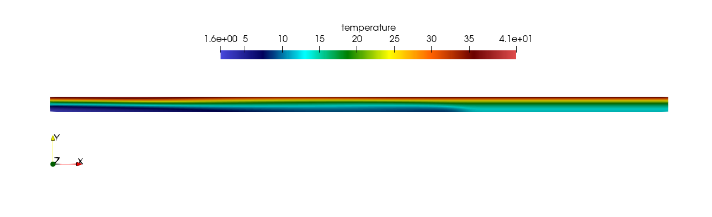
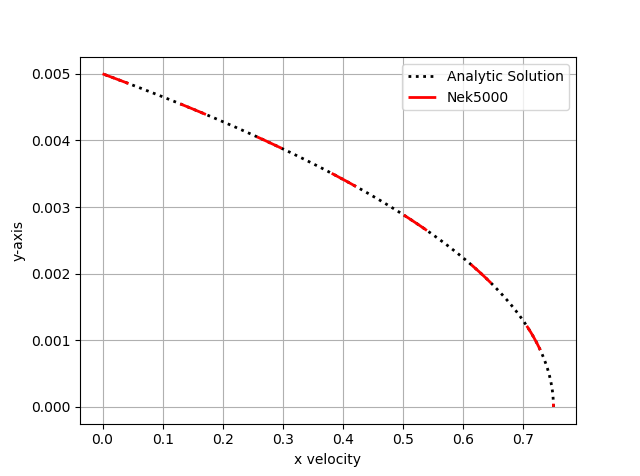

.. _plf:

-------------------------
Periodic Laminar Flow
-------------------------

In this tutorial we will be building a case that involves incompressible laminar flow in a channel with a constant heat flux applied. 

........................
Pre-processing
........................
This tutorial assumes that you have installed Nek5000 in your home directory. Be sure that ``$HOME/Nek5000/bin`` is in your search PATH. Before running the case, you will need to compile the tools ``genbox`` and ``genmap``. These can be compiled using the following command in the ``$HOME/Nek5000/tools`` directory:

.. code-block:: none

   ./maketools genbox
   ./maketools genmap

Before building the case, the user should set up a case direcotry in their run directory.

.. code-block:: none

   cd $HOME/Nek5000/run
   mkdir plf
   cd plf

........................
Mesh Generation
........................

This tutorial uses a box mesh generated by ``genbox``. To create the input file, copy the following script and save the file as ``plf.box``.

.. code-block:: none

   -2                     spatial dimension (will create box.re2)
   2                      number of fields
   #
   #    comments: periodic laminar flow
   #
   #========================================================
   #
   Box                                       plf
   -50 -5                                    Nelx  Nely
   0.0 0.2 1.0                               x0 x1 ratio
   0.0 0.005 0.7                             y0 y1 ratio
   v  ,O  ,SYM,W                             Velocity BC's:  (cbx0, cbx1, cby0, cby1)
   t  ,O  ,I  ,f                             Temperature BC's:  (cbx0, cbx1, cby0, cby1)
 
For this mesh we are specifying 50 uniform elements in the stream-wise (x) direction and 5 uniform elements in the span-wise (y) direction. The velocity boundary conditions in the x-direction are a standard Dirichlet velocity boundary condition at x\ :sub:`min`\  and an open boundary condition with zero pressure at x\ :sub:`max`\ . The velocity boundary conditions in the y-direction are a symmetric boundary at y\ :sub:`min`\  and a wall with no slip condition at y\ :sub:`max`\. The temperature boundary conditions in the x-direction are a standard Dirichlet boundary condition at x\ :sub:`min`\  and an outflow conditon with zero gradient at x\ :sub:`max`\. The temperature boundary conditions in the y-direction are an insulated condition with zero gradient at y\ :sub:`min`\  and a constant heat flux at y\ :sub:`max`\. Note that the boundary conditions specified with lower case letters must have values assigned in userbc, which will be shown later in this tutorial. Now we can run genbox with

.. code-block:: none

   genbox

When prompted provide the input file name, which for this case is ``plf.box``. The tool will produce binary mesh and boundary data file ``box.re2`` which should be renamed to ``plf.re2``.

........................
Control parameters
........................

The control parameters for any case are given in the ``.par`` file. For this case, create a new file called ``plf.par`` with the following:

.. code-block:: ini

   #
   # nek parameter file
   #
   [GENERAL]
   dt = 1.0e-4
   numsteps = 10000
   writeInterval = 2000

   userParam01 = 0.01  #channel height [m]
   userParam02 = 0.5   #mean velocity [m/s]
   userParam03 = 300.0 #heat flux [W/m^2]
   userParam04 = 10    #inlet temperature [C]

   [VELOCITY]
   density = 1.2
   viscosity = 0.00002

   [TEMPERATURE]
   rhoCp = 1200.0
   conductivity = 0.025

For this case the properties evaluated are for air at ~20 C. The required values for the initial and boundary conditions specfied by lower case letters in the  ``.box`` file are defined here as a list of user given parameters, as well as the height of the channel. These initial and boundary conditions will later be called in respective subroutines of the ``.usr`` file.

........................
usr file
........................

The user file implements various subroutines to allow the user to interact with the solver.

To get started we copy the template to our case directory

.. code-block:: none

   cp $HOME/Nek5000/core/zero.usr plf.usr

........................
Initial & boundary conditions
........................

The next step is to specify the intial conditions. This can be done in the subroutine ``useric`` as follows:

.. code-block:: fortran

   subroutine useric(ix,iy,iz,ieg)
   implicit none
   include 'SIZE'
   include 'TOTAL'
   include 'NEKUSE'

   integer ix,iy,ix,ieg

   um = uparam(2)
   Tin = uparam(4)

   ux   = um
   uy   = 0.0
   uz   = 0.0
   temp = Tin

   return
   end

The inlet temperature and mean velocity are called from the list of user defined parameters in the ``.par`` file. The boundary conditions can be setup in subroutine ``userbc`` as follows:

.. code-block:: fortran

   subroutine userbc(ix,iy,iz,iside,eg) ! set up boundary conditions
   implicit none
   include 'SIZE'
   include 'TOTAL'
   include 'NEKUSE'

   integer ix,iy,iz,iside,eg

   H    = uparam(1)     !channel height
   um   = uparam(2)     !mean velocity
   qpp  = uparam(3)     !heat flux
   Tin  = uparam(4)     !mean inlet temperature
   con  = cpfld(2,1)    !thermal conductivity
   term = qpp*H/(2*con)

   ux   = um*3./2.*(1-4.*(y/H)**2)
   uy   = 0.0
   uz   = 0.0
   temp = term*(3.*(y/H)**2-2.*(y/H)**4-39./280.)+Tin
   flux = qpp

   return
   end

The channel height, mean velocity, heat flux, and mean inlet temperature are all called from the list of user defined parameters in the ``.par`` file as well.

........................
userchk
........................

The subroutine ``userchk`` is a general purpose function that is executed before the time stepper and after each time step. The following should be copied to this subroutine

.. code-block:: fortran

   subroutine userchk()

   implicit none

   include 'SIZE'
   include 'TOTAL'

   real bc_average,glsc3,glsc2
   real Dh,um,qpp,Tin,rho,mu,con,L,Pin,Pout,darcy,Re,derror
   real Tbulk,Twall,HTC,Nuss,Nerror

   integer n

   n=lx1*ly1*lz1*nelv

   Dh   = uparam(1)*2.0 !hydraulic diameter
   um   = uparam(2)     !mean velocity
   qpp  = uparam(3)     !heat flux
   rho  = cpfld(1,2)    !density
   mu   = cpfld(1,1)    !viscosity
   con  = cpfld(2,1)    !conductivity

   c     Evaluate friction factor
   L = 0.2
   Pin = bc_average(pr,'v  ',1)
   Pout = bc_average(pr,'O  ',1)
   darcy = -2.*Dh*(Pout-Pin)/(L*rho*um*um)
   Re = rho*um*Dh/mu
   derror = abs(1.-darcy*Re/96.)

   c     Evaluate Nusselt number
   Tbulk = glsc3(t,vx,bm1,n)/glsc2(vx,bm1,n)
   Twall = bc_average(t,'f  ',2)
   HTC = qpp/(Twall-Tbulk)
   Nuss = HTC*Dh/con
   Nerror = abs(1.-Nuss*17./140.)

   c     Print to logfile
   if(nio.eq.0) then
     write(*,*) "Friction factor = ",darcy,derror
     write(*,*) "Nusselt = ",Nuss,Nerror
     write(*,*)
   endif

A custom function is called to evaluate the inlet pressure, outlet pressure, and the wall temperature. Built in routines for array multiplication are used to evaluate the bulk temperature. The Nusselt number and Darcy friction factor are evaluated and printed to the logfile along with their associated errors.

........................
SIZE file
........................

It is recommended to copy a template of the ``SIZE`` file from the core directory and rename it ``SIZE`` in the working directory:

.. code-block:: none

   cp $HOME/Nek5000/core/SIZE.template SIZE 
Then, adjust the following parameters in the BASIC section

.. code-block:: fortran

   ...

   ! BASIC
   parameter (ldim=2)
   parameter (lx1=8)
   parameter (lxd=12)
   parameter (lx2=lx1-0)

   parameter (lelg=250)
   parameter (lpmin=1)
   parameter (lelt=lelg/lpmin + 3)
   parameter (ldimt=1)

   ...

For this tutorial we have set our polynomial order to be :math:`N=7` which is defined in the ``SIZE`` file as ``lx1=8`` which indicates that there are 8 points in each spatial dimension of every element. The number of dimensions is specified using ``ldim`` and the number of global elements used is specified using ``lelg``. 

........................
Compilation
........................

With the ``plf.usr`` and ``SIZE`` files created, we are now ready to compile:

.. code-block:: none

   makenek plf

If the compilation is successful, the executable ``nek5000`` will be generated.

........................
Running the case
........................

First, we need to run our domain partitioning tool

.. code-block:: none

   genmap

On input specify ``plf`` as your casename and press enter to use the default tolerance. This step will produce ``plf.ma2`` which needs to be generated only once.

Now you can run the case

.. code-block:: bash

   nekbmpi plf 4

To launch an MPI jobs on your local machine using 4 ranks. The output will be redirected to ``logfile``.

........................
Post-processing the results
........................

Once execution is completed your directory should now contain 5 checkpoint files that look like this:

.. code-block:: none

   plf0.f00001
   plf0.f00002
   ...

The preferred mode for data visualization and analysis with Nek5000 is to use Visit/Paraview. One can use the script *visnek*, to be found in ``/scripts``. It is sufficient to run:

.. code-block:: none

   visnek plf

to obtain a file named ``plf.nek5000`` which can be recognized in Visit/Paraview. In the viewing window one can visualize the flow-field as depicted in :numref:`fig:velocity_paraview` as well as the temperature profile as depicted in :numref:`fig:temperature_paraview` below.

.. _fig:velocity_paraview:

.. figure:: plf/velocity_paraview.png
   :align: center
   :figclass: align-center
   :alt: per_flow

   Steady-State flow field visualized in Visit/Paraview. Colors represent velocity magnitude.

.. _fig:temperature_paraview:

   Temperature profile visualized in Visit/Paraview.

Plots of the velocity and temperature varying along the y-axis as evaluated by Nek5000 compared to analytic solutions are shown below in :numref:`velocity_lineplot` and :numref:`temperature_lineplot`.

.. _fig:velocity_lineplot:

   Nek5000 velocity solutions plotted against analytical solutions.

.. _figure:temperature_lineplot:

.. figure:: plf/temperature_lineplot.png
   :align: center
   :figclass: align-center
   :alt: per_flow

   Nek5000 temperature solutions plotted against analytical solutions.
