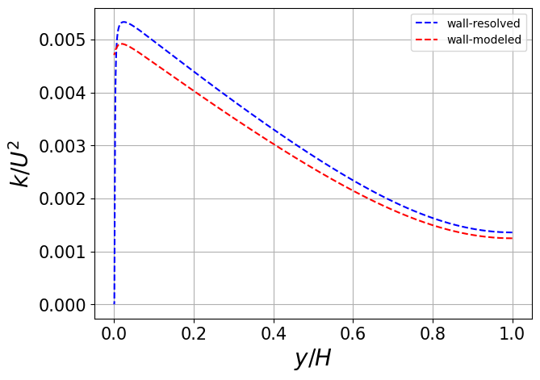
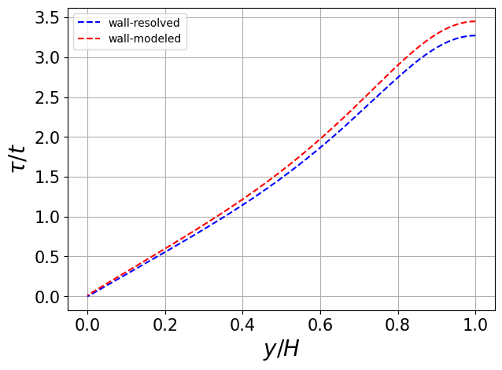

.. _rans:

------------
RANS Channel
------------

This tutorial describes the essential setup details for RANS wall-resolved simulation, illustrated through 
a 2D channel case. The :math:`k-\tau` RANS model is employed for this tutorial, which is the recommended RANS
model in Nek5000. Other RANS models, including the regularized :math:`k-\omega`, are also available, listed 
:ref:`here <intro_ktau>`. 

..........................
Before You Begin
..........................

It is highly recommended that new users familiarize themselves with the basic Nek5000 simulation
setup files and procedures outlined in the :ref:`fdlf` and :ref:`perhill` tutorials before proceeding.

..............................
Mesh and Boundary Conditions
..............................
 
The mesh is generated with ``genbox`` using the following script

.. literalinclude:: rans/wallResolved/chan_WR.box
   :language: none 
   
It creates an infinite 2D half-channel of non-dimensional width :math:`1`. The streamwise 
(:math:`x`) direction has 3 elements with periodic boundary conditions, while the spanwise 
(:math:`y`) direction has 7 elements with symmetry boundary condition specified at the bottom face 
and wall on the top face. In addition to velocity and temperature, RANS simulation 
requires two additional scalar fields including turbulent kinetic energy, :math:`k`, and :math:`\tau`
stored at the 3rd and 4th field index respectively. Note that the 1st and 2nd index are reserved for
velocity and temperature, respectively. In wall-resolved simulations Dirichlet boundary conditions are
specified at the wall, denoted by ``W`` for velocity and ``t`` for :math:`k` and :math:`\tau`.

..............................
Control Parameters (.par file)
..............................

Details of the structure of parameter file can be found :ref:`here <case_files_par>`. For RANS simulations it
is critical to include ``[SCALAR01]`` and ``[SCALAR02]`` cards which correspond to the :math:`k` and 
:math:`\tau` fields respectively. In addition, it is essential to also include the ``[PROBLEMTYPE]`` card
and enable ``variableProperties`` and ``stressFormulation``.

For this particular tutorial, the simulation is :ref:`non-dimensionalized <intro_ns_nondim>` and flow
properties are ``density=1.0`` and ``viscosity=-125000``, the latter being the Reynolds number of the flow.
It is strongly recommended to run RANS simulations in non-dimensional form. ``density`` and ``diffusivity`` 
for ``SCALAR01`` and ``SCALAR02`` should be assigned identical values as ``density`` and ``viscosity`` for
velocity field, respectively (Note: property values for scalars are internally replaced with `velocity` 
properties).  Temperature field is not solved in this tutorial, but can be turned on by removing 
``solver=none`` entry under the ``[TEMPERATURE]`` card.

.. literalinclude:: rans/wallResolved/chan_WR.par
   :language: none 

..............................
User Routines (.usr file)
..............................

This section describes the essential code snippets required in ``.usr`` file for RANS simulations.
Other details of all the subroutines can be found :ref:`here <case_files_usr>`. 

Foremost, it is essential to include the following header at the beginning of the ``.usr`` file.

.. code-block:: console

   include "experimental/rans_komg.f"
   include "experimental/rans_wallfunctions.f"
   
Files in the above relative locations in the Nek5000 repo load the essential RANS subroutines.
RANS initialization is done through the ``rans_init`` subroutine call from ``usrdat2``. The 
required code snippet is shown below.

.. code-block:: console

	subroutine usrdat2()
	implicit none
	include 'SIZE'
	include 'TOTAL'

	real wd
	common /walldist/ wd(lx1,ly1,lz1,lelv)

	common /rans_usr/ ifld_k, ifld_omega, m_id
	integer ifld_k,ifld_omega, m_id

	integer w_id,imid,i
	real coeffs(30) !array for passing your own coeffs
	logical ifcoeffs
            
	ifld_k     = 3 !address of tke equation in t array
	ifld_omega = 4 !address of tau equation in t array
	ifcoeffs=.false. !set to true to pass your own coeffs

	! Supported models:
	! m_id = 0 !regularized standard k-omega (no wall functions)
	! m_id = 1 !regularized low-Re k-omega (no wall functions)
	! m_id = 2 !regularized standard k-omega SST (no wall functions)
	! m_id = 3 !non-regularized standard k-omega (wall functions)
	m_id = 4 !non-regularized standard k-tau
	! m_id = 5 !non-regularized low Re k-tau 
	! m_id = 6 !non-regularized standard k-tau SST

	! Wall distance function:
	! w_id = 0 ! user specified
	! w_id = 1 ! cheap_dist (path to wall, may work better for periodic boundaries)
	w_id = 2 ! distf (coordinate difference, provides smoother function)

	call rans_init(ifld_k,ifld_omega,ifcoeffs,coeffs,w_id,wd,m_id)

	return
	end

``ifld_k`` and ``ifld_omega`` variables specify the field index location of the transport variables of the 
two-equation RANS model. The specific RANS model used is identified by the ``m_id`` variable. All available
RANS models are annotated in the above code. ``m_id=4`` invokes the recommended :math:`k-\tau` model. 
``ifcoeffs=.false.`` selects the standard RANS coefficients outlined in [Wilcox2008]_. Advanced users have
the option of specifying their own coefficients which have to populated in the ``coeffs`` array, with 
``ifcoeffs=.true.``. Final parameter to be aware of is the wall distance function code ``w_id``. The recommended
value for it is ``w_id=2`` which provides a smooth distance, populated in the ``wd`` array. A cheaper option
is available through ``w_id=1`` which is recommended for periodic domains. The user also has the option of 
specifying their own wall distance array by setting ``w_id=0`` which will require ``wd`` array to
be populated with user computed wall distance before the ``rans_init`` call. 

Diffusion coefficients for all fields in RANS simulation runs must be modified to include eddy viscosity.
This is done by the following inclusions in the ``uservp`` subroutine

.. code-block:: console

	subroutine uservp (ix,iy,iz,eg)
	implicit none
	include 'SIZE'
	include 'TOTAL'
	include 'NEKUSE'

	integer ix,iy,iz,e,eg
	
	common /rans_usr/ ifld_k, ifld_omega, m_id
	integer ifld_k,ifld_omega, m_id
	
	real rans_mut,rans_mutsk,rans_mutso,rans_turbPrandtl
	real mu_t,Pr_t

	e = gllel(eg)

	Pr_t=rans_turbPrandtl()
	mu_t=rans_mut(ix,iy,iz,e)

	utrans = cpfld(ifield,2)
	if(ifield.eq.1) then
		udiff = cpfld(ifield,1)+mu_t
	elseif(ifield.eq.2) then
		udiff = cpfld(ifield,1)+mu_t*cpfld(ifield,2)/(Pr_t*cpfld(1,2))
	elseif(ifield.eq.ifld_k) then  
		udiff = cpfld(1,1)+rans_mutsk(ix,iy,iz,e)
	elseif(ifield.eq.ifld_omega) then  
		udiff = cpfld(1,1)+rans_mutso(ix,iy,iz,e)
	endif

	return
	end
	
As above, eddy viscosity, ``mu_t``, is added to momentum diffusion coefficient and :math:`k` and :math:`\tau`
diffusion coefficients are modified as described in :eq:`ktau`. 

Source terms in the :math:`k-\tau` transport equations :eq:`ktau` are added with the following inputs in 
``userq`` subroutine

.. code-block:: console

	subroutine userq  (ix,iy,iz,ieg)
	implicit none
	include 'SIZE'
	include 'TOTAL'
	include 'NEKUSE'

	common /rans_usr/ ifld_k, ifld_omega, m_id
	integer ifld_k,ifld_omega, m_id

	real rans_kSrc,rans_omgSrc
	real rans_kDiag,rans_omgDiag

	integer ie,ix,iy,iz,ieg
	ie = gllel(ieg)

	if(ifield.eq.2) then
		qvol = 0.0 
		avol = 0.0
	elseif(ifield.eq.ifld_k) then
		qvol = rans_kSrc  (ix,iy,iz,ie)
		avol = rans_kDiag (ix,iy,iz,ie)
	elseif(ifield.eq.ifld_omega) then
		qvol = rans_omgSrc (ix,iy,iz,ie)
		avol = rans_omgDiag(ix,iy,iz,ie)
	endif
	
	return
	end
	
Implicit source terms contributions are specified to the ``avol`` variable, while remaining terms are 
in the ``qvol`` variable. 

For wall-resolved :math:`k-\tau` RANS, Dirichlet boundary conditions for velocity, :math:`k` and 
:math:`\tau` are all zero. ``userbc``, therefore, is simply

.. code-block:: console

	subroutine userbc(ix,iy,iz,iside,eg) 
	implicit none
	include 'SIZE'
	include 'TOTAL'
	include 'NEKUSE'

	integer ix,iy,iz,iside,e,eg
	
	common /rans_usr/ ifld_k, ifld_omega, m_id
	integer ifld_k,ifld_omega, m_id
	
	e = gllel(eg)

	ux   = 0.0
	uy   = 0.0
	uz   = 0.0
	
	if(ifield.eq.ifld_k) then
		temp = 0.0
	elseif(ifield.eq.ifld_omega) then
		temp = 0.0
	endif

	return
	end
	
Initial conditions are specified in ``useric`` routine. For RANS simulations, a positive initial value for
the :math:`k` and :math:`\tau` fields is recommended. Following is used for the channel simulation,

.. code-block:: console

	subroutine useric (ix,iy,iz,eg)
	implicit none
	include 'SIZE'
	include 'TOTAL'
	include 'NEKUSE'

	integer ix,iy,iz,e,eg
	
	common /rans_usr/ ifld_k, ifld_omega, m_id
	integer ifld_k,ifld_omega, m_id
	
	e = gllel(eg)

	ux   = 1.0
	uy   = 0.0
	uz   = 0.0
	temp = 0.0

	if(ifield.eq.ifld_k) temp = 0.01
	if(ifield.eq.ifld_omega) temp = 0.2

	return
	end
	
Flow is driven through the channel by the application of streamwise mass flux, specified in ``usrdat``

.. code-block:: console

	subroutine usrdat  
	implicit none
	include 'SIZE'     
	include 'TOTAL'     

	! apply mass flux to drive the flow such that Ubar = 1
	param(54) =-1       !x-direction
	param(55) = 1.0     !Mean Bulk velocity, Ubar

	return
	end

..............................
SIZE file
..............................

The ``SIZE`` file can be copied from the available template as decribed in the :ref:`fdlf` tutorial. The user
needs to ensure that the auxiliary fields specified in the SIZE file is at minimum ``ldimt=3`` for RANS
simulations. Other details on the contents of the ``SIZE`` file can be found :ref:`here<case_files_SIZE>`.

..............................
Compilation
..............................

All required case files for RANS wall-resolved channel simulation can be downloaded using the links below:

 * :download:`chan_WR.usr <rans/wallResolved/chan_WR.usr>`
 * :download:`chan_WR.par <rans/wallResolved/chan_WR.par>`
 * :download:`chan_WR.box <rans/wallResolved/chan_WR.box>`
 * :download:`SIZE <rans/wallResolved/SIZE>`
 
..............................
Results
..............................

For reference, the results obtained from the :math:`k-\tau` RANS wall-resolved simulation are shown below:

.. _fig:streamwise_vel:

.. figure:: rans/U1.png
   :align: center
   :figclass: align-center

   Normalized stream-wise velocity from wall-resolved :math:`k-\tau` RANS simulation
   
.. _fig:chan_tke:

   Normalized TKE from wall-resolved :math:`k-\tau` RANS simulation
   
.. _fig:chan_tau:

   Normalized :math:`\tau` from wall-resolved :math:`k-\tau` RANS simulation